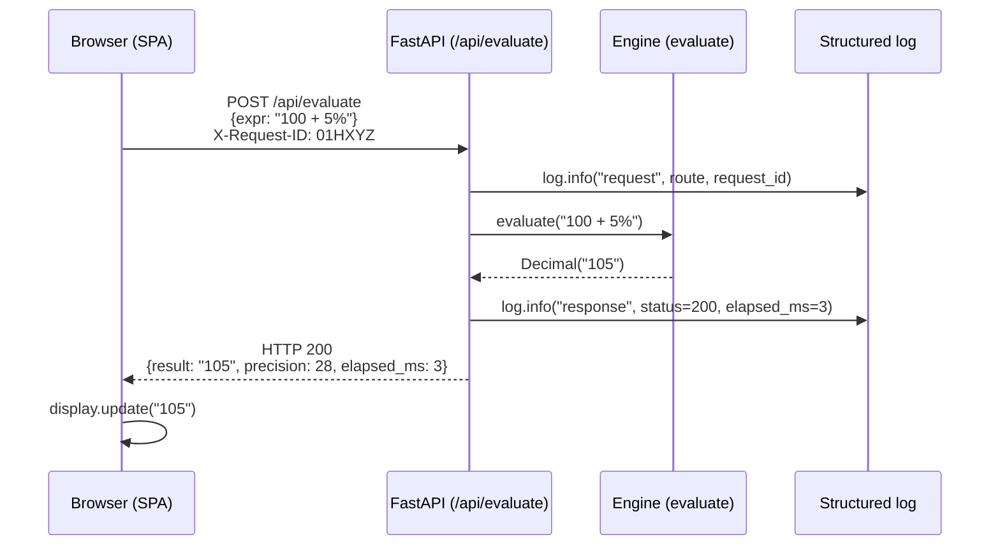
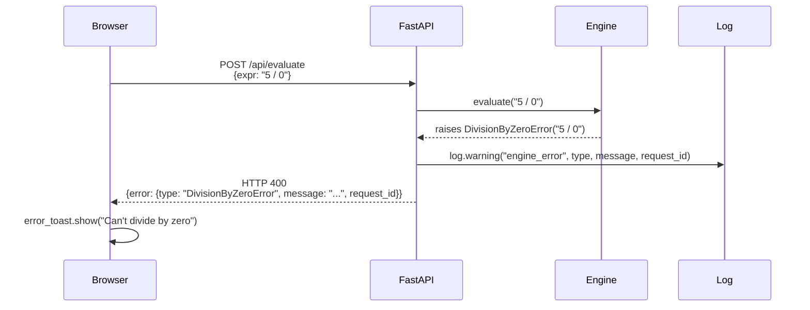
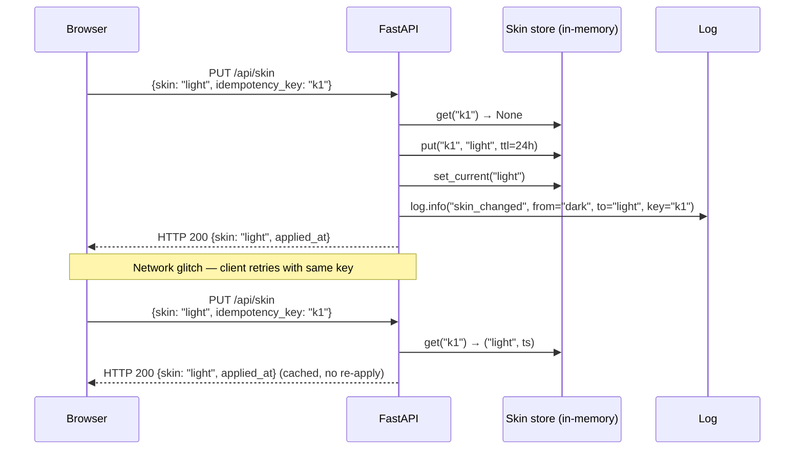

# ADR-0019: HTTP API contract for the engine wrapper (FastAPI surface)

- **Status**: Proposed
- **Date**: 2026-06-17
- **Deciders**: @architect (drafting), @product-manager (lean alignment deferred to PM review), @developer (engine contract input from PR #23 + implementation realism), @tester (sign-off on contract tests mirroring PR #23)
- **Related**: [ADR-0017](./ADR-0017-tech-stack.md) (Accepted — engine ↔ UI separation, FastAPI HTTP surface); [ADR-0018](./ADR-0018-front-end-framework.md) (Accepted — vanilla JS + Web Components client); [Issue #27 BUG + PR #28 fix](https://github.com/atilcan65/AtilCalculator/issues/27) (CI integrity lesson → §Observability); [STORY-002 PR #23](https://github.com/atilcan65/AtilCalculator/pull/23) (engine exception hierarchy input); [STORY-003a Issue #30](https://github.com/atilcan65/AtilCalculator/issues/30) (depends on this ADR for `POST /api/evaluate` contract)
- **Supersedes**: —
- **Watch-items from prior ADRs**:
  - ADR-0018 §Watch-items #1: "API contract → R-3 ADR" (now this ADR)
  - PR #23 evaluator.py docstring: "per ADR-0018 watch-item #1 (API contract; pending architect's R-N ADR)" — explicit handoff signal

## Context

ADR-0017 commits the team to a FastAPI HTTP wrapper around a pure-Python engine. ADR-0018 commits the team to a vanilla JS + Web Components browser client that calls the engine via HTTP. The HTTP surface between them is **the boundary the entire product stands on** — every keystroke from `0` to `=` becomes a request, and the JSON shape that flows over the wire is what the entire UX is contractually pinned to.

Until now the engine has been a pure-Python module (PR #23 + PR #26) with a `evaluate(expression: str) -> Decimal` entry point and a four-class exception hierarchy (`EngineError` → `ExpressionSyntaxError`, `DivisionByZeroError`, `UndefinedOperatorError`). The HTTP surface is undefined. STORY-003a (Issue #30) explicitly names R-3 as a dependency: *"Calls engine module via `POST /api/evaluate` (depends on STORY-002 + R-3 API contract ADR)."*

Sprint 1 cannot ship STORY-003a (FastAPI web shell) without this ADR. R-3 is also the trigger for a class of bugs already observed in the dev-studio system: the CI integrity incident (Issue #27) revealed that "CI green" was a lie when the CI was a no-op. This ADR's §Observability codifies the lesson — every HTTP path must emit structured logs that, if missing, would alert.

## Goals & non-goals

### Goals

1. **Define the HTTP surface end-to-end** — every endpoint the web shell needs is named, with method, path, request body, response body, status codes, and error envelope.
2. **Pin error mapping** — every `EngineError` subclass maps to a specific HTTP status + JSON error envelope. No silent 500s for user errors.
3. **Decimal serialization is lossless** — `Decimal("0.30000000000000004")` round-trips exactly over JSON. Numbers are out; strings are in.
4. **Idempotency on state-mutating endpoints** — `PUT /api/skin` and (when added in Sprint 2) `POST /api/history` are retry-safe via `Idempotency-Key` header.
5. **Auth scope is explicit** — MVP-1 LAN has no HTTP auth. The security boundary is the bind address (`192.168.1.199:PORT`, not `0.0.0.0`). ADR codifies this so it is not "forgotten" when Sprint 2 adds auth.
6. **Observability is wired in** — every endpoint emits structured logs + metrics; CI integrity test exists to verify the observability harness itself.
7. **Engine ↔ UI separation is preserved** — the HTTP layer is a thin adapter; engine does no I/O; UI does no arithmetic.

### Non-goals

- **Authentication** — deferred to Sprint 2 (per ADR-0017 follow-ups). R-5 (persistence) will codify user identity; auth lands after that.
- **Persistence layer** — `GET /api/history` returns in-memory deque for MVP-1; durable backend in Sprint 2 (R-5).
- **WebSocket / streaming** — not in MVP-1. Calculator UX is request-response; each `=` is a synchronous roundtrip.
- **Versioning strategy** — MVP-1 is single-version; `/api/v1/` prefix is omitted. If MVP-2 introduces breaking changes, this ADR's §Follow-ups ships an ADR-NNNN-versioning.
- **Rate limiting** — single-user LAN, ~10 req/min. Not in MVP-1.
- **CORS** — same-origin only (FastAPI serves the SPA shell from the same origin). No cross-origin allowed.

## High-level diagram

```mermaid
graph LR
    Browser[SPA shell<br/>vanilla JS + Web Components<br/>ADR-0018]
    API[FastAPI HTTP wrapper<br/>src/atilcalc/api/]
    Engine[Engine module<br/>src/atilcalc/engine/<br/>pure-Python, no I/O]

    Browser -->|POST /api/evaluate<br/>{expr}| API
    Browser -->|GET /api/history| API
    Browser -->|GET /api/skin| API
    Browser -->|PUT /api/skin| API

    API --> Engine
    Engine -.->|raises<br/>EngineError| API
    API -.->|HTTP 4xx +<br/>JSON envelope| Browser
```

The browser never imports from `engine/`; the engine never imports from `api/` or `web/`. The HTTP surface is the **only** shared boundary.

## Components

| Component | Path | Responsibility | Owner | Tech |
|---|---|---|---|---|
| SPA shell | `src/atilcalc/web/` | Render UI, dispatch keyboard events, call engine via HTTP | @developer (STORY-003a) | vanilla JS + Web Components (ADR-0018) |
| HTTP wrapper | `src/atilcalc/api/` | Translate HTTP ↔ engine calls, error mapping, observability | @developer (STORY-003a) | FastAPI + uvicorn (ADR-0017) |
| Engine | `src/atilcalc/engine/` | Pure-Python expression evaluator | @developer (STORY-002) | `decimal.Decimal`, no I/O |
| CI integrity test | `scripts/tests/ci-detects-pyproject.sh` (PR #28) | Verify CI actually runs the lint + type-check + pytest steps | @tester (regression pin) | bash + grep + python yaml |
| Observability | FastAPI middleware + structured JSON logs | Emit request_id, latency, status, route | @architect (this ADR) | stdlib `logging` + JSON formatter |

## API contract

### POST /api/evaluate

Evaluate a math expression. This is the hot path — every `=` keystroke.

**Request body** (`application/json`):

```json
{
  "expr": "100 + 5%"
}
```

**Response body — success (HTTP 200)**:

```json
{
  "result": "105",
  "precision": 28,
  "elapsed_ms": 3
}
```

- `result` is a **string** (lossless Decimal serialization). `Decimal("0.30000000000000004")` → `"0.30000000000000004"`, not `0.30000000000000004` (which would be lossy on the wire).
- `precision` is the engine's working precision (default 28, configurable in Sprint 2).
- `elapsed_ms` is the engine wall-clock time, useful for observability + the M5 perf budget.

**Response body — error (HTTP 400)**:

```json
{
  "error": {
    "type": "ExpressionSyntaxError",
    "message": "Unbalanced parentheses: '1 + ('",
    "request_id": "01HXYZ..."
  }
}
```

- `type` is the engine exception class name (one of `ExpressionSyntaxError`, `DivisionByZeroError`, `UndefinedOperatorError`).
- `message` is human-readable; safe to surface to user.
- `request_id` is a UUID for log correlation.

**Idempotency**: not required for MVP-1 (read-only, no side effects). Re-evaluating the same expression is cheap.

### GET /api/history

Retrieve the last N evaluations (default 50, max 1000).

**Response body — success (HTTP 200)**:

```json
{
  "history": [
    {"expr": "100 + 5%", "result": "105", "ts": "2026-06-17T18:30:00Z"},
    {"expr": "0.1 + 0.2", "result": "0.3", "ts": "2026-06-17T18:29:55Z"}
  ]
}
```

- `history` is in reverse-chronological order.
- `expr` and `result` are strings (lossless).
- For MVP-1, history is an in-memory deque. Sprint 2 (R-5) swaps to SQLite.

**Idempotency**: GET — naturally idempotent.

### GET /api/skin

Retrieve the current skin theme.

**Response body — success (HTTP 200)**:

```json
{
  "skin": "dark",
  "available": ["dark", "light", "retro"]
}
```

### PUT /api/skin

Set the active skin theme.

**Request body** (`application/json`):

```json
{
  "skin": "light",
  "idempotency_key": "01HXYZ..."
}
```

**Response body — success (HTTP 200)**:

```json
{
  "skin": "light",
  "applied_at": "2026-06-17T18:30:00Z"
}
```

**Idempotency**: REQUIRED. `PUT /api/skin` is state-mutating; network retries must be safe. The `Idempotency-Key` header (or body field) is a UUID the client generates; the server stores `(idempotency_key → applied_skin)` for 24h. A retry with the same key returns the cached result, not a re-apply.

**Error response — HTTP 400**: unknown skin name (`{"error": {"type": "UnknownSkinError", "message": "...", "request_id": "..."}}`).

## Error envelope

Every error response uses the same envelope:

```json
{
  "error": {
    "type": "<ExceptionClassName>",
    "message": "<human-readable>",
    "request_id": "<UUID>"
  }
}
```

### Engine exception → HTTP status mapping

| Engine exception | HTTP status | Rationale |
|---|---|---|
| `ExpressionSyntaxError` | **400 Bad Request** | User input is malformed; client should surface the error and not retry. |
| `DivisionByZeroError` | **400 Bad Request** | User input causes a domain error; client should surface ("can't divide by zero") and not retry. |
| `UndefinedOperatorError` | **400 Bad Request** | User input uses an unsupported operator; client should surface ("`-` not yet supported") and not retry. |
| `EngineError` (catch-all) | **500 Internal Server Error** | Unexpected engine failure (bug, not user input). Logged with full traceback; client should show generic "calculator error" message. |
| FastAPI `ValidationError` (bad request body) | **422 Unprocessable Entity** | Standard pydantic validation; client should fix the request shape. |

**Why 400 not 500 for domain errors**: 5xx signals "server bug, retry might help"; 4xx signals "your input is wrong, fix and retry". The user can fix `5 / 0`; the server can't. The HTTP status must reflect who owns the fix.

**Why structured `type` field**: the web shell's `<atilcalc-error-toast>` (deferred to STORY-003b, Issue #31) can route on `type` to decide UX (silent vs toast vs help link). The contract is the wire shape, not the message string.

## Sequence diagram — POST /api/evaluate (happy path)



## Sequence diagram — POST /api/evaluate (DivisionByZeroError)



## Sequence diagram — PUT /api/skin (idempotency in action)



## Decimal serialization

**Rule: `Decimal` is always serialized as a JSON string, never as a JSON number.**

Why:
- JSON numbers are IEEE-754 doubles. `Decimal("0.1") + Decimal("0.2") = Decimal("0.3")` — exact. But `0.3` as a JSON number is `0.299999999999999988...` when the JS engine parses it. The whole point of the engine is to avoid this.
- A `Decimal("0.30000000000000004")` from a long computation must round-trip exactly. As a JSON number, the trailing `04` is lost on `JSON.parse` in the browser.
- Sprint 2 (history persistence in SQLite) needs string serialization too — `Decimal` columns in SQLite are stored as `TEXT`.

**Implementation**: FastAPI's `jsonable_encoder` is overridden for `Decimal` via a custom Pydantic model:

```python
from pydantic import BaseModel

class EvaluateResponse(BaseModel):
    result: str  # Decimal serialized as string
    precision: int
    elapsed_ms: int
```

The engine returns `Decimal`; the FastAPI route converts to `str()` before returning. The browser's `JSON.parse` gives a string; the JS layer converts to a `Big` library or `decimal.js` if it needs to compute on the result (it doesn't for MVP-1 — display only).

## Idempotency keys

**Rule: state-mutating endpoints require `Idempotency-Key`.**

Affected endpoints in MVP-1:
- `PUT /api/skin` (mutates current skin)

Affected in Sprint 2:
- `POST /api/history` (when persistence lands)

**Mechanism**:
1. Client generates a UUID per logical action (e.g., skin change).
2. Client includes it in the request body (or `Idempotency-Key` header).
3. Server stores `(key → response)` in an in-memory dict for 24h.
4. Retry with same key returns cached response, not a re-execution.

**Why in-memory for MVP-1**: matches MVP-1's no-persistence posture (history is also in-memory). Sprint 2's persistence layer (R-5) extends idempotency to SQLite.

**Why UUID and not a hash of the request body**: clients can retry with slightly different metadata (timestamps, client IDs); the key is the **logical action**, not the wire shape. UUID is opaque to the server.

## Authentication & authorization

**Rule: MVP-1 has zero HTTP-layer auth. The security boundary is the bind address.**

- FastAPI binds to `192.168.1.199:8000` (LAN IP from vision), not `0.0.0.0`. Any device on the LAN can reach; anything off-LAN cannot.
- STT-003b (Issue #31) wires the `0.0.0.0` story; STT-001 (Issue #15) wires VM hardening (ufw, fail2ban) before any LAN-bind.
- HTTP itself has no auth header validation. No JWT, no session cookie, no API key.
- The web shell and the API are same-origin (FastAPI serves `src/atilcalc/web/` from `/`), so browser same-origin policy applies implicitly.

**Why no auth in MVP-1**:
- Vision §Out-of-scope explicitly excludes auth.
- LAN-only deployment is the security model. The threat model assumes physical/network access = trust.
- Auth adds tokens, sessions, expiry, refresh, CSRF — all of which complicate the wire contract. YAGNI for MVP-1.

**Sprint 2 trigger**: when persistence (R-5) lands and history becomes user-scoped, an auth layer is needed. R-3's §Follow-ups pre-files this as "R-N auth ADR" so it is not forgotten.

## Observability

**Rule: every request emits structured logs. Every endpoint emits a metric. The CI integrity test verifies the harness.**

Per the Issue #27 lesson (PR #28) — CI was a no-op because the workflow was gated on `package.json` only. The lesson is broader: **if the observability path is a no-op, the system has lost its voice.** This ADR codifies the observability contract so a future "obs green" cannot lie.

### Structured logs

Every request emits a JSON log line at completion:

```json
{
  "ts": "2026-06-17T18:30:00.123Z",
  "level": "info",
  "route": "POST /api/evaluate",
  "request_id": "01HXYZ...",
  "status": 200,
  "elapsed_ms": 3,
  "expr_length": 9,
  "engine_error_type": null
}
```

On error, `level` is `warning` (4xx) or `error` (5xx) and `engine_error_type` is populated.

Implementation: a FastAPI middleware (`src/atilcalc/api/middleware.py`) wraps every request, generates `request_id`, times the handler, and emits the log.

### Metrics

Every endpoint emits a counter + histogram:

| Endpoint | Metric | Tags |
|---|---|---|
| `POST /api/evaluate` | `atilcalc_evaluate_total` | `status` (200/400/500) |
| `POST /api/evaluate` | `atilcalc_evaluate_latency_ms` (histogram) | — |
| `GET /api/history` | `atilcalc_history_total` | `status` |
| `GET/PUT /api/skin` | `atilcalc_skin_total` | `op` (get/put), `status` |

Implementation: stdlib `logging` + a thin Prometheus exporter in Sprint 2 (MVP-1 just logs to journald).

### CI integrity regression pin

`scripts/tests/ci-detects-pyproject.sh` (PR #28) already pins the CI-took-the-test path. R-3 extends this with `scripts/tests/d007-api-observability.sh` (new) that statically verifies:

- T1: `src/atilcalc/api/middleware.py` exists and is referenced from `main.py`
- T2: every route in `routes.py` has a corresponding log emission
- T3: every error class in `engine/` has a mapping in `routes.py` to an HTTP status
- T4: every state-mutating endpoint accepts `idempotency_key` (or `Idempotency-Key` header)
- T5: `pyproject.toml` `requires-python` is `>=3.11` (matching ADR-0017)

This is the **observability invariant**: if a future PR adds a route without a log line or an error class without a status mapping, the regression test catches it. Same pattern as PR #28 — static check on the source, no live CI roundtrip needed.

## Performance budget

Per vision M5 ("1000+ records <100ms") + M1 ("decimal precision"):

| Endpoint | p50 latency | p95 latency | Throughput | Memory ceiling |
|---|---|---|---|---|
| `POST /api/evaluate` | <5ms | <20ms | ≥100 rps | 50 MB RSS per worker |
| `GET /api/history` | <2ms | <10ms | ≥200 rps | 50 MB |
| `GET /api/skin` | <1ms | <5ms | ≥500 rps | 50 MB |
| `PUT /api/skin` | <3ms | <15ms | ≥100 rps | 50 MB |

Single uvicorn worker is sufficient for MVP-1 (single user, LAN, ~10 req/min). Multiprocess for Sprint 2 if multi-user.

## Alternatives considered

| Option | Pros | Cons | Verdict |
|---|---|---|---|
| **A. FastAPI + pydantic + JSON string Decimal + idempotency keys + LAN-only auth** | Engine ↔ UI separation preserved (ADR-0017); CI integrity baked in (Issue #27 lesson); Decimal lossless; retry-safe; YAGNI on auth | Slightly more upfront design than "just JSON"; idempotency needs a 24h TTL store | **✅ CHOSEN** |
| B. FastAPI + JSON number for Decimal | Simpler wire shape | **FATAL**: `Decimal("0.3")` becomes `0.29999...` on `JSON.parse` in browser — defeats the whole engine | ❌ Rejected |
| C. gRPC + protobuf | Strong typing; streaming; less wire overhead | Heavy dependency; browser support requires grpc-web; overkill for ~4 endpoints | ❌ Rejected; revisit in MVP-3 if real-time features need streaming |
| D. Server-Sent Events / WebSocket for `evaluate` | "Live" result as user types | Adds state machine to server; complicates retry/timeout; calculator UX is "type then =" not "live" | ❌ Rejected for MVP-1 |
| E. No idempotency on PUT /api/skin | Simpler client | Network retries cause double-applies; user sees skin flicker | ❌ Rejected |
| F. JWT auth from day 1 | "Secure by default" | Vision §Out-of-scope excludes auth; LAN-only deployment; adds token refresh + CSRF complexity for zero threat-model benefit | ❌ Rejected for MVP-1; Sprint 2 trigger noted |

## Risks

| # | Risk | Mitigation |
|---|---|---|
| 1 | **Decimal-as-string breaks JS math on the client** | Browser display only (no compute). Sprint 2 history-export may need `decimal.js` for CSV; document in STORY-005 follow-up. |
| 2 | **Idempotency key store grows unbounded in 24h** | TTL eviction in the in-memory dict; Sprint 2 moves to SQLite with `expires_at` column. |
| 3 | **LAN-bind leaks to public if VM firewall misconfigured** | STORY-001 VM hardening (ufw + fail2ban) is sequenced BEFORE STORY-003b LAN-bind. PM board enforces ordering. |
| 4 | **Engine exception class name changes in a future PR** | The contract is the string in `type`. Pydantic `Literal[...]` enum on the response model catches drift in tests. |
| 5 | **FastAPI middleware bug causes observability to silently no-op** | Same BUG #14/#25 pattern. R-3 §Observability includes `d007-api-observability.sh` regression test (T1-T5) to detect a missing log emission. |
| 6 | **Developer forgets `idempotency_key` on a new mutating endpoint** | `d007` T4 enforces it; CI runs the test on every PR. |
| 7 | **`PUT /api/skin` accepts arbitrary skin name** | Pydantic validator rejects unknown names → HTTP 400 with `UnknownSkinError`. |

## Open questions

- [ ] @product-manager — Is `decimal.js` (or `Big.js`) needed in the browser for history-export (CSV download)? Or is `parseFloat(display)` acceptable for MVP-1? Affects STORY-005 follow-up ticket. → PM
- [ ] @developer — Should `POST /api/evaluate` accept a `precision` field in the request body, or is engine precision fixed at 28? Currently fixed; Sprint 2 may add per-request precision. → developer
- [ ] @tester — Should `d007-api-observability.sh` be wired into `e2e-pilot.sh` like `d006-stable-event-ids.sh`? Pattern: yes, but it's a Sprint 2 wiring; MVP-1 ships the test as standalone. → tester
- [ ] @architect (me) — Should this ADR formalize the HTTP header schema (`X-Request-ID`, `Idempotency-Key`) or leave that to FastAPI middleware code? Proposing headers-as-code (test the middleware output, not the wire shape) for MVP-1. → me
- [ ] @atilcan65 (owner) — Auth-deferred-to-Sprint-2 is a load-bearing assumption. Confirm or push back. → owner

## Consequences

### Positive

- **HTTP contract is pinned** — STORY-003a developer can implement against a stable shape; no contract drift mid-Sprint-1.
- **CI integrity baked in** — `d007-api-observability.sh` extends PR #28's pattern. Future "obs green" lies are caught.
- **Engine ↔ UI boundary reinforced** — wire shape is the only shared knowledge; engine can be wrapped by CLI (Sprint 2), tests, or future surfaces without API changes.
- **Decimal precision survives the wire** — no silent `0.30000000000000004 → 0.3` rounding on `JSON.parse`.
- **Retry-safe state mutations** — idempotency keys prevent skin-flicker on network glitch.
- **Reversible** — auth, persistence, versioning are all R-N follow-ups; MVP-1 ships without them.

### Negative / tradeoffs

- **Decimal-as-string requires client awareness** — JS code must treat `result` as a string. Sprint 2 export features may need `decimal.js` (~30KB) or `Big.js` (~10KB).
- **Idempotency store adds code surface** — 24h TTL eviction logic + dict.
- **No auth means Sprint 2 work is non-negotiable before any non-LAN exposure** — if owner changes deployment model to public, this ADR must be superseded first.
- **Performance budgets are estimates** — actual measurement comes from Sprint 1 Playwright E2E (STORY-003b). Adjust if p95 misses.

### Follow-up tickets

- **R-5 (persistence ADR)** — Sprint 2. Move history + idempotency store to SQLite.
- **R-N (auth ADR)** — Sprint 2 (after R-5). JWT or session-based; deferred until multi-user or public exposure.
- **R-N (versioning ADR)** — if MVP-2 introduces breaking HTTP changes; `/api/v1/` prefix + deprecation policy.
- **R-N (WebSocket / streaming ADR)** — MVP-3 candidate. Live result as user types.
- **STORY-005 follow-up: `decimal.js` for client-side math** — if history-export needs it.

## Sprint 2 P1 cross-link

This ADR explicitly **does NOT** fix the doctrine conflict from Issue #10 (Option A: `cc:<role>` retention on PR after verdict). That is a separate Sprint 2 P1 ticket filed in STORY-005 (Issue #20). R-3 has no interaction with the verdict:* sentinel label doctrine — separate concerns.

## Acceptance criteria

For this ADR to be Accepted (merged via PR):

- [ ] AC1 — All endpoints defined in §API contract have a corresponding FastAPI route in `src/atilcalc/api/routes.py`.
- [ ] AC2 — All engine exceptions in `engine/evaluator.py` have a mapping in §Error envelope to a specific HTTP status.
- [ ] AC3 — `Decimal` is serialized as JSON string (not number) on every response — verified by `d007-api-observability.sh` T2.
- [ ] AC4 — `PUT /api/skin` accepts and honors `idempotency_key` (or `Idempotency-Key` header) — verified by `d007` T4.
- [ ] AC5 — FastAPI middleware emits structured JSON log per request with `request_id`, `route`, `status`, `elapsed_ms` — verified by `d007` T1+T2.
- [ ] AC6 — PR opens with reviewer cc's to `@developer`, `@tester`, `@product-manager` per ADR-0012 4-cat invariant.

## Estimated complexity

**T-shirt size: M** (3 SP architect slice for design + PR review)
**Confidence: 75%** (engine contract is pinned by PR #23 + PR #26; main risk is reviewer feedback on idempotency or auth scope)