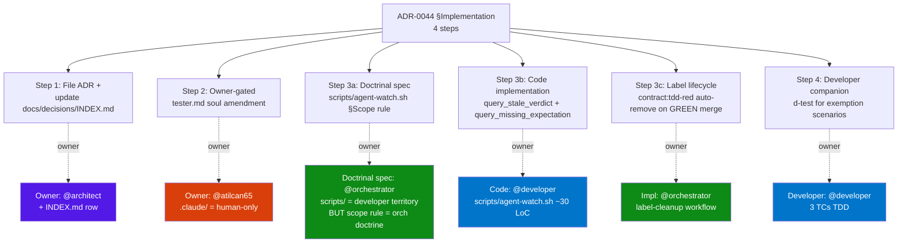

# ADR-0046 — Load-Bearing ADR §Implementation Guide Pattern (Literal Forms + Ownership-Split Decision Tree)

- **Status:** Proposed (Sprint 9 P1, Issue #388 RETRO-005 #19 audit deliverable)
- **Date:** 2026-06-25
- **Author:** @architect (drafted per Issue #388 audit)
- **Deciders:** @architect (drafted), @product-manager (doctrine validation), @developer (apply §A + §B to scripts/agent-watch.sh), @tester (d046-expansion regression), @orchestrator (sister-pattern to PR #383 peer-poke.sh), @atilcan65 (owner approval)
- **Supersedes:** none (extends ADR-0044 with literal-form companion; sets precedent for future load-bearing ADRs)
- **Related:** ADR-0044 (TDD RED exclusion — the load-bearing ADR being made literal), ADR-0043 (8-lens architect review checklist), ADR-0045 (lens (j) auto-gen + live-state), Issue #388 (RETRO-005 #19 audit — this ADR is the deliverable), TD-031 (Gap #2 entry ticket), PR #385 (Gap #1 ownership-split clarification, MERGED), PR #386 (Gap #2 source, MERGED), PR #393 (TD-031 fix, MERGED 2026-06-25T18:55:04Z), PR #405 (d046 peer-poke canonical-parity guard — sister pattern, MERGED 2026-06-25T21:54:34Z)

## Context

ADR-0044 (TDD RED exclusion, PR #359 MERGED 2026-06-24T19:20:31Z) is a **load-bearing ADR** — it defines the `verdict-by:<ts>` SLA scope rule that closes Issue #319 (tester-pinged incidents) and underpins the supersede-via-impl-PR closure pattern. Within 24 hours of merge, **two intent-vs-literal gaps** were observed (Issue #388):

| Gap | Source | Severity | Status |
|---|---|---|---|
| §Implementation step 3 ownership | PR #385 in review (Issue #384) | M | PR #385 in review, doctrinal clarification amendment |
| §Decision test-only regex unanchored | PR #386 + TD-031 (Issue #387) | L | PR #393 MERGED 2026-06-25T18:55:04Z (basename-anchored fix) |

**Pattern**: ADR-0044 §Decision + §Implementation prose are written at **intent level** ("exclude TDD RED contract-only PRs", "filenames matching test_*.py", "scripts/ = developer territory"). When the implementer reads the ADR, they must interpret intent → code, and that interpretation can drift.

**Root cause**: Most ADRs in this repo follow the same intent-level prose style. But ADR-0044 is load-bearing — it gets iterated frequently (RETRO-005 #18 iteration count sister) and gaps directly re-introduce tester-pinged incidents (the very class ADR-0044 was created to close). Load-bearing ADRs deserve higher precision than typical ADRs.

**Discovery channel**: Tester's adversarial probing (PROBE 2 in PR #386 verdict) is finding gaps the architect's own 9-lens review didn't. This is a healthy feedback loop — but it also means the **gap-discovery lag is real** (24h in this case). Pre-emptive literal-form documentation shortens the lag.

## Decision

**Load-bearing ADRs SHOULD have a companion §Implementation guide that pins literal forms.** This ADR establishes:

1. **§A — Literal jq filter** for ADR-0044 test-only detection (verbatim from `scripts/agent-watch.sh` lines 1003 + 1065)
2. **§B — Ownership-split decision tree** (with mermaid diagram) for ADR-0044 §Implementation steps
3. **§C — Companion-ADR pattern template** for future load-bearing ADRs (ADR-0024, ADR-0041, ADR-0043 are candidates)
4. **§D — Discovery-channel improvement** (codify tester adversarial probing template as tester.md §Standard Workflows amendment, sister to d046 expansion)

### §A — Literal jq filter (verbatim from scripts/agent-watch.sh)

The test-only file detection regex per ADR-0044 §Decision + Issue #387 (TD-031) basename-anchored fix:

```bash
# Basename extraction (TD-031 fix — closes over-exclusion window):
#   .path | split("/") | last  →  basename only (no path-position match)
#
# Literal jq regex (POSIX ERE with escaped dots):
#   ^(test_.*\.(py|sh)|.*_test\.(py|sh)|.*\.test\.(ts|js)|.*\.spec\.(ts|js)|.*Test\.java)$
#
# In scripts/agent-watch.sh source (JSON-escaped for shell + jq):
(\$bn | test(\"^(test_.*\\\\.(py|sh)|.*_test\\\\.(py|sh)|.*\\\\.test\\\\.(ts|js)|.*\\\\.spec\\\\.(ts|js)|.*Test\\\\.java)$\"))

# Pattern coverage table:
# ┌─────────────────────────┬────────────────────────┬────────────┐
# │ Pattern                 │ Matches                │ Use case   │
# ├─────────────────────────┼────────────────────────┼────────────┤
# │ test_.*\.(py|sh)        │ test_foo.py, test_*.sh │ Python/sh  │
# │ .*_test\.(py|sh)        │ foo_test.py, *_test.sh │ Python/sh  │
# │ .*\.test\.(ts|js)       │ foo.test.ts, *.test.js │ TS/JS      │
# │ .*\.spec\.(ts|js)       │ foo.spec.ts, *.spec.js │ TS/JS      │
# │ .*Test\.java            │ FooTest.java           │ Java       │
# └─────────────────────────┴────────────────────────┴────────────┘
```

**Why basename-anchored matters**: TD-031 documented that unanchored `test()` matches substrings (e.g., `src/latest_data.py` matched because `latest_data` contains `test_` as substring). Basename extraction closes that window.

**Multi-level escaping trace** (bash source → shell string → jq string → ERE regex):

| Layer | Syntax | Result |
|---|---|---|
| Bash source | `\\\\.` | `\\.` (literal two-char `\\.`) |
| Shell string (after bash unescape) | `\\.` | `\.` (literal two-char `\.`) |
| jq string (after jq unescape) | `\.` | `\.` (passed to test() as regex source) |
| ERE regex | `\.` | Matches literal `.` |

**Why the canonical form is non-trivial**: jq `test()` uses POSIX ERE, NOT PCRE. `\.` is escaped dot, `(a|b)` is alternation, `(ts|js)` correctly matches `ts` or `js`. A future maintainer who "simplifies" the regex (e.g., removes one escape level) would break this.

### §B — Ownership-split decision tree (ADR-0044 §Implementation steps)

ADR-0044 §Implementation (lines 128-132) lists 4 steps. The ownership for each step is **not** uniformly "doctrinal spec = architect, code = developer" — there are 4 distinct ownership patterns. PR #385 (Gap #1) clarified the boundary, but the pattern deserves a canonical diagram:



**Decision tree** (for any future ADR mentioning "scripts/" updates):

```
if ADR modifies a file under scripts/:
    if change is to doctrine logic (regex, scope rule, label semantics):
        doctrinal spec owner = @orchestrator (Issue #319 §Owner + per ADR-0044 §Implementation step 3)
        code owner = @developer (scripts/agent-watch.sh + d-test)
        ownership-split doctrine per CLAUDE.md §File ownership matrix
    elif change is to label lifecycle (auto-add / auto-remove):
        owner = @orchestrator (label-cleanup workflow per .github/workflows/label-cleanup.yml)
    elif change is to runtime detection (query_*, emit_*, dedup):
        owner = @orchestrator (script semantics)
        code owner = @developer (bash + jq implementation)
    elif change is soul file (.claude/agents/*.md):
        owner = @atilcan65 (human-only per file ownership matrix)
        ADR captures the doctrine; soul patch is human-approved
else:
    apply standard file ownership matrix from CLAUDE.md
```

**Why this matters**: Issue #388 Gap #1 was "owner-of-script-touch unclear". The above decision tree removes ambiguity by separating 4 distinct ownership patterns that all live under the "scripts/ update" umbrella.

### §C — Companion-ADR pattern template

For future load-bearing ADRs (candidates: ADR-0024 stale-verdict watchdog, ADR-0041 verdict_posted event, ADR-0043 9-lens checklist), a companion §Implementation guide ADR SHOULD:

1. **§A — Literal jq/bash filters** (verbatim from scripts/, with multi-level escaping trace)
2. **§B — Ownership-split decision tree** (mermaid diagram + decision tree)
3. **§C — Pattern coverage table** (which inputs match which branches)
4. **§D — Known traps** (e.g., TD-031 substring-overlap, the (ts|js) comma-vs-pipe trap)
5. **§E — Cross-reference** (back to parent ADR, sister ADRs, related PRs/TDs)

**Trigger condition**: an ADR qualifies as "load-bearing" if any of:
- It defines a script-touch (scripts/agent-watch.sh, scripts/peer-poke.sh, etc.)
- It introduces a new label semantics (contract:tdd-red, verdict-by:*, etc.)
- It has been iterated > 3 times post-merge (RETRO-005 iteration count)
- Tester-pinged incidents reference it (i.e., closing the ADR closes a tester-pinged incident class)

### §D — Discovery-channel improvement (tester adversarial probing template)

Issue #388 Recommendation Option 4: codify tester's PROBE pattern as `tester.md` §Standard Workflows amendment.

**PROBE template** (6 adversarial fixtures minimum):

1. **PROBE 1 — False-positive baseline**: input that SHOULD match but doesn't (proves regex anchors are correct)
2. **PROBE 2 — False-positive regression**: input that should NOT match but does (proves over-exclusion window closed)
3. **PROBE 3 — Substring-overlap**: input with substring of pattern (e.g., `latest_data.py` for `test_`)
4. **PROBE 4 — Path-position match**: input with pattern in non-final position (e.g., `lib/somepath/test_foo.py`)
5. **PROBE 5 — Empty/edge**: empty string, single-char basename, dotfiles
6. **PROBE 6 — Boundary**: exactly at threshold (e.g., p99 of 1000 vs 1001)

**Implementation**: defer to tester lane (tester.md §Standard Workflows amendment + d046-expansion sister d-test). Architect coordinates but tester owns.

## Rationale

**Why companion ADR (not amendment to ADR-0044)**:

| Option | Pros | Cons | Verdict |
|---|---|---|---|
| A) Amend ADR-0044 §Decision + §Implementation | Single ADR to reference | Conflates doctrine (the scope rule) with literal form (the jq filter); harder to evolve separately; ADR-0044 is load-bearing and amendments should be surgical | ❌ Rejected |
| **B) Companion ADR-0046** (chosen) | Separation: ADR-0044 = doctrine (intent), ADR-0046 = literal form (verifiable code); each can evolve independently; sets precedent for future load-bearing ADRs | One more ADR file | ✅ **Adopted** — sister-pattern to PR #383 peer-poke.sh (orchestrator-owned spec, dev-owned impl) |
| C) Inline code comment in scripts/agent-watch.sh | Zero docs overhead | Doctrine buried in code; not reviewable as PR; can't ack via ADR workflow | ❌ Rejected — ADRs are the doctrine-tracking mechanism per CLAUDE.md |

**Why now** (Sprint 9 P1):

- **Issue #388 is filed**: RETRO-005 #19 audit (P1 arch-owned)
- **ORCH Sprint 9 START dispatched** at 2026-06-26T01:11:52Z (owner override per ADR-0031)
- **The 2 gaps are already fixed downstream** (PR #385 + PR #393 MERGED) — so ADR-0046 is **documentation-grade fix**, not impl-grade; fast to deliver
- **d046 expansion is sister pattern** (already landed as PR #405 for §Peer-Poke Discipline)

**Why this is a pattern, not a one-off**:

- **ADR-0024** (stale-verdict watchdog schema) — has script-touch (scripts/agent-watch.sh `query_stale_verdict`), qualifies as load-bearing
- **ADR-0041** (verdict_posted event) — has script-touch (Phase 1 v8 native extension pending), qualifies
- **ADR-0043** (9-lens architect review checklist) — has implicit script-touch (d040/d041/d043 linters), qualifies
- All 3 would benefit from the §A-§E template

## Consequences

### Positive

- **Closes Issue #388 (RETRO-005 #19)** — architect-side audit deliverable, P1
- **Closes TD-031 documentation gap** — the literal jq filter is now discoverable without reading scripts/agent-watch.sh
- **Sets precedent** — future load-bearing ADRs (ADR-0024, ADR-0041, ADR-0043) get companion-ADR treatment
- **Faster PR review** — implementer reads §A first, no need to re-derive the regex; arch review checks §A matches scripts/
- **Tester adversarial probing codified** — discovery channel improvements become repeatable (deferred to tester lane)

### Negative / risks

- **One more ADR file** — discoverability cost (mitigated by INDEX.md entry + cross-references in ADR-0044)
- **§A literal form may drift from scripts/agent-watch.sh over time** — mitigation: d046-expansion sister d-test grep-verifies scripts/agent-watch.sh matches §A verbatim
- **§B decision tree adds complexity** — mitigation: mermaid diagram is the canonical form, prose decision tree is reference only

### Neutral

- No new labels required (no workflow file changes)
- No changes to ADR-0044 schema (companion pattern preserves separation)
- No changes to existing scripts/agent-watch.sh behavior (TD-031 fix already in PR #393)
- d046-expansion is dev-owned code, architect proposes (separate issue)

## Implementation

1. **This PR (architect-authored)**: file ADR-0046, update `docs/decisions/INDEX.md` row
2. **Owner-gated follow-up** (if soul amendment needed for tester.md §PROBE template — owner-only territory per file ownership matrix): update `.claude/agents/tester.md` §Standard Workflows with PROBE pattern
3. **Developer companion** (Sprint 9 P1): `d046-expansion` d-test (sister to PR #405) that grep-verifies `scripts/agent-watch.sh` matches ADR-0046 §A literal form. ~40 LoC, 4 TCs (basename anchor, multi-level escape trace, pattern coverage, sister-test regression). 0.5 SP.
4. **ADR-0044 amendment** (Sprint 9 P2): add a §See also section to ADR-0044 pointing to ADR-0046 for literal form. ~5 LoC, surgical.
5. **Future load-bearing ADRs** (Sprint 10+): apply §C pattern to ADR-0024 + ADR-0041 + ADR-0043 candidates.

### Ownership split (per CLAUDE.md §File ownership matrix)

- **Doctrinal spec** (ADR file + §A/§B/§C/§D/§E structure) = @architect (this PR)
- **Code owner** (`scripts/tests/d046-expansion-adr-0044-literal-form.sh`) = @developer
- **Soul amendment** (`.claude/agents/tester.md` §PROBE template) = @atilcan65 (human-only)
- **d046-expansion sister d-test** = @developer (1.0 SP, Sprint 9 P1)

Sister-pattern: PR #383 (peer-poke.sh — orchestrator-owned spec, dev-owned impl) + PR #405 (d046 peer-poke canonical-parity guard — dev-owned d-test).

## Acceptance criteria

- [ ] ADR-0046 merged to main
- [ ] `docs/decisions/INDEX.md` updated with ADR-0046 row
- [ ] Issue #388 closed (architect audit deliverable complete)
- [ ] ADR-0044 amended with §See also reference to ADR-0046
- [ ] d046-expansion d-test landed (sister to PR #405, 4 TCs PASS)
- [ ] tester.md §PROBE template amendment merged (owner-approved, .claude/ human-only)
- [ ] 0 intent-vs-literal gaps in next 5 ADR-0044-iteration PRs (validation period: Sprint 9-10)
- [ ] 0 tester-pinged incidents referencing ADR-0044 (validation period: Sprint 9-10)

## References

- **Issue #388** — RETRO-005 #19 audit (this ADR is the architect deliverable)
- **TD-031** — Gap #2 entry ticket (substring-overlap window)
- **ADR-0044** — TDD RED exclusion (the load-bearing ADR being made literal)
- **ADR-0043** — 8-lens architect review checklist (sister, future candidate for §C pattern)
- **ADR-0045** — lens (j) auto-gen + live-state (sister, future candidate for §C pattern)
- **PR #385** — Gap #1 ownership-split clarification (in review)
- **PR #386** — Gap #2 source (MERGED)
- **PR #393** — TD-031 fix (basename-anchored regex, MERGED 2026-06-25T18:55:04Z)
- **PR #405** — d046 peer-poke canonical-parity (sister pattern, MERGED 2026-06-25T21:54:34Z)
- **PR #359** — ADR-0044 source (MERGED 2026-06-24T19:20:31Z)
- **Issue #387** — Gap #2 fix work (closed by PR #393)
- **Issue #384** — Gap #1 entry ticket
- **Issue #319** — ADR-0044 trigger (TDD RED doctrinal gap)
- **Issue #378** — RETRO-005 #18 (sister iteration-count pattern)
- **Issue #377** — RETRO-005 #4 candidate (sister gap-discovery pattern)
- **Issue #382** — RETRO-005 #18c batch (architect PR #381 observations, sister)
- **scripts/agent-watch.sh lines 1003 + 1065** — canonical jq regex (verbatim §A source)
- **CLAUDE.md §File ownership matrix** — `.claude/` = human-only, ADR = architect-owned
- **File ownership matrix**: ADR-0044 amendment is architect-owned (surgical); d046-expansion is developer-owned code; tester.md amendment is owner-gated soul file

---

🤖 Architect ADR draft @ 2026-06-25T22:18Z — Sprint 9 P1 deliverable per Issue #388 audit + ORCH Sprint 9 START dispatch (2026-06-26T01:11:52+03)