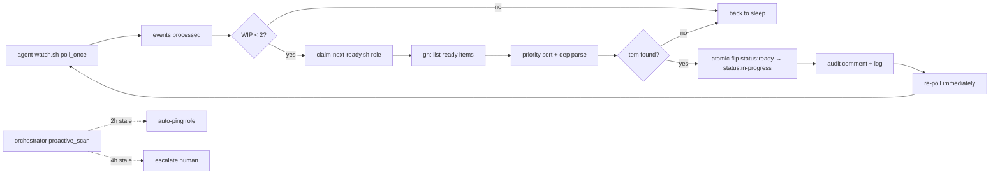
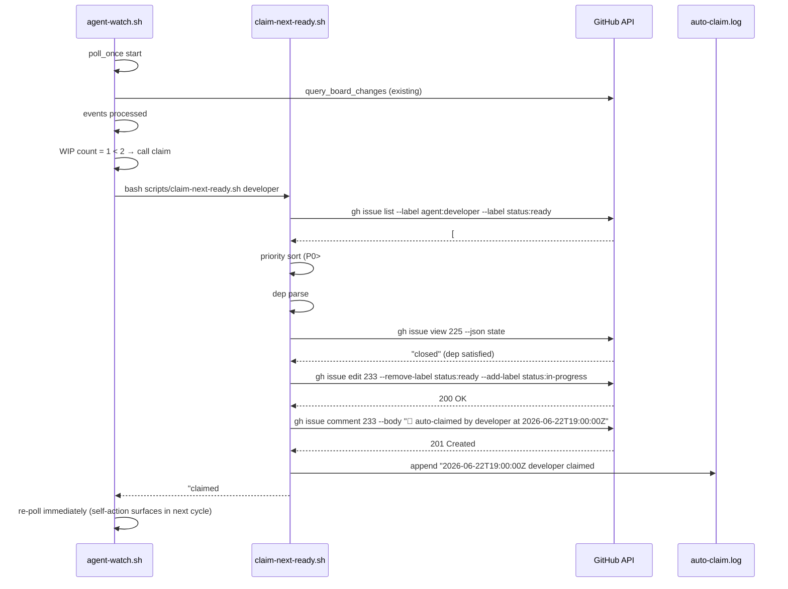

# Design: AUTO-CLAIM-PROTOCOL — agents self-claim highest-priority ready item when WIP < 2

- **Story / Issue**: #271 (P1 doctrine gap, "no initiative" pattern)
- **Author**: @architect
- **Date**: 2026-06-22
- **Status**: Proposed (architect review)
- **ADR**: [ADR-0038](../decisions/ADR-0038-auto-claim-protocol.md) (companion, must be Accepted before this design ships)
- **Related**: Issue #222 (RCA-19, family), ADR-0002 (autonomy loop), ADR-0012 (4-cat invariant), ADR-0031 (owner-override), ADR-0036 (status-transition wake, sister), TD-011 (PM issue-level events — separate gap), TD-023 (multi-repo watcher — separate gap)

## Context

The autonomy loop (ADR-0002) is **event-driven**, not **claim-driven**. When an agent receives `issue_assigned` for a `status:ready` item and decides "not now", no re-fire happens — the item sits in queue indefinitely until external nudge (Telegram ping, human chat). Issue #222 (RCA-19, dev idle 8h 42min on 2026-06-22) is the canonical observed instance: 3 ready items in dev queue, watcher heartbeat FRESH (107s), but no claim activity. This design closes the gap.

## Goals & non-goals

**Goals**:
- Agent self-claims highest-priority `status:ready` item when WIP < 2, distributed (no orchestrator bottleneck)
- Dependency-aware: skip items blocked by open predecessors
- Auditable: per-issue comment + central log file
- Reversible: soul patch can be reverted; script can be disabled
- Failsafe: orchestrator detects when claim should have fired but didn't (Layer 3 stale detection)

**Non-goals**:
- No auto-claim across roles (each agent only claims its own `agent:<role>` items)
- No priority override mechanism (YAGNI — agent deprioritization is a slippery slope)
- No template-repo auto-claim in Phase 1 (Phase 2 port per Issue #271)
- No fix for TD-011 (PM issue-level events) or TD-023 (multi-repo watcher) — separate gaps

## High-level diagram



## Components

| Component | Responsibility | Owner | Tech |
|---|---|---|---|
| Soul patch | Trigger condition (after events, WIP<2 → call claim) | @atilcan65 (human-only) | markdown |
| `scripts/claim-next-ready.sh` | Atomic claim helper (priority sort, dep parse, WIP cap, flip, audit) | @developer | bash |
| `scripts/agent-watch.sh` integration | `poll_once` calls claim helper after events; re-polls on success | @developer | bash (extends existing) |
| `scripts/tests/d031-auto-claim.sh` | 4 mandatory TCs + 1 negative | @tester | bash |
| Orchestrator `stale_ready_queue` detection | Failsafe: detect when claim should have fired but didn't | @orchestrator (Sprint 5+) | bash (extends `proactive-board-scan.sh`) |

## Data model

No schema changes. New audit log file:

```bash
/var/log/dev-studio/${PROJECT}/auto-claim.log
# Format: ISO-8601-timestamp role claimed #N (WIP=N/2)
# Example: 2026-06-22T19:00:00Z developer claimed #233 (WIP=1/2)
```

Append-only, no rotation (matches `status-flips.log` per ADR-0036 Part C).

## API contract (script)

```bash
# scripts/claim-next-ready.sh <role>
# Atomic claim helper for any role.
# Exit codes:
#   0 = claim succeeded (issue #N flipped to status:in-progress + audit log written)
#   1 = nothing to claim (no status:ready items, or all blocked by deps)
#   2 = invalid role argument
#   3 = WIP limit reached (>=2 status:in-progress items already)
#   4 = gh API error (network/auth)

# Examples:
$ bash scripts/claim-next-ready.sh developer
claimed #233 (WIP=1/2)
$ echo $?
0
$ bash scripts/claim-next-ready.sh developer
nothing to claim
$ echo $?
1
```

## Sequence diagram (happy path)



## Alternatives considered

| Option | Pros | Cons | Verdict |
|---|---|---|---|
| A) Status quo + better soft-pings | No code change | Issue #222 showed this doesn't work (8h 42min idle) | ❌ Reject |
| B) Orchestrator manually assigns + tracks WIP | Centralized control | Doesn't scale; orchestrator is already overloaded | ❌ Reject |
| C) Auto-claim protocol (this design) | Addresses root cause; distributed; layered; reversible | Auto-claim could grab wrong item; mitigated by dep parser + WIP cap | ✅ **Accept** |
| D) Auto-claim with override-able priority | More flexible | More complex; agent deprioritization is a slippery slope | ❌ Defer (YAGNI) |

## Risks

| # | Risk | Mitigation |
|---|---|---|
| 1 | Auto-claim grabs wrong item (priority sort misses context) | (a) WIP cap=2 limits damage; (b) agent can deprioritize via `cc:developer` flip (workaround until D-future); (c) audit log + re-poll surfaces self-action for human review |
| 2 | Soul patch not applied (owner gate slips) | (a) Layer 3 orchestrator detection pings role on stale queue; (b) explicit check in `d031-auto-claim.sh` TC-5 verifies soul patch exists in dev workflow |
| 3 | `agent-watch.sh` integration breaks critical infra (PR #249 rebase lesson) | (a) bounded change (~15 LOC in `poll_once`); (b) JSON-quote everything per Issue #267 lesson; (c) `d031` regression covers integration |
| 4 | Dependency parser misreads body (false positive skips) | (a) conservative regex `(?i)(depends on|blocked by) #(?<n>[0-9]+)`; (b) `Refs #N` is informational, NOT a skip; (c) d031 TC-3 covers both directions |
| 5 | Audit log file grows unbounded | (a) append-only, no rotation initially; (b) owner can add logrotate later if file size becomes issue (deferred YAGNI) |
| 6 | WIP cap=2 too restrictive for some roles (e.g., tester reviewing many PRs) | (a) cap is per-role (each role has own WIP count); (b) cap configurable via env var `WIP_LIMIT=2`; (c) Sprint 5+ review based on observed demand |

## Observability

**Metrics emitted** (via `auto-claim.log` + per-issue comment):
- `auto_claim_attempts_total{role}` — count of claim attempts
- `auto_claim_success_total{role,issue_priority}` — successful claims by role × priority
- `auto_claim_skip_total{role,reason}` — skipped claims (WIP cap, dep, none-to-claim)
- `auto_claim_p50_latency_seconds` — time from `claim-next-ready.sh` call to gh API completion

**Structured log fields** (`auto-claim.log`):
- `timestamp` (ISO-8601 UTC)
- `role` (developer|architect|product-manager|tester|orchestrator)
- `issue_number`
- `wip_count` (post-claim)
- `priority` (P0|P1|P2|P3)
- `dep_status` (none|satisfied|skipped)

**Trace span names**: `claim-next-ready.sh.execute`, `gh.issue.list`, `gh.issue.edit`, `audit.append`

**Dashboard**: (deferred — Sprint 5+ if needed)

## Security & privacy

- **Authn/authz**: same as existing `gh issue edit` (repo-scoped token); no new permissions
- **PII fields**: none — only issue numbers, role names, timestamps
- **Threat model**:
  - **T1**: malicious agent claims wrong item → WIP cap=2 limits blast; orchestrator stale detection catches pattern at 2h
  - **T2**: claim script mis-execution (race condition between WIP check and flip) → mitigated by `gh issue edit` atomicity (single API call) + re-poll surfaces self-action
  - **T3**: dependency parser regex injection (issue body with malicious text) → regex is bounded (`#<digits>`), no shell eval of captured groups

## Performance budget

- **p50 latency**: <500ms (gh API dominates; 3 calls: list, view dep, edit + comment)
- **p95 latency**: <2s (worst case: 3 ready items + 1 dep + slow network)
- **Throughput**: N/A (claim runs once per poll cycle per role, not continuous)
- **Memory**: <50MB (no caching; gh CLI is the only consumer)

## d031 spec (regression test)

| # | Test | Coverage |
|---|---|---|
| 1 | 3 ready items with priorities P0/P1/P2 → P0 claimed first | priority sort |
| 2 | 2 ready items with same priority, different ages → oldest claimed | age tie-break |
| 3 | Ready item with `depends on #N` where #N is open → skipped; ready item without deps → claimed | dependency skip |
| 4 | Agent with 2 in-progress items + 1 ready → no claim (WIP limit) | WIP cap |
| 5 | Agent with 0 ready items → exit 1, no flip | negative test |

**Total: 5 TCs**.

## Open questions

- [ ] Owner approval on soul patch wording (proposed text in ADR-0038 Layer 1 spec)
- [ ] WIP cap = 2 vs 3 (current doctrine is 2 per ADR-0002; review after Sprint 5 data)
- [ ] Stale detection thresholds (2h/4h initial guess; configurable via env var)

## Estimated complexity

- **T-shirt size**: **M** (multi-layer, multi-role, multi-component, ~95 LOC total)
- **Confidence**: 75% (soul patch + audit log + dep parser are well-understood; integration with `agent-watch.sh` has 1 unknown — re-poll semantics; d031 TCs are concrete)

## Sprint 4 commitment (revised)

| Role | SP | Scope | Fits Sprint 4 EOD? |
|---|---|---|---|
| **Architect** (me) | 0.5 | This design doc + ADR-0038 + INDEX update — **DONE in this PR** | ✅ |
| **Developer** | 1.5 | claim-next-ready.sh (~80 LOC) + agent-watch.sh integration (~15 LOC) + d031 (5 TCs) | ❌ (slips Sprint 5 unless prioritized) |
| **Tester** | 0.5 | d031 sign-off | ❌ (depends on dev) |
| **Human** | 0.25 | soul patch to 4 agent docs | ❌ (owner-gated, fast) |
| **Orchestrator** (Sprint 5+) | 0.5 | stale_ready_queue detection | ❌ (Phase 1 deferral) |
| **Total Phase 1** | **3.25 SP** | | |

**Sprint 4 EOD 2026-06-22T24:00Z — only the architect scope fits.** Owner can prioritize dev + tester if Sprint 5 has bandwidth; otherwise full impl lands Sprint 5.

## References

- Issue #271 (P1 doctrine gap, this design's parent)
- Issue #222 (RCA-19 dev idle 8h 42min, family)
- ADR-0002 (autonomy loop, polling cadence, WIP limit doctrine)
- ADR-0012 (4-cat label invariant)
- ADR-0031 (owner-override — soul patch is owner-gated)
- ADR-0036 (status-transition wake — sister fix for orchestrator's flip signal)
- TD-004 (silent label-flip failure — mitigated by single-call atomic flip)
- TD-011 (PM `agent-watch.sh` issue-level events — related, separate gap)
- TD-023 (multi-repo watcher — separate gap)
- Issue #267 (JSON-quote cmd_set — agent-watch.sh integration must apply this lesson)
- Issue #221 (auto-ping dual-channel — same "informational vs directive" root cause class)
- File ownership matrix (`.claude/` human-only, `scripts/` developer territory, `.github/workflows/` human-only)
