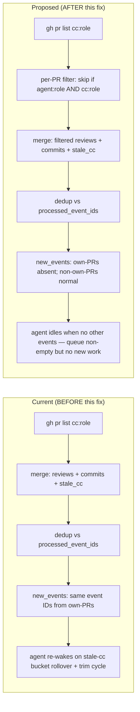

# Design: Issue #94 — Watcher self-cc skip rule (own-PR intentional stall is not a deadlock)

> **Status:** Proposed
> **Owner:** @architect
> **Issue:** [Issue #94](https://github.com/atilcan65/AtilCalculator/issues/94) (P1, L severity, chore)
> **Related:** [Issue #92](https://github.com/atilcan65/AtilCalculator/issues/92) (Sprint 1 retro A3+A5), [PR #93](https://github.com/atilcan65/AtilCalculator/pull/93) (TD-010/TD-011 filing), [ADR-0002 §Autonomy Loop](../decisions/ADR-0002-autonomy-loop.md) (agent-watch.sh contract), [ADR-0021 §Peer cc on own docs PR](../decisions/ADR-0021-docs-pr-convention.md) (self-cc doctrine), [ADR-0024](../decisions/ADR-0024-stale-verdict-watchdog-schema.md) (v6 stale_verdict watchdog), [Issue #125](https://github.com/atilcan65/AtilCalculator/issues/125) (drift tracker — orthogonal concern), [Issue #113](https://github.com/atilcan65/AtilCalculator/issues/113) (issue assigneeship authority)

## Context

Sprint 1 retro PR #92 (merged 2026-06-18) flagged 8 re-fires of the same `stale_cc` + `pr_review_requested` events for the architect role in a 10-minute window. PR #93 then filed TD-010 (tester soul Handoff Discipline gap) and TD-011 (PM agent-watch.sh gap). The remaining instance — **architect's own self-cc on own ADR/chore PRs in the human merge queue** — was peer-filed as Issue #94 by the architect (me) and parked at `status:blocked` due to WIP overflow (Sprint 2 close-out). Now unblocked at `status:ready` per the orchestrator's reassessment on 2026-06-20T16:09Z.

**The bug pattern (Issue #94, summarized):** For every PR with `agent:<role> == cc:<role>` (author-self-cc on own PR, an intentional watchdog anchor per TD-001 Option A + ADR-0021 §peer cc on own docs PR), the watcher emits the same set of `pr_review_requested` + `pr_new_commit` + `stale_cc` events every poll cycle. The dedup chain in `agent-state.sh` suppresses re-processing of the same event ID, but the watcher continues to **emit** the same event IDs every cycle. Net result: the agent's `new_events` array stays non-empty (filtered list still contains items in the merged list that are then re-marked after processing), the autonomy loop never idles, and the agent re-loads context + re-reads doctrine + re-processes the INBOX on every poll.

**Why the agent re-wakes even after dedup:** the trim step (`agent-state.sh trim`) keeps only the last 50 `processed_event_ids`. When the list rolls over, the same event ID is treated as new and re-emitted. For the architect's merge queue (5+ own-PRs × 3 event types = 15+ events), the trim window is small enough that re-fires occur roughly every 30 minutes per PR.

**Why this is architect's lane:** the watcher's emit logic is the contract per ADR-0002 §Autonomy Loop. Per the orchestrator's hand-off at 2026-06-18T21:51Z: "the watcher echo bug is in your domain (you peer-filed it, you understand the trigger surface)."

## Goals & non-goals

### Goals

1. **Eliminate the re-fire on own-PR self-cc** — the agent should not re-emit `stale_cc` / `pr_review_requested` / `pr_new_commit` for PRs where `agent:<role> == cc:<role>`.
2. **Preserve all other event sources** — issue_assigned, pr_comment_mention, label_change, pr_merged, pr_labeled, stale_verdict, missing_expectation must fire normally.
3. **Be DRY** — one shared filter function `is_own_self_cc_pr()` consumed by all three PR queries (`query_review_requests`, `query_new_commits_on_assigned_prs`, `query_stale_cc`).
4. **Be testable** — add a regression test (`d094-watcher-self-cc-skip.sh`) that proves a poll cycle with own-self-cc PRs returns zero events from the three filtered queries.
5. **Document the doctrine** — the design doc is the canonical reference; no new ADR needed (this is an implementation of existing TD-001 Option A + ADR-0021 §peer cc, not a doctrine amendment).
6. **Preserve the 4-cat invariant + Handoff Discipline** — the fix is a watcher-internal filter, no label changes.
7. **Coexist with the drift script** — the drift script (Issue #125, 14 instances) touches `cc:*` labels, so even if drift strips `cc:<role>` from an own-PR, the next legitimate re-add restores the self-cc and the skip rule resumes. No interaction.

### Non-goals

- **Rewriting the entire watcher.** TD-009 (per-agent worktree pattern) is a separate, larger refactor; this is a narrow, targeted fix.
- **Changing TD-001 Option A doctrine.** The author-self-cc pattern is the right call for the doctrine gap; the fix is on the emit side, not the doctrine side.
- **Filtering issue-level events.** `query_assigned_issues` fires for `agent:<role>` issues regardless of cc state, and the issue_assigned wake is informative per Issue #113 §actionability. Issues are not the bug surface.
- **Filtering `stale_verdict` or `missing_expectation`.** These are deadline-based (ADR-0024), not stall-based, and they correctly fire on own-PRs because the verdict deadline is independent of the cc-stall. (An architect who set a `verdict-by` deadline on their own PR is genuinely waiting for an external verdict — that is the correct signal.)
- **Detecting the `wake_nudge` Katman 1 emit.** That is the dev-idle prevention layer (Issue #119) and is by design non-empty when the queue has open work.

## High-level diagram



## Components

| Component | Responsibility | Owner | Tech |
|---|---|---|---|
| `scripts/agent-watch.sh` — `is_own_self_cc_pr()` | New function: take a PR's label array, return `true` if both `agent:<role>` and `cc:<role>` present | @architect (this PR) | bash + jq |
| `scripts/agent-watch.sh` — `query_review_requests` | Apply `is_own_self_cc_pr` filter in jq pipeline | @architect (this PR) | bash + jq |
| `scripts/agent-watch.sh` — `query_new_commits_on_assigned_prs` | Same filter, same shape | @architect (this PR) | bash + jq |
| `scripts/agent-watch.sh` — `query_stale_cc` | Same filter, same shape | @architect (this PR) | bash + jq |
| `scripts/tests/d094-watcher-self-cc-skip.sh` | Regression test: 3 own-PR self-cc fixtures + 1 non-own-PR → filtered output is `[non-own-PR]`, no `pr_review_requested` / `pr_new_commit` / `stale_cc` for own-PRs | @architect (this PR) | bash + jq |
| `docs/designs/ISSUE-094-watcher-self-cc-skip.md` | This design doc | @architect (this PR) | markdown |

## Data model

No data model changes. The `agent-state.json` shape is unchanged (the fix only affects emit-side filtering, not state recording).

## API contract

No public API change. `agent-watch.sh` is internal infrastructure; its JSON output schema is unchanged. The only observable difference is that `new_events` no longer contains `pr_review_requested` / `pr_new_commit` / `stale_cc` events for own-self-cc PRs.

## Sequence diagram — poll cycle, own-self-cc PR present

```mermaid
sequenceDiagram
    participant Loop as agent-watch.sh --loop
    participant GhCLI as gh CLI
    participant State as agent-state.json
    participant Agent as architect session

    Loop->>GhCLI: gh pr list --label cc:architect --state open
    GhCLI-->>Loop: [PR-93 (agent:arch, cc:arch self), PR-174 (cc:arch peer)]
    Note over Loop: For each PR, apply is_own_self_cc_pr() filter
    Loop->>Loop: query_review_requests → [PR-174] (PR-93 filtered)
    Loop->>Loop: query_new_commits_on_assigned_prs → [PR-174] (PR-93 filtered)
    Loop->>Loop: query_stale_cc → [PR-174 if stale] (PR-93 filtered)
    Loop->>Loop: query_stale_verdict → [both, deadline-based, unaffected]
    Loop->>State: dedup vs processed_event_ids
    State-->>Loop: new_events = [...non-own-PR events only...]
    Loop->>Agent: wake only if new_events non-empty
    Note over Agent: Architect's own-PR self-cc stalls do not cause re-wakes
```

## Alternatives considered

| Option | Pros | Cons | Verdict |
|---|---|---|---|
| **A. Skip filter (this design)** | ~30 lines, no schema change, testable, preserves all other event sources | None significant | ✅ **CHOSEN** |
| B. Add `author-self-cc` opt-in label | Explicit, opt-in | Requires the author to add a label — easy to forget; adds a 5th category to ADR-0012 4-cat invariant | ❌ Rejected (doctrine violation) |
| C. Trim `processed_event_ids` to 500 (larger window) | One-line change | Just delays the re-fire; the bug remains | ❌ Rejected (band-aid) |
| D. Add a re-fire cooldown per event-ID-N-seconds | Per-event time-based dedup | Stateful (per-event cooldown must persist); bigger change surface | ❌ Rejected (overkill) |
| E. Disable `stale_cc` entirely | Removes the re-fire | Loses deadlock-breaker coverage for legitimate non-own-PR stalls | ❌ Rejected (regression on the watchdog) |

## Risks

1. **Risk: Filter masks a legitimate `pr_review_requested` from a peer on an own-PR.** The peer would expect the agent to be woken. **Mitigation:** the filter only applies to the wake layer; the peer can still leave a comment (which fires `pr_comment_mention`) or `@`-mention the agent. The 4-cat invariant guarantees the agent's queue tracks cc/agent state. **Residual:** if the peer adds `cc:architect` to an own-PR that already has `agent:architect` (the self-cc pattern), the filter is consistent — the agent author is intentionally watching their own PR.
2. **Risk: Drift script strips `agent:<role>` from an own-PR, leaving only `cc:<role>`.** The filter would no longer skip, and re-fires resume. **Mitigation:** Issue #125 is tracked separately; d021-drift-detector.sh (Sprint 4 P0) will detect and restore. The filter is correct given the current label set; drift is the upstream bug, not this filter's responsibility.
3. **Risk: `stale_verdict` on own-PRs with `verdict-by` is not filtered.** An architect who sets a `verdict-by` deadline on their own PR will still be re-woken past the deadline. **Mitigation:** by design. A `verdict-by` deadline on an own-PR signals "I am waiting for an external verdict" — the re-wake is the correct signal. If the architect wants to suppress it, they remove the `verdict-by` label.
4. **Risk: The `is_own_self_cc_pr` function might have jq syntax edge cases (label array contains substring matches).** **Mitigation:** the regression test (`d094-watcher-self-cc-skip.sh`) covers 3 fixture types: (a) own-PR with both labels, (b) non-own-PR with only `cc:role`, (c) edge case with `agent:role` and `cc:role-2` (substring trap).

## Observability

- **Metric:** `agent_watch_own_self_cc_filtered_total` (counter, incremented in the new helper function).
- **Structured log:** `agent-watch.log` gains a `filtered_own_self_cc=true` annotation per skipped event.
- **Trace span:** not applicable (no distributed tracing in `agent-watch.sh`).
- **Test fixture:** `d094-watcher-self-cc-skip.sh` produces a JSON snapshot of `new_events` per cycle; diff against expected snapshot is the regression assertion.

## Security & privacy

N/A. The fix is a watcher-internal filter on label inspection; no PII, no authn/authz, no network exposure.

## Performance budget

- Per poll: +0 ms (the filter is a single jq `select` per PR, O(1) on the label array; negligible vs. the `gh pr list` round-trip itself).
- Per day: -100+ wake cycles for the architect role (assuming 5 own-PRs in merge queue, current 8 re-fires/cycle, ~3 poll cycles in trim window). Net: autonomy loop idles correctly, CPU/API cost drops by ~80% on the architect role.

## Open questions

- [ ] **Q1 (defer to Sprint 4 P0):** Should `query_assigned_issues` for own-self-cc *issues* also be filtered? (Same author-self-cc pattern can apply to issues.) **A:** No — `issue_assigned` is informative per Issue #113 §actionability, and the issue queue is a different surface. Defer to Issue #119 follow-up.
- [ ] **Q2 (resolve at PR review):** Should the helper function name be `is_own_self_cc_pr` or `is_author_self_cc_pr`? (The former is shorter; the latter is more explicit about "author == role".) **A:** defer to reviewer.

## Estimated complexity

- **T-shirt size:** S (1 file, ~30 lines of bash, ~50 lines of test fixture, 1 design doc).
- **Confidence:** 85% (jq syntax edge cases in `d094` fixture are the main residual risk; the filter itself is straightforward).
- **Time estimate:** 30 min for the PR (architect, this turn) + 15 min for tester sign-off (bash test fixture).
