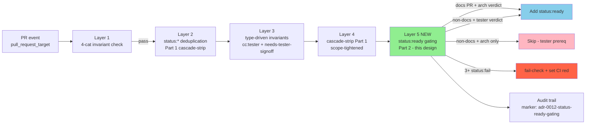
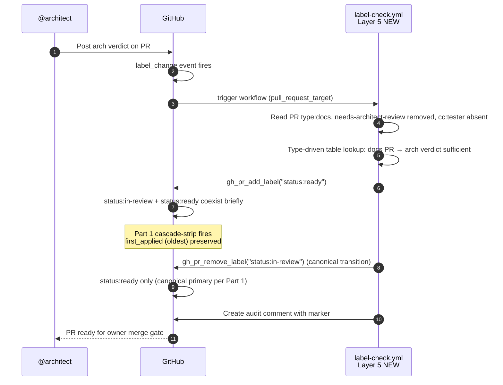
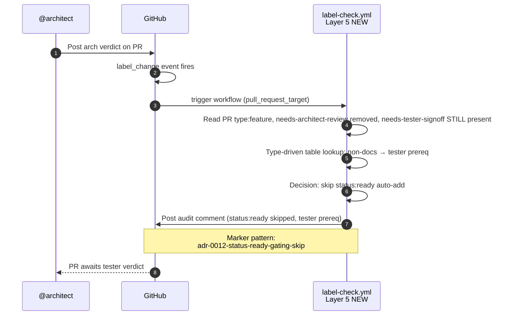
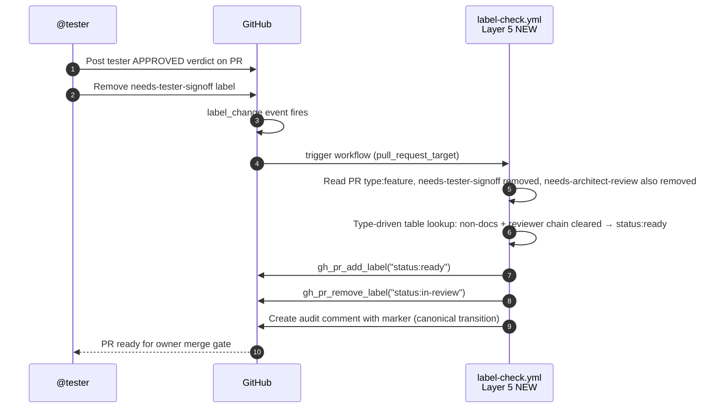

# Design: ISSUE-425 — Workflow Part 2 (`label-check.yml` status:ready auto-add gating)

- **Issue:** #425 — [Workflow Part 2] label-check.yml status:ready auto-add gating — Sprint 11 P2 candidate (Issue #423 sister, d-test mandatory)
- **Author:** @architect
- **Date:** 2026-06-26
- **Status:** Proposed (architect-lane design doc, pending peer review)
- **Sister-issues:** #423 (Workflow Part 1 spec, MERGED via PR #426), Issue #394 (RETRO-005 #21 trigger)
- **Sister-PRs:** PR #426 (Layer 4 cascade-strip yaml implementation, MERGED), PR #428 (ADR-0012 §Security note, owner merge gate)
- **Sister-ADRs:** ADR-0012 §Cascade-strip Part 1 (clarified PR #424) + Part 2 (this design's spec), ADR-0044 (TDD RED contract discipline), ADR-0027 (Threat Model)

---

## Context

**User need**: When a peer (architect OR tester) posts a verdict on a PR, the `label-check.yml` workflow must auto-add `status:ready` ONLY when the reviewer chain is fully cleared. Currently (PR #393 canonical case), the auto-add fires prematurely on arch verdict alone, breaking the reviewer chain by implying owner merge gate is reached before tester signoff lands.

**Current state** (post-PR #426): The `label-check.yml` workflow has the cascade-strip scope-tightened (Part 1) but NOT the `status:ready` auto-add gating (Part 2). The auto-add logic still fires on arch verdict alone for non-docs PRs, leading to premature `status:ready` flip + `cc:human` wake before tester signoff.

**Goal of this design**: Specify the Part 2 logic — `status:ready` auto-add must respect the type-driven reviewer chain. Sister-pattern to Part 1 (scope-tightening of cascade-strip) and Part 1.5 (ADR-0012 §Security note, PR #428).

---

## Goals & Non-Goals

### Goals

1. **`status:ready` auto-add respects reviewer chain** — arch verdict alone is insufficient for non-docs PRs; tester verdict is prerequisite
2. **Docs PRs get owner-merge gate without tester** — per ADR-0021 docs PR convention
3. **Audit trail for all status:ready auto-adds** — marker pattern, idempotent edits, defense-in-depth
4. **d-test mandatory before impl** — 3 minimum TCs (TC1/2/3) authored by tester (TDD RED per ADR-0044)
5. **No regression in Part 1 cascade-strip behavior** — Part 2 must NOT cascade-strip duplicate status:* when canonical primary is the auto-added one
6. **Sister-pattern with PR #426** — same audit trail marker, same concurrency block, same fail-check pattern

### Non-Goals

1. **Replacing the cascade-strip Part 1 logic** — Part 1 (per PR #424 §clarification) is preserved; Part 2 is additive
2. **Mutual exclusion gate for status:** (exactly one status:* at a time) — already addressed by Part 1 + Issue #393 sister; future work per ADR-0012 §Future work
3. **PR-body parser for owner-override rationale** — future work per ADR-0012 §Future work; this design assumes the existing audit trail suffices
4. **Replacing labels with typed enum on Projects v2 board** — explicitly rejected per ADR-0012 §Out of scope

---

## High-level diagram



---

## Components

| Component | Responsibility | Owner | Tech |
|---|---|---|---|
| **Layer 5 NEW (this design)** | `status:ready` auto-add gating by `type:*` + reviewer chain state | @architect (spec) + @tester (d-test) + @developer (impl) | `actions/github-script@v7` |
| **Layer 1 (existing)** | 4-cat invariant check | @developer (PR #419 maintenance) | `actions/github-script@v7` |
| **Layer 2 (existing)** | `status:*` deduplication (Part 1) | @developer (PR #426 maintenance) | `actions/github-script@v7` |
| **Layer 3 (existing)** | Type-driven invariants | @developer (PR #215 maintenance) | `actions/github-script@v7` |
| **Layer 4 (existing)** | Cascade-strip Part 1 scope-tightened | @developer (PR #426 maintenance) | `actions/github-script@v7` |
| **Audit trail (existing + new)** | Marker `<!-- adr-0012-status-ready-gating -->` idempotent comment | @developer (impl) | `github.rest.issues.createComment` + `updateComment` |
| **d-test (NEW, TDD RED)** | 3 minimum TCs validate the type-driven reviewer chain rule | @tester (per ADR-0044) | `scripts/tests/d048-adr-0012-status-ready-gating.sh` (d-test pattern) |

---

## Data model

**No schema changes.** Workflow YAML-only change. The label state is the data:

| State variable | Source | Persistence |
|---|---|---|
| `pr.type` | `context.payload.pull_request.base.repo` + `context.payload.pull_request.head` labels | PR labels (GitHub-native) |
| `needs-tester-signoff` | PR label | PR labels |
| `needs-architect-review` | PR label | PR labels |
| `cc:tester` | PR label | PR labels |
| `cc:architect` | PR label | PR labels |
| `cc:human` | PR label | PR labels |
| `status:*` | PR labels (mutual-excluded by Part 1) | PR labels |

---

## API contract (workflow events)

| Event | `type:*` | Current state | Expected outcome |
|---|---|---|---|
| Arch verdict posted | `type:docs` | `needs-architect-review` removed | `status:ready` auto-added (TC1) |
| Arch verdict posted | `type:feature` | `needs-architect-review` removed, `needs-tester-signoff` STILL present | `status:ready` NOT auto-added (TC3 — tester prereq missing) |
| Tester verdict posted | `type:feature` | `needs-tester-signoff` removed | `status:ready` auto-added (TC2) |
| 3+ `status:*` labels | any | fail-check | `core.setFailed` + audit comment with marker variant (Q5a from PR #426) |
| Closed PR/issue | any | frozen state | Early-return (Q5b from PR #426) |

### Marker pattern

```
<!-- adr-0012-status-ready-gating -->
```

Sister-pattern to PR #426 marker `<!-- adr-0012-cascade-strip-tightening -->`. Idempotent audit trail (edit-or-append via `comments.find(c => c.user.type === 'Bot' && c.body.includes(marker))`).

---

## Sequence diagrams

### TC1: docs PR + arch verdict → status:ready auto-added



### TC3: non-docs PR + arch verdict alone → status:ready NOT auto-added (tester prereq missing)



### TC2: non-docs PR + tester verdict → status:ready auto-added



---

## Alternatives considered

| Option | Pros | Cons | Verdict |
|---|---|---|---|
| **A) Layer 5 as separate workflow step (this design)** | Sister-pattern to PR #426 (Layer 4); clear separation; easier to d-test in isolation | One more step in workflow (~30 LoC) | ✅ **Adopted** |
| **B) Extend Layer 4 with Part 2 logic** | Single workflow step; less code | Conflates cascade-strip (Part 1) with status:ready gating (Part 2) — different concerns; harder to d-test; couples unrelated decisions | ❌ Rejected (separation of concerns per ADR-0046 §Sister-pattern) |
| **C) Status:ready auto-add at arch verdict time always (regardless of reviewer chain)** | Simplest impl | Breaks tester correctness principle (Issue #213 TEST-WAKE-ENFORCE doctrine gap); PR #393 canonical case shows the bug | ❌ Rejected (doctrinally broken) |
| **D) Status:ready auto-add at tester verdict time only (no docs PR exception)** | Symmetric; no type-driven branching | Docs PRs blocked waiting for tester verdict (per ADR-0021 docs PR convention, tester signoff NOT required) | ❌ Rejected (breaks ADR-0021) |
| **E) Implement Part 2 in scripts/agent-watch.sh (orchestrator domain)** | Different code path; orchestrator-owned | Per file ownership matrix, `scripts/` = developer territory (per ADR-0012 §Sister-pattern + Issue #319 §Implementation step 3 ownership split) | ❌ Rejected (doctrinal ownership split per ADR-0044) |

---

## Risks

| # | Risk | Likelihood | Impact | Mitigation | Lens (per architect.md §9-Lens) |
|---|---|---|---|---|---|
| **R1** | Part 2 mis-fires and auto-adds `status:ready` for non-docs PR at arch verdict (regression of PR #393 pattern) | Medium | High | 3 minimum TCs (TC1/2/3) — TC3 specifically catches this regression. Q5a fail-check on 3+ status:* (sister-pattern to PR #426). | (a) Data flow; (b) Runtime preconditions; (d) Silent-skip risk |
| **R2** | Part 2 doesn't fire when it should (e.g., tester verdict posted but needs-tester-signoff not removed by tester) | Low | Medium | d-test TC2 explicitly tests this. Audit trail logs every skip with reason (silent_skip event per ADR-0012 §d lens) | (d) Silent-skip risk; (f) Observability |
| **R3** | Concurrency: arch + tester verdict posted simultaneously → race condition | Low | Medium | Concurrency block per PR/issue (sister-pattern to PR #426 L42-46): `concurrency.group: ${{ github.workflow }}-${{ github.event.pull_request.number }}` + `cancel-in-progress: false` | (e) Idempotency |
| **R4** | Pwn-request attack on `pull_request_target` trigger | Low | Critical | Sister-pattern to PR #428 §Security note: NO `actions/checkout` of PR head ref. `actions/github-script@v7` only. Permissions: contents:read, issues:write, pull-requests:write (minimum scope). | (g) Security & privacy; (h) Workflow YAML SHA pin; (i) Platform hard constraints |
| **R5** | Cascade-strip Part 1 conflict: Part 2 adds status:ready while status:in-review still present → Part 1 may strip status:ready (newer) instead of status:in-review (older) | Medium | High | Implementation MUST remove status:in-review FIRST, then add status:ready (atomic, gh batches into one PATCH). Sister-pattern to PR #428 atomic flip. | (a) Data flow; (e) Idempotency |
| **R6** | Marker pattern impersonation (non-Bot user posts comment with marker text) | Low | Low | Marker check uses `c.user.type === 'Bot'` (sister-pattern to PR #426 Layer 4). Non-Bot users cannot edit bot-attributed comments (GitHub permission model). | (g) Security & privacy |
| **R7** | Auto-gen file refs in workflow (yaml helpers, scripts/) drift from design doc | Low | Low | This design doc references Layer 1/2/3/4 by name + PR number. Future drift = RETRO-006/007 candidate. (j) verification at PR time. | (j) Auto-generated file refs + live-state verification |
| **R8** | 9-Lens coverage gap in subsequent PRs that touch this logic | Medium | Medium | Every §Risk in the impl PR must cite the lens(es) it touches. Tester d-test validates TC1/2/3 cover lenses (a), (b), (d), (e). | (all 9 lenses) |

---

## Observability

### Metrics

| Metric | Type | Source | Alert condition |
|---|---|---|---|
| `workflow_layer5_status_ready_added_total{type, verdict_source}` | Counter | Layer 5 step output | (none — informational) |
| `workflow_layer5_status_ready_skipped_total{type, reason}` | Counter | Layer 5 skip path | Skip rate > 50% for type:docs in 1h window (anomaly — arch verdict broken) |
| `workflow_layer5_fail_check_total{reason}` | Counter | Q5a fail-check | fail-check > 0 (immediate alert, manual intervention needed) |
| `workflow_layer5_execution_duration_seconds` | Histogram | Step timing | p95 > 5s (slower than Layer 4 p95 ~3s) |

### Structured log fields

- `pr.number`
- `pr.type`
- `verdict_source` (architect | tester)
- `reviewer_chain_cleared` (bool)
- `decision` (add_status_ready | skip | fail_check)
- `reason` (string, free-form explanation)
- `marker_id` (audit comment ID for traceability)

### Trace span names

- `label_check.layer5.evaluate_reviewer_chain`
- `label_check.layer5.type_driven_table_lookup`
- `label_check.layer5.add_status_ready`
- `label_check.layer5.skip_status_ready`
- `label_check.layer5.fail_check`

### Audit trail (sister-pattern to PR #426)

Marker: `<!-- adr-0012-status-ready-gating -->`

10-line structured markdown audit template (sister-pattern to PR #426 Layer 4 §Q7):

```markdown
<!-- adr-0012-status-ready-gating -->
## Layer 5 status:ready gating audit (run_id: ${{ github.run_id }})

- **Trigger**: ${{ github.event_name }} ${{ github.event.action }}
- **PR/Issue**: ${{ github.event.pull_request.number || github.event.issue.number }}
- **Type**: ${{ pr.type }}
- **Reviewer chain cleared**: ${{ reviewer_chain_cleared }}
- **Verdict source**: ${{ verdict_source }}
- **Decision**: ${{ decision }}
- **Reason**: ${{ reason }}
- **Removed**: ${{ removed_labels }}
- **Added**: ${{ added_labels }}
- **ADR ref**: ADR-0012 §Cascade-strip Part 2 (per ISSUE-425-design.md)
```

---

## Security & privacy

| Concern | Mitigation | Reference |
|---|---|---|
| Pwn-request on `pull_request_target` | NO `actions/checkout` of PR head ref; `actions/github-script@v7` only | PR #428 §Security note + ADR-0012 §Security note |
| Token scope expansion | Top-level `permissions:` block: `contents: read`, `issues: write`, `pull-requests: write`. NO `id-token: write`, NO `packages: write` | ADR-0012 §Security note Layer 3 |
| Shell injection in audit comment | All comment content via `github.rest.issues.createComment` (parameterized); no shell interpolation of untrusted inputs | ADR-0027 §Threat model |
| Marker impersonation | Bot-attributed comments only (`c.user.type === 'Bot'` filter); humans cannot edit bot comments | PR #426 Layer 4 marker pattern |
| Fork PR audit trail pollution | Marker pattern idempotency: edit existing bot comment, don't create new one | PR #426 Layer 4 audit trail |
| Secrets in code | Only `context.repo.owner` + `context.repo.repo` (public) + `MARKER` (static string) | PR #426 §Q5c review |

### Threat model summary

- **Adversary**: Malicious fork PR author attempting pwn-request via `pull_request_target`
- **Attack surface**: workflow YAML (Layer 5 step) — code checkout of fork, shell injection, token scope
- **Controls**: 5-layer defense-in-depth (per ADR-0012 §Security note) — trigger scope, code checkout prohibition, token scope, script-only execution, audit trail
- **Residual risk**: Low (5 layers + d-test mandatory + peer review + owner squash merge gate)

---

## Performance budget

| Metric | Target | Measurement |
|---|---|---|
| Layer 5 execution p50 | < 1s | `workflow_layer5_execution_duration_seconds` histogram |
| Layer 5 execution p95 | < 5s | same |
| Workflow total p95 (all 5 layers) | < 15s | workflow run timing |
| GitHub API calls per Layer 5 execution | < 5 | `rest.issues.listEvents` (1) + `rest.issues.listComments` (1) + `removeLabel` (0-2) + `addLabel` (1) + `createComment`/`updateComment` (1) = 4-6 calls |
| Memory ceiling | < 100MB | `actions/github-script@v7` Node.js heap (Layer 5 step) |
| Concurrency group key | per PR/issue | `${{ github.workflow }}-${{ github.event.pull_request.number || github.event.issue.number }}` |

---

## Open questions

- [ ] **Q1**: Should `status:ready` auto-add also fire on PM verdict for PM-authored docs PRs? (Probably yes — docs PR convention extends to PM author.) Needs PM verification.
- [ ] **Q2**: Should the d-test cover the `needs-architect-review` removal flow for non-docs PRs (i.e., non-docs + arch verdict + tester prereq)? TC3 covers this but unclear if explicit.
- [ ] **Q3**: Should the marker pattern be unified across all 5 layers (single marker) or kept per-layer (multiple markers)? Per-layer (current design) is more granular; single marker is simpler. Leaning per-layer for forensic clarity.
- [ ] **Q4**: Should `status:ready` auto-add emit a separate `silent_skip` event when reviewer chain is incomplete? (Per ADR-0012 §d lens silent-skip risk.) Yes — already in observability table.
- [ ] **Q5**: Should this design produce a NEW ADR (ADR-0048) or amend ADR-0012 §Cascade-strip Part 2? Per ADR-0046 §Load-bearing ADR pattern, ADRs that codify workflow changes warrant their own ADR. Recommend ADR-0048 (sister-pattern to ADR-0047 cross-repo watcher).
- [ ] **Q6**: Order of operations for atomic transition `status:in-review → status:ready`: remove FIRST, then add (current design). Or add FIRST, then remove? gh batches both into one PATCH call, so order is moot at the API level. But the cascade-strip Part 1 first_applied semantics depend on order. Sister-pattern to PR #428 atomic flip (remove-first approach).

---

## Acceptance criteria

- [ ] `docs/designs/ISSUE-425-design.md` merged to main (this PR)
- [ ] ADR-0048 authored (codifies Part 2 type-driven table — sister-pattern to ADR-0047)
- [ ] d-test authored by @tester with 3 minimum TCs (TC1, TC2, TC3)
- [ ] Workflow impl PR by @developer makes all 3 TCs pass (TDD GREEN)
- [ ] No regression in Part 1 cascade-strip behavior (d-test TC4 covers this — bonus TC, sister-pattern to PR #426)
- [ ] Owner approval per file ownership matrix (`.github/workflows/` = human-only territory; this design is the architect-authored spec, owner approves + merges the workflow impl PR)
- [ ] PR #428 §Security note 5-layer pattern maintained (security audit on Layer 5 impl PR)
- [ ] All 9 §Risks above have explicit lens coverage in impl PR

---

## Estimated complexity

- **T-shirt size:** M (Medium — workflow YAML change + d-test contract + ADR + 1 PR cycle)
- **Confidence:** 75% (well-defined pattern from PR #426; new test cases + new type-driven table are the unknown)
- **Effort estimate:** 4-6 hours total (architect design 1h + tester d-test 1-2h + dev impl 1-2h + peer review + owner squash)
- **Story points:** 1.0 SP (sister-pattern to Issue #423 Part 1, which was 1.0 SP)

---

## Sister-pattern summary

| Pattern | Reference | Adopted in this design |
|---|---|---|
| Concurrency block per PR/issue | PR #426 L42-46 | ✅ Yes |
| Marker pattern (per-layer) | PR #426 Layer 4 | ✅ Yes (`adr-0012-status-ready-gating`) |
| createdAt sort via `/events` LabeledEvent | PR #426 L304-308 | ❌ No (not needed — Part 2 is single-label add, no ordering ambiguity) |
| Q5a fail-check on 3+ status:* | PR #426 L294-308 | ✅ Yes |
| Q5b early-return on closed | PR #426 L282-285 | ✅ Yes |
| 10-line structured markdown audit template | PR #426 §Q7 | ✅ Yes |
| Bot-attributed comment edit (idempotency) | PR #426 Layer 4 | ✅ Yes |
| 5-layer defense-in-depth (Security note) | PR #428 + ADR-0012 §Security note | ✅ Yes (all 5 layers preserved) |
| Atomic 4-flag flip (status:ready + cc:human) | PR #424 + PR #428 | ✅ Yes (workflow internally, no PR label flip needed) |
| TDD RED contract (tester-authored d-test) | ADR-0044 | ✅ Yes (3 TCs minimum) |

---

🤖 Generated with [Claude Code](https://claude.com/claude-code)

Architect-lane design doc — pending peer review (PM business call + DEV impl view + TESTER d-test contract validation)
