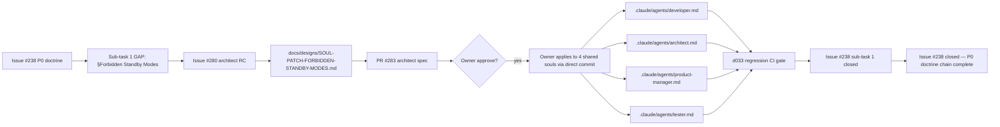
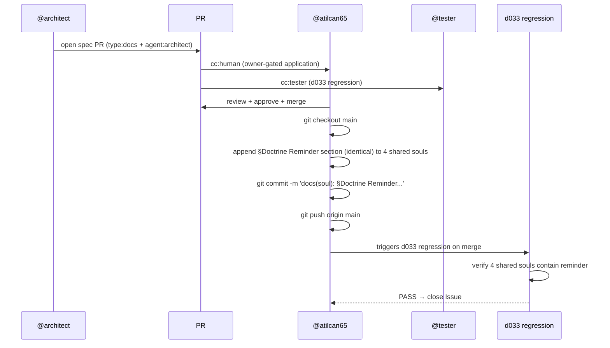

# Design: §Forbidden Standby Modes — Soul-Patch Spec for 4 Shared Souls (Issue #280)

- **Story / Issue**: #280 ([GAP] §Forbidden Standby Modes soul reminder missing in 4 shared soul files, Issue #238 sub-task 1 close-out)
- **Parent**: Issue #238 (P0 doctrine: agents self-standby on dependency)
- **Author**: @architect
- **Date**: 2026-06-22
- **Status**: Proposed (architect review)
- **Related**: Issue #238 (parent P0 doctrine), PR #242 (CLAUDE.md amendment MERGED 08:46:08Z), PR #246 (is_alive + d028 MERGED 10:04:15Z), PR #253 (original soul patch attempt CLOSED, linter revert), `.claude/CLAUDE.md §Things agents must NEVER do`, `.claude/agents/orchestrator.md §Doctrine Reminder — no self-standby`
- **Owner-gated**: spec only — owner applies to `.claude/agents/*.md` (human-only territory per file ownership matrix)

## Context

Issue #238 (P0 doctrine: agents self-standby on dependency) declared 5 sub-tasks in PR #243. Sub-tasks 0, 2, 3, 4 landed via PR #242 (CLAUDE.md amendment) + PR #246 (is_alive + d028 regression). Sub-task 1 (PR #253: §Forbidden Standby Modes soul patch in 4 shared souls) was **CLOSED without merge** — owner reoriented to a DRAFT file approach per linter feedback, but the DRAFT-to-soul application never happened.

**Verification 2026-06-22T20:30Z** (orchestrator gap-detect):
```
$ grep -c "Doctrine Reminder" .claude/agents/*.md
.claude/agents/orchestrator.md:1
.claude/agents/{developer,architect,product-manager,tester}.md:0  # all zero

$ grep -c "Things agents must NEVER" .claude/agents/*.md
.claude/agents/orchestrator.md:1
.claude/agents/{developer,architect,product-manager,tester}.md:0  # all zero
```

**Gap**:
- `orchestrator.md` has `## Doctrine Reminder — no self-standby` (extended orchestrator section, 1 file)
- 4 shared souls (`developer.md`, `architect.md`, `product-manager.md`, `tester.md`) lack the explicit reminder
- Universal doctrine is in `.claude/CLAUDE.md §Things agents must NEVER do` (architecturally universal)
- BUT: soul files are what agents read first; CLAUDE.md is read second
- Per the agent-watch loop design (ADR-0002), soul files are the first source of role-specific guidance

## Goals & non-goals

**Goals**:
- Each of the 4 shared soul files contains a `## §Doctrine Reminder — no self-standby` section that mirrors the orchestrator's reminder wording
- Spec is owner-applied (human-only territory)
- d033 regression test verifies 4-soul-coverage invariant

**Non-goals**:
- No new doctrine (only echoes `.claude/CLAUDE.md §Things agents must NEVER do`)
- No behavioral change to agents (the universal doctrine is already enforced; this just makes it visible in soul-first reads)
- No changes to orchestrator soul (already has the reminder)
- No changes to CLAUDE.md (already has the universal doctrine)

## High-level diagram



## Sequence diagram (owner-apply procedure)



## Spec content (per-soul additive section)

Each of the 4 shared souls (`developer.md`, `architect.md`, `product-manager.md`, `tester.md`) gets this **identical** section appended at the end (before any closing footer):

```markdown

## §Doctrine Reminder — no self-standby

Soul files are read FIRST by agents (CLAUDE.md is read second). This reminder echoes `.claude/CLAUDE.md §Things agents must NEVER do` for soul-first visibility.

**Forbidden standby modes** — agents MUST NOT invent:
- "standby", "holding", "waiting for work hours", "iş saatleri", "office hours"
- Time-of-day gating rules ("will resume at 09:00")
- Self-imposed pauses when queue is non-empty but no `status:ready` items are present
- Reasoning like "no work to do right now" — queue is informational, not authoritative

**Valid pause conditions** (3 only):
1. Explicit human instruction in chat (verbatim, current thread)
2. Explicit dependency block documented in an issue/PR (with link)
3. Heartbeat / REPRIME SOP step (per `.claude/CLAUDE.md §REPRIME Protocol`)

**Self-check before pausing**: Am I pausing because of (1), (2), or (3)? If none, **resume work**. If unclear, treat as standby violation and run `scripts/agent-watch.sh <role>` to re-poll.

**Reference**: `.claude/CLAUDE.md §Things agents must NEVER do`, `.claude/CLAUDE.md §REPRIME Protocol`, ADR-0002 (autonomy loop, polling cadence), Issue #238 (parent P0 doctrine).
```

**Total per-file addition**: ~20 lines (the section above, no role substitution needed since wording is identical).

## Owner-apply procedure

Per `.claude/CLAUDE.md §File ownership matrix`, `.claude/agents/*.md` is **human-only territory**. Owner applies via:

```bash
# For each of 4 shared souls (NOT orchestrator — it already has the reminder):
for role in developer architect product-manager tester; do
  # Verify section NOT already present (idempotency check)
  if ! grep -qF "## §Doctrine Reminder — no self-standby" ".claude/agents/${role}.md"; then
    # Append the section above to the file
    # (manual edit; cannot be automated due to file ownership boundary)
    :
  fi
done

# Verify all 4 have the section
grep -lF "## §Doctrine Reminder — no self-standby" .claude/agents/*.md
# Expected: 4 files (developer, architect, product-manager, tester)
```

**Idempotency**: section content is identical for all 4 roles; re-applying is a no-op (grep check).

**Reversibility**: removing the section reverts to pre-Issue #280 state. No cross-file dependencies.

## Suggested commit message (owner-applied)

```
docs(soul): §Doctrine Reminder — no self-standby in 4 shared souls (Issue #238 sub-task 1)

Adds §Doctrine Reminder — no self-standby section to:
- .claude/agents/developer.md
- .claude/agents/architect.md
- .claude/agents/product-manager.md
- .claude/agents/tester.md

Closes #280 + closes #238 sub-task 1 (last unresolved sub-task of the P0 doctrine chain).
Content mirrors .claude/CLAUDE.md §Things agents must NEVER do (universal doctrine,
now visible in soul-first reads). Owner-applied (human-only territory per file ownership matrix).
```

## d033 regression test (tester-deliverable)

New file: `scripts/tests/d033-soul-standby-reminder.sh`

Test contract (5 TCs):
| # | Test | Coverage |
|---|---|---|
| 1 | All 4 shared souls contain `## §Doctrine Reminder — no self-standby` header | coverage invariant |
| 2 | All 4 shared souls contain the "Forbidden standby modes" word list (standby, holding, work hours, office hours, iş saatleri) | forbidden-mode enumeration |
| 3 | All 4 shared souls enumerate the 3 valid pause conditions (human instruction, dependency block, heartbeat/REPRIME) | valid-pause enumeration |
| 4 | All 4 shared souls contain `Reference:` line pointing to `.claude/CLAUDE.md §Things agents must NEVER do` | doctrinal traceability |
| 5 | All 4 shared souls do NOT contain orchestrator-only terms (e.g., "stale_ready_queue" — that's orchestrator-specific) | role-boundary hygiene |

Exit code: 0 = all pass, 1 = at least one fail.

## Alternatives considered

| Option | Pros | Cons | Verdict |
|---|---|---|---|
| A) Single section in CLAUDE.md only (no soul duplication) | Avoid soul drift | Soul-first reads miss the reminder; agents may pause without reading CLAUDE.md | ❌ Reject (defeats the purpose of soul-first architecture) |
| B) Per-role customized reminders | Role-specific wording | Risk of doctrinal drift between roles; 4× review surface | ❌ Reject (YAGNI; identical wording enforces consistency) |
| C) Single identical section in 4 shared souls (this spec) | Soul-first visibility + doctrinal consistency + minimal scope | Slight duplication with CLAUDE.md | ✅ **Accept** (defensive design — soul-first + second-read both have it) |
| D) Auto-apply via orchestrator script | Faster | Violates file ownership matrix (`.claude/` human-only) | ❌ Reject (doctrinal violation per TD-024 same family) |

## Risks

| # | Risk | Mitigation |
|---|---|---|
| 1 | Owner forgets to apply (script auto-applies banned) | (a) Sprint 5 task list includes owner-apply; (b) d033 regression will fail CI on main until applied; (c) orchestrator's gap-detect (per Issue #235) re-checks weekly |
| 2 | Soul patch content drifts from CLAUDE.md over time | (a) Spec explicitly references CLAUDE.md §Things agents must NEVER do as source of truth; (b) d033 TC-4 verifies the reference is present; (c) future CLAUDE.md amendment triggers soul patch re-review |
| 3 | Linter rejects the section (per PR #253 linter feedback) | (a) Spec follows markdown conventions (## header, fenced code, bullet lists); (b) linter feedback from PR #253 was about DRAFT file approach (now abandoned); soul-appended section is conventional |
| 4 | TD-024 doctrinal deviation (soul patch via agent-PR vs owner direct commit) | Per Issue #280 §Decision required: owner MUST apply directly. Spec explicitly states "owner-applied" in title, commit message, and apply procedure. This avoids TD-024 repeat. |

## Observability

**d033 CI gate** (post-apply): `.github/workflows/d033-soul-standby-reminder.yml` runs on every push to main, fails if any of the 4 souls lacks the section. Owner-gated (`.github/workflows/` is human-only per file ownership matrix, but the workflow YAML can be added by dev in a separate PR with owner approval).

**Orchestrator gap-detect** (post-apply): per Issue #235, the proactive-gap-scan should include the grep verification in its weekly cycle.

## Performance budget

N/A — this is a docs/spec change. No runtime impact.

## Open questions

- [ ] Owner confirmation: apply via direct commit (recommended) or via owner-gated PR (per TD-024 deviation pattern)?
- [ ] Sprint 5 inclusion: 0.75 SP total (architect RC 0.25 + owner apply 0.25 + d033 0.25) — fits within Sprint 5 capacity (5-7 SP per PR #279 plan)
- [ ] d033 owner-gate: should the d033 workflow YAML be filed in Sprint 5 P1 (alongside the soul patch) or Sprint 5 P2 (after soul patch lands)?

## Estimated complexity

- **T-shirt size**: **XS** (single markdown section, 4 files identical content, owner-applied in ~5 min, d033 ~30 LOC test)
- **Confidence**: 90% (well-understood doctrine echo; main risk is linter feedback from PR #253 which is mitigated by following conventional markdown)
- **Total Sprint 5 SP**: 0.75 SP (architect 0.25 + owner 0.25 + tester 0.25)

## Sprint 5 commitment

| Role | SP | Scope |
|---|---|---|
| **Architect** (this PR) | 0.25 | This design doc (architect spec only — owner applies, not architect) |
| **Owner** (next, gate) | 0.25 | Apply section to 4 shared soul files (direct commit, owner-only) |
| **Developer** | 0 | N/A — file ownership matrix blocks dev from `.claude/` edits |
| **Tester** | 0.25 | d033 regression test (5 TCs) |
| **Total** | **0.75 SP** | Fits Sprint 5 capacity (5-7 SP per PR #279) |

## References

- Issue #238 (parent P0 doctrine)
- Issue #280 (this spec's task)
- PR #242 (CLAUDE.md amendment, MERGED 08:46:08Z)
- PR #246 (is_alive + d028, MERGED 10:04:15Z, commit 64e34ba)
- PR #253 (original soul patch attempt, CLOSED, linter revert)
- `.claude/CLAUDE.md §Things agents must NEVER do` (universal doctrine source)
- `.claude/CLAUDE.md §File ownership matrix` (`.claude/` = human-only territory)
- `.claude/agents/orchestrator.md §Doctrine Reminder — no self-standby` (extended orchestrator section, exists)
- ADR-0002 (autonomy loop, polling cadence)
- TD-024 (soul patch doctrinal deviation — owner-applied spec avoids the deviation pattern)
- Issue #235 (orchestrator proactive-gap-scan — weekly re-check of coverage invariant)
