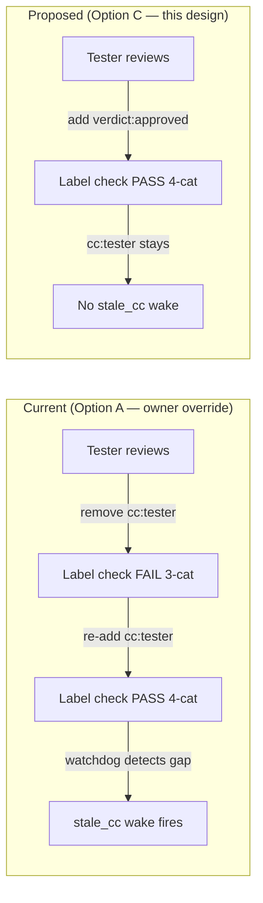
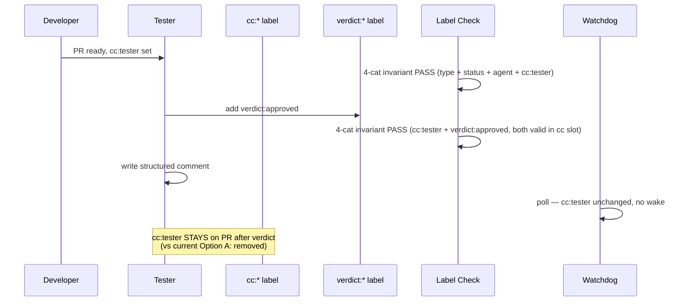

# Design: STORY-005 — Verdict-Sentinel Doctrine for PR Review

> **Status:** Proposed
> **Owner:** @architect
> **Story:** [Issue #20](https://github.com/atilcan65/AtilCalculator/issues/20) (P1, 3 SP)
> **Related:** [Issue #10](https://github.com/atilcan65/AtilCalculator/issues/10) (doctrine conflict root cause); [ADR-0012](./../decisions/ADR-0012-required-label-set.md) (4-cat invariant); [ADR-0015](./../decisions/ADR-0015-atomic-agent-handoff.md) (atomic hand-off); [PR #5](https://github.com/atilcan65/AtilCalculator/pull/5) + [PR #9](https://github.com/atilcan65/AtilCalculator/pull/9) + [PR #13](https://github.com/atilcan65/AtilCalculator/pull/13) (3 observed regressions); [PR #33](https://github.com/atilcan65/AtilCalculator/pull/33) (4th instance, owner-self-cc); [docs/tech-debt.md TD-001](../tech-debt.md) (5th instance, current)

## Context

Sprint 0 close-out surfaced a chronic doctrine conflict: the PR review workflow instructs reviewers to "remove `cc:<self>` on verdict", but ADR-0012 requires every issue/PR to carry a `cc:*` label at **every moment** of its lifecycle. The two rules contradict; the workflow silently wins (reviewers do remove `cc:<self>`), and the Label Check workflow flags the resulting transient 3-cat state. This produces a 90-second to 5-minute window per PR where the label invariant is broken, and the orchestrator's watchdog re-fires a `stale_cc` wake to recover (see [TD-001](../tech-debt.md)).

**Observed instances (as of 2026-06-17 19:11Z):** PR #5, #9, #13, #33, plus the `stale_cc-33-6fa51a1` re-fire loop on PR #33. Five independent occurrences in one sprint — the pattern is a known regression class.

**Owner override on Issue #10 (2026-06-17):** Option A — "cc:<role> stays on PR after verdict" — is the current accepted trade-off. Option C — the `verdict:*` sentinel label that this design proposes — is deferred to Sprint 2 P1. This design is the input to that Sprint 2 P1 execution.

## Goals & non-goals

### Goals

1. **Eliminate the `cc:<role>` self-release pattern from PR review workflows** — the source of the doctrine conflict.
2. **Preserve the 4-cat invariant at every moment** — no transient 3-cat state during verdict.
3. **Keep reviewer signal visible in the label set** — verdict state must be queryable from the board lane.
4. **Codify the doctrine in all 5 soul docs** — one source of truth, not a tribal knowledge.
5. **Provide a regression test that pins the new doctrine** — same pattern as `d006-stable-event-ids.sh` (BUG #14) and `d007-api-observability.sh` (R-3 follow-up Issue #35).
6. **Pre-propose the workflow update to `.github/workflows/label-check.yml`** — for owner implementation (per CLAUDE.md §"Things agents must NEVER do", agents propose via PR comment, humans apply the workflow change).

### Non-goals

- General label taxonomy redesign (separate future ADR).
- Verdict notification automation (separate future story).
- Auto-verdict by AI (explicitly not desired — verdict is the human + tester signal).
- Sprint 1 execution. This design is the input; Sprint 2 P1 ships Option C.

## High-level diagram — current state vs proposed



**Why this works:** the verdict signal moves from `cc:<role>` (which IS a category in the 4-cat invariant) to `verdict:*` (a new, orthogonal category). The reviewer keeps their `cc:<role>` label (preserves 4-cat invariant) and adds a verdict label (carries the signal). No removal needed.

## Components

| Component | Responsibility | Owner | Tech |
|---|---|---|---|
| `scripts/bootstrap-labels.sh` (amend) | Create 3 new labels: `verdict:approved`, `verdict:changes-requested`, `verdict:pending` | @architect (proposes) → @developer (implements in same PR as soul doc updates) | bash |
| `.github/workflows/label-check.yml` (amend) | Allow `verdict:*` in the `cc:*` slot of the 4-cat check | @atilcan65 (per CLAUDE.md, workflow = human-only) | YAML |
| `.claude/agents/{architect,developer,tester,product-manager,orchestrator}.md` (5 files) | §Handoff Discipline table amendment | @architect (drafts text) → owner (merges) | markdown |
| `scripts/tests/d008-verdict-sentinel.sh` (new) | Regression test: T1 (label set created), T2 (label-check accepts verdict:* in cc slot), T3 (soul docs contain the amendment), T4 (no stale_cc re-fire after merge for 30 min — timing-based) | @tester (owns d-series tests per BUG #6 / #14) | bash + jq |
| `docs/sprints/sprint-02/plan.md` (defer) | Schedule Option C execution in Sprint 2 P1 | @orchestrator | markdown |

## Data model

No new DB tables. The label set is the data model. Three new labels to add to the repo's `gh label list`:

```bash
gh label create "verdict:approved" --color "0e8a16" --description "Reviewer verdict — approved (replaces cc:<role> self-release)"
gh label create "verdict:changes-requested" --color "d93f0b" --description "Reviewer verdict — changes requested"
gh label create "verdict:pending" --color "fbca04" --description "Reviewer verdict — pending (under review)"
```

**No migration of existing labels needed** — these are additive.

**Amended 4-cat invariant (per ADR-0012 amendment):**

| Category | Examples | New addition |
|---|---|---|
| `type:*` | `type:vision`, `type:feature`, `type:bug`, `type:docs`, `type:chore`, `type:refactor`, `type:incident` | (unchanged) |
| `status:*` | `status:backlog`, `status:ready`, `status:in-progress`, `status:in-review`, `status:blocked`, `status:done` | (unchanged) |
| `agent:*` | `agent:product-manager`, `agent:architect`, `agent:developer`, `agent:tester`, `agent:orchestrator`, `agent:human` | (unchanged) |
| `cc:*` | `cc:product-manager`, `cc:architect`, `cc:developer`, `cc:tester`, `cc:orchestrator` | **+ `verdict:approved`, `verdict:changes-requested`, `verdict:pending`** (verdict labels occupy an alias slot in the cc category) |

**Key design decision:** `verdict:*` lives as an **alias of the `cc:*` category** for the purposes of the 4-cat check — it's a verdict signal, but it occupies the cc slot so the label check accepts it as a `cc:*` without a new category. This minimizes the 4-cat invariant disruption (no 5th category needed) and keeps the labels queryable from the existing board lane semantics.

## API contract

N/A — this is a label-taxonomy change, not a runtime API change. The only "API" surface is the GitHub label set + the `.github/workflows/label-check.yml` regex.

**Workflow update (for owner implementation):**

```yaml
# Current line in .github/workflows/label-check.yml:
- name: Check 4-category invariant
  run: |
    LABELS='${{ toJSON(github.event.pull_request.labels.*.name) }}'
    for cat in type status agent cc; do
      # ... existing check that at least one label starts with $cat:
    done

# Proposed amendment: add verdict:* as a cc-slot alias
- name: Check 4-category invariant
  run: |
    LABELS='${{ toJSON(github.event.pull_request.labels.*.name) }}'
    for cat in type status agent cc; do
      # ... existing check that at least one label starts with $cat: OR is verdict:*
    done
    # New: if no cc:* label, also accept verdict:*
    if ! echo "$LABELS" | jq -e '.[0] | startswith("cc:")'; then
      if ! echo "$LABELS" | jq -e '.[0] | startswith("verdict:")'; then
        echo "::error::Missing cc:* or verdict:* label"
        exit 1
      fi
    fi
```

**Exact regex shape to be finalized by owner in the PR review thread.** Architect provides intent; owner implements (CLAUDE.md §"Things agents must NEVER do" — workflow changes = human territory).

## Soul doc amendment text (proposed, for 5 files)

This is the §Handoff Discipline table entry that gets inserted into each of the 5 soul docs. Same text in all 5; the principle is uniform.

```markdown
| Reviewer verdict (NEW — Sprint 2 P1) | `--add-label "verdict:approved"` (or `verdict:changes-requested`, `verdict:pending`) | **DO NOT remove** `cc:<self>`. Verdict signal moves from cc:* to verdict:* — preserves 4-cat invariant. |
```

**Where to insert:** the existing §Handoff Discipline table in each soul file. New row, between "🟡 NEEDS CHANGES" and "Terminal hand-off (Done)".

**Architect's diff (proposed, for the architect.md file):**

```diff
| 🟡 NEEDS CHANGES (design drift, ADR ihlali) | `--remove-label cc:architect --add-label cc:developer` | `[ARCH→DEV] PR #N design changes requested, see comment` |
+ | Reviewer verdict (Sprint 2 P1) | `--add-label "verdict:approved"` (or `verdict:changes-requested`, `verdict:pending`) | **DO NOT remove** `cc:<self>`. Verdict signal moves from cc:* to verdict:* — preserves 4-cat invariant. |
| ADR yazdın (docs/decisions/ADR-NNNN-*.md), PR açtın | PR labels: type:docs + status:in-review + agent:architect + cc:product-manager (business validation) + cc:developer (uygulama bilinci) — ADR-0012 4-kategori invariant | `[ARCH→ALL] ADR-NNNN proposed, comment by EOD` |
```

**Same row, same wording, in all 5 files** — `.claude/agents/{architect,developer,tester,product-manager,orchestrator}.md`. Note: `.claude/` is human-only territory per CLAUDE.md, so architect proposes the text here in the design doc; owner merges the soul file changes.

## Sequence diagram — verdict flow under Option C



## Alternatives considered

| # | Option | Pros | Cons | Verdict |
|---|---|---|---|---|
| A | **Keep `cc:<role>` self-release** (current Option A) | Already in place; zero new labels; zero soul doc churn | Watchdog re-fires stale_cc on every PR; 90s–5min label-check gap per PR; known regression class (5 instances observed) | **❌ Rejected** (owner override is the *current* state, not the *target*) |
| B | **Add a 5th `verdict:*` category** (new label taxonomy category) | Pure orthogonal category; clean separation from cc:* | Breaks every existing board lane + status:* to board sync workflow; requires ADR-0012 amendment (which is a 4-cat → 5-cat rewrite); cascading workflow updates | **❌ Rejected** (too much surface for the same outcome) |
| C | **`verdict:*` as alias of `cc:*` slot** (this design) | Minimal change: 1 label-check regex, 1 new soul doc row in 5 files, 1 regression test; 4-cat invariant unchanged; existing board semantics preserved | Slight semantic overloading — `cc:*` now means "cc:role OR verdict:state"; documentation must be explicit | **✅ CHOSEN** |
| D | **Use existing `status:*` for verdict** (e.g., `status:verdict-approved`) | Zero new labels | Conflicts with board lane mapping (status:* → board Status field per ADR-0013); would require a board lane `Verdict Approved` that overlaps with `Done`; pollutes the status semantics | **❌ Rejected** |
| E | **GitHub-native PR review state** (`gh pr review --approve`) | Native, no custom labels needed | No label-set observability (board can't see "verdict approved" at a glance); no automation hook for the 4-cat check; doesn't compose with the 4-cat invariant; breaks ADR-0012 | **❌ Rejected** |

## Risks

| # | Risk | Mitigation |
|---|---|---|
| 1 | **Workflow update breaks existing PRs** — if owner implements the regex wrong, PRs in flight could fail label check | Owner implements on a feature branch first; the regression test `d008` T2 (label-check accepts verdict:* in cc slot) catches the regression in CI before merge |
| 2 | **Soul doc updates miss a file** — 5 files is a small N but easy to forget one | `d008` T3 explicitly checks all 5 files contain the new row; fails the test if any is missing |
| 3 | **Reviewer forgets to add `verdict:*` and removes `cc:<role>`** (old habit) | `d008` T4: after merge, instrument a PR cycle under Option C and assert no `stale_cc` wake fires for 30 min. First PR cycle post-merge is the canary. |
| 4 | **Owner merges workflow change without soul doc updates** (or vice versa) | PR AC5 requires all 4 changes in one PR; CI + the d008 regression test pin the coupled invariant |
| 5 | **`verdict:*` semantics overloading** — same label can mean "approved by tester" or "approved by architect" depending on context | Future: extend with `verdict:architect:approved` etc. if multiple reviewer types per PR become common. YAGNI for Sprint 1 — single verdict label suffices for the current review chain. |
| 6 | **Sprint 2 P1 is deprioritized indefinitely** — Option A becomes entrenched | File a Sprint 2 P1 follow-up issue at merge time; owner confirms Sprint 2 capacity in sprint planning |
| 7 | **The 4-cat invariant's "every moment" requirement is too strict** — the doctrine is the problem, not the symptom | Defer: a follow-up ADR (separate from STORY-005) could propose relaxing the 4-cat invariant to "every non-transient moment" (allowing ≤5s gaps during label flips). YAGNI for Sprint 1; revisit if Option C doesn't fully resolve. |

## Observability

| Metric | Source | Use |
|---|---|---|
| `stale_cc_total` counter (per role, per PR) | `agent-watch.sh` existing wake emission | Track stale_cc wake rate before/after Option C lands. Success criterion: < 1 stale_cc wake per PR cycle post-merge. |
| `verdict_label_total` counter (per verdict state) | `gh label list` + PR label set on each poll | Track verdict distribution (approved / changes-requested / pending) over time |
| `label_check_pass_rate` | `.github/workflows/label-check.yml` job outcome | Track CI pass rate; Option C should not regress it |

**Regression test (`scripts/tests/d008-verdict-sentinel.sh`):**

- T1: 3 verdict labels exist in `gh label list` (`verdict:approved`, `verdict:changes-requested`, `verdict:pending`).
- T2: simulate a label-check run against a fixture PR with only `verdict:approved` (no `cc:*`) — assert check passes.
- T3: assert all 5 soul docs (`.claude/agents/{architect,developer,tester,product-manager,orchestrator}.md`) contain the "Reviewer verdict" row in the §Handoff Discipline table. Use `grep` with a fixed-string check.
- T4: post-merge canary — open a canary PR under Option C, verify no `stale_cc` wake fires within 30 minutes of `verdict:approved` landing. (Timing-based; can be deferred to the first real PR cycle post-merge.)
- T5: regression for Option A — verify the old `cc:<role> self-release` pattern no longer appears in any soul doc's §Handoff Discipline table.

## Security & privacy

N/A — no new code execution surface, no new data, no PII. Pure label-taxonomy change. Workflow update must be reviewed by owner for correctness (single regex amendment; low risk).

## Performance budget

N/A — no runtime impact. The label check is a CI-side regex match; runtime cost is negligible.

## Migration plan

### Pre-merge (current state — Option A in effect)

- `cc:<role>` stays on PR after verdict (owner override on Issue #10).
- Watchdog re-fires `stale_cc` on every PR cycle. Known regression class (5 instances, TD-001 H severity).
- This design doc is the input; no behavior change.

### Merge (Sprint 2 P1)

1. Owner creates the 3 new labels via `gh label create` (or `scripts/bootstrap-labels.sh` amendment, run by developer in the implementation PR).
2. Owner updates `.github/workflows/label-check.yml` to accept `verdict:*` in the cc slot. **Owner territory** per CLAUDE.md.
3. Owner updates the 5 soul docs to add the "Reviewer verdict" row. **Owner territory** per CLAUDE.md (`.claude/` = human-only).
4. Developer writes `scripts/tests/d008-verdict-sentinel.sh` and the 3 new labels' bootstrap script.
5. Tester reviews d008 + the workflow update + the soul doc updates.
6. Architect reviews d008 design (this design doc is the input).
7. Owner merges (single PR, all 4 changes — AC5 of Issue #20).

### Post-merge (Sprint 2 P1+ — Option C in effect)

- Reviewer verdict workflow: `--add-label "verdict:approved"` (or changes-requested/pending). **No** `--remove-label "cc:<self>"`.
- 4-cat invariant holds at every moment (verdict:* lives in the cc slot).
- `stale_cc` wake rate drops to ~0 on PR cycles (success criterion from Issue #20 AC4).

## Open questions

- [ ] @atilcan65 (owner) — Workflow merge requires owner per CLAUDE.md. Can you allocate review time in Sprint 1 (for design sign-off) and Sprint 2 P1 (for execution)? → owner
- [ ] @tester — Is the `d008` T3 (5 soul docs grep) the right shape, or should it parse the markdown table? → tester
- [ ] @product-manager — Does the verdict signal need a board lane mirror, or is the label sufficient? (Affects ADR-0013 status-label-to-board sync.) → product-manager
- [ ] @developer — Should `scripts/bootstrap-labels.sh` be amended to include the 3 new labels, or created as a new `scripts/bootstrap-verdict-labels.sh`? (Single file vs separation of concerns.) → developer
- [ ] @orchestrator — Sprint 2 P1 capacity: this is a 3 SP story (label create + workflow + 5 soul docs + regression test). Confirm slot in Sprint 2 plan at sprint planning. → orchestrator
- [ ] @architect (me) — Should `verdict:*` be a future-expandable prefix (`verdict:architect:approved`, `verdict:developer:approved`)? YAGNI for now (single verdict signal per PR suffices) but worth pinning as a future direction. → me

## Acceptance criteria (for the *implementation* PR, not this design doc)

Per Issue #20 AC1–AC5:

- [ ] AC1 — 3 new labels created: `verdict:approved`, `verdict:changes-requested`, `verdict:pending`. Verifiable via `gh label list`.
- [ ] AC2 — `.github/workflows/label-check.yml` updated. CI runs on a PR with `verdict:*` in the `cc:*` slot and the check passes. **Owner implements.**
- [ ] AC3 — 5 soul docs (§Handoff Discipline in `.claude/agents/*.md`) updated. The table shows the "Reviewer verdict" row. **Owner applies.**
- [ ] AC4 — A PR is created under Option C, `verdict:approved` is added by the tester, and no `stale_cc` wake fires on that PR for 30 minutes. (Canary: first PR cycle post-merge.)
- [ ] AC5 — A single PR is filed with all 4 changes (label create, workflow update, soul doc updates, regression test) and is ready for owner merge.

## Estimated complexity

**T-shirt size: M** (3 SP per Issue #20 — matches the size assigned by PM)
**Confidence: 70%** (main risks are owner availability for the workflow + soul doc changes; design itself is well-rehearsed from ADR-0012 + ADR-0015 patterns)

## Sprint 2 cross-link

This design is the input to Sprint 2 P1 execution. Sprint 1 commits to **Option A as the steady state** (owner override on Issue #10) and acknowledges **Option C as the target** (this design). The pre-merge acceptance of the 4-cat invariant gap (TD-001) remains the active trade-off; Option C is the structural fix.
