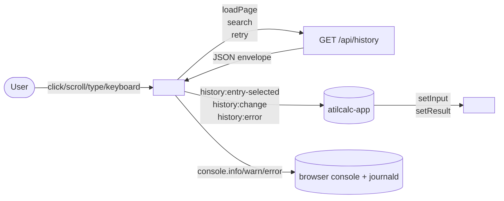
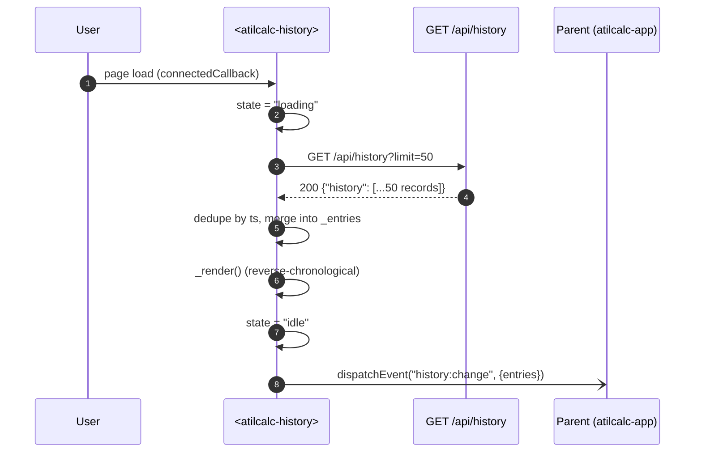
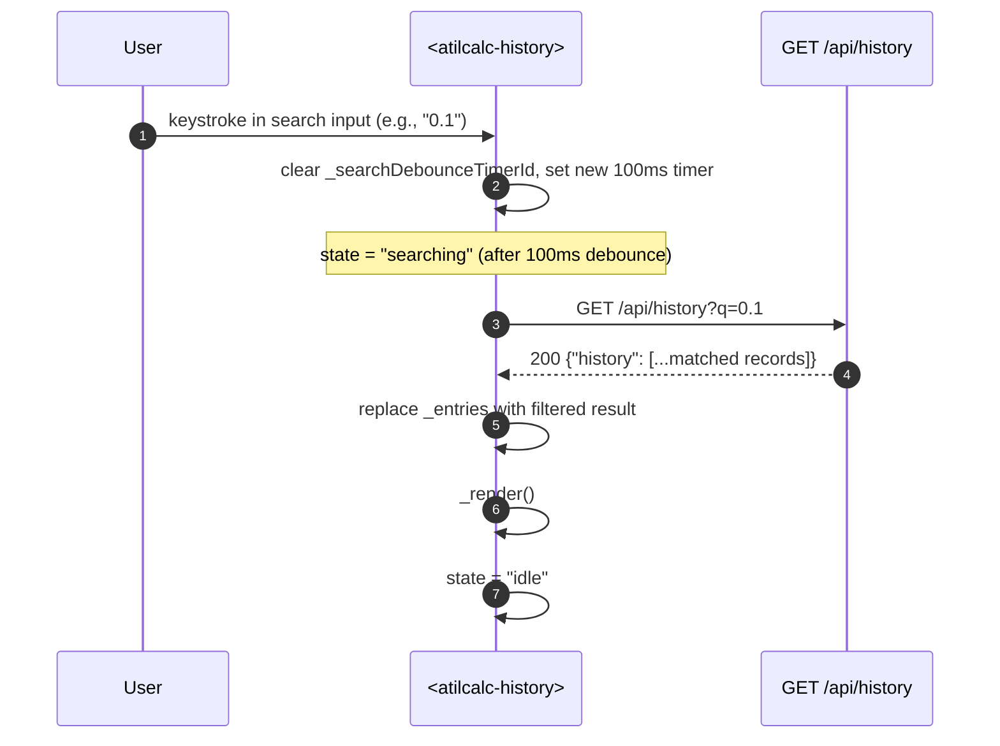
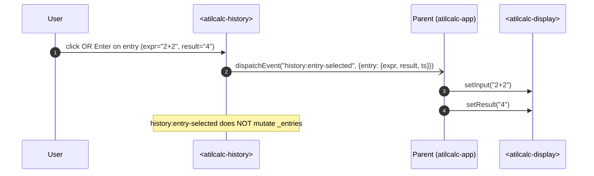
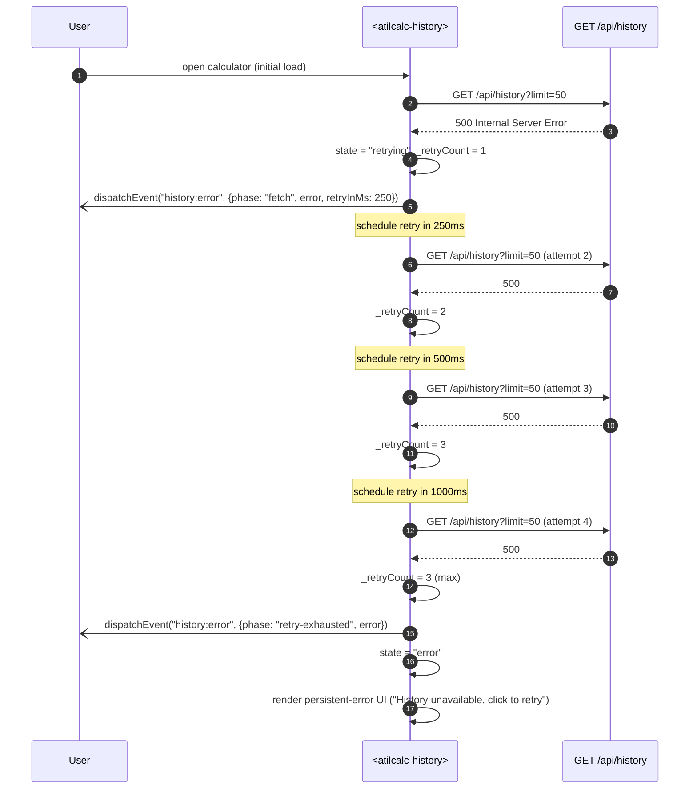
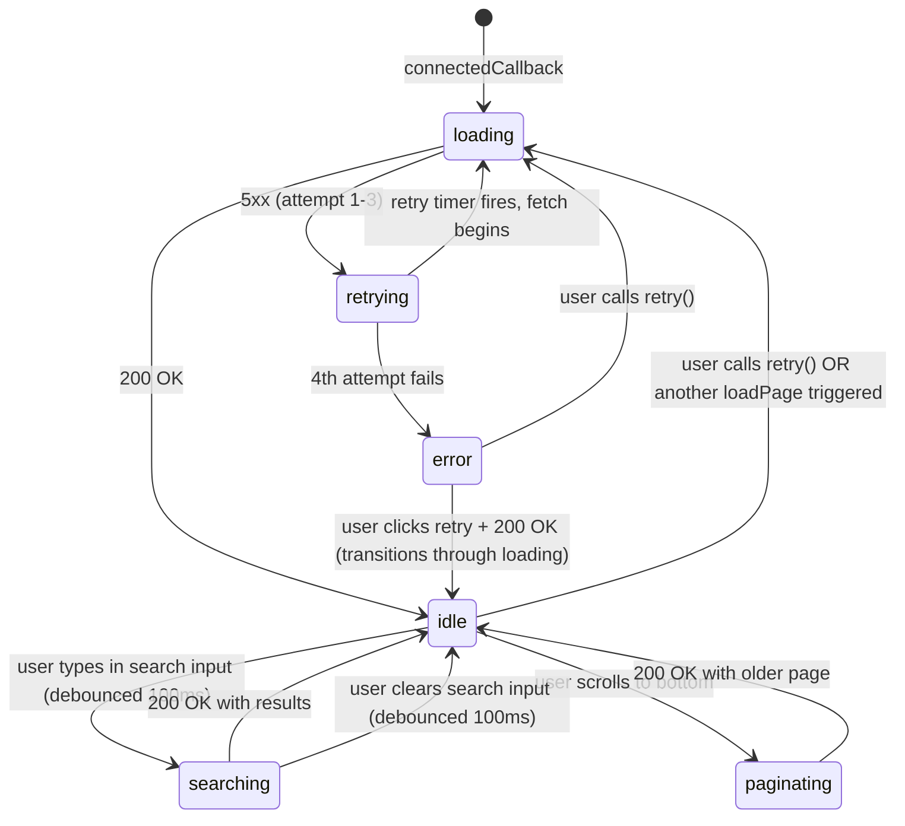

# Design: STORY-008 — `<atilcalc-history>` impl design (path b prep, refs #96, #81)

**Date:** 2026-06-19
**Author:** @architect
**Refs:** Issue #70 (STORY-008 backlog), Issue #96 (agent-stall), Issue #99 (this design), PR #81 (TDD red contract suite), PR #81 comment #4745743004 (pinned contract), PR #84 (ADR-0019 amendment 2), ADR-0018 (vanilla JS + Web Components), ADR-0019 (HTTP API contract)
**Status:** Proposed (awaiting owner implementation per Issue #96 path (b))

---

## Context

The `<atilcalc-history>` Web Component shell shipped in Sprint 1 (STORY-003a, Issue #30, merged via PR #49 + #51) — but it was wired to an in-memory deque and only implemented `pushEntry(expr, result)` + `clear()` + a `history:change` event. With STORY-007 (SQLite persistence) now merged (PR #88) and the backend `GET /api/history` contract pinned per ADR-0019 amendment 2 (PR #84), the shell needs to be rewired to the backend and gain the M5-required affordances (substring search, click-to-load, infinite scroll, retry-with-backoff).

The TDD red contract suite (PR #81, 21 tests across 3 files) is already merged at status:ready, awaiting implementation. PR #81 comment #4745743004 (architect-authored, 2026-06-18T20:09Z) pins the API surface — observed attrs, methods (Sprint 1 preserve + STORY-008 new), events, backend envelope.

Issue #96 escalated the agent-stall on STORY-008 impl: developer is blocked on path decision. Orchestrator recommended path (b) = owner-implement; **this design doc is the precondition** for the owner to start coding tonight per Issue #99 time bound (EOD 2026-06-19T21:00:00Z).

## Goals & Non-goals

**Goals**
- Rewire `<atilcalc-history>` from in-memory deque to `GET /api/history` backend (ADR-0019 amend 2 envelope)
- Add new methods: `loadPage({limit?, before?})`, `search(q)`, `retry()`
- Add new events: `history:entry-selected` (AC3), `history:error` (AC6)
- Preserve Sprint 1 surface (`pushEntry`, `clear`, `history:change`) — Sprint 1 callers MUST NOT break
- Land all 6 ACs (AC1-AC6 from `docs/backlog/STORY-008.md`)
- Land all 21 TDD red tests GREEN (PR #81 suite)

**Non-goals**
- History edit/delete (records immutable post-creation; out of scope per `STORY-008.md` §Out of scope)
- History export/import (Sprint 3+)
- History analytics (frequency, top expressions)
- Cross-user isolation (single-user MVP per vision)
- Multi-tab synchronization (single-tab MVP; background re-sync on next `loadPage` covers eventual consistency)
- `<atilcalc-history>` shell refactor (CSS, scrollbar, theming) — Sprint 3 polish

## High-level diagram



## Components

| Component | Responsibility | Owner | Tech |
|---|---|---|---|
| `<atilcalc-history>` | Render history list; debounce search; lazy-load pages; retry on 5xx | @owner (path b impl) | Web Component (vanilla JS, shadow DOM, no build) per ADR-0018 |
| `GET /api/history` | Read history with `limit`, `before`, `q` filters; return `{"history": [...]}` envelope | (existing, PR #88) | FastAPI route per ADR-0019 amend 2 (PR #84) |
| Parent (atilcalc-app) | Wire `history:entry-selected` → setInput + setResult; (existing) | (existing, Sprint 1) | Web Component (vanilla JS) |
| Console/journald | Receive structured logs from history component (observability) | (operational) | browser `console.*` + systemd journald via `atilcalc.service` |

## Data model

No new tables or schema changes. The `<atilcalc-history>` component reads from the existing `evaluations` table (PR #88, STORY-007, SQLite backend per ADR-0022).

```sql
-- existing (PR #88, ADR-0022): no change
SELECT expr, result, ts FROM evaluations
WHERE ts < :before            -- optional; AC5 pagination
  AND expr LIKE '%' || :q || '%'  -- optional; AC2 substring search
ORDER BY ts DESC
LIMIT :limit;                 -- default 50, server cap per ADR-0019
```

Response envelope per ADR-0019 amend 2 (PR #84):

```json
{
  "history": [
    { "expr": "1+1", "result": "2", "ts": "2026-06-19T20:00:00.000Z" }
  ]
}
```

## API contract

The component calls `GET /api/history` with three optional query params. The backend contract is already pinned (PR #84); the component is a **consumer**.

| Param | Type | Default | Effect |
|---|---|---|---|
| `limit` | int | `50` | Max records returned. Client cap at 100; server cap per ADR-0019. |
| `before` | ISO8601 string | (none) | Return records with `ts < before` (strictly older). Used for AC5 pagination. |
| `q` | string | (none) | Case-insensitive substring on `expr`. Used for AC2 search. |

Response:
- `200 OK` → `{"history": [...]}` (pinned envelope)
- `400 Bad Request` → invalid `limit` / `before` / `q`
- `5xx` → exponential backoff retry (250/500/1000 ms, max 3) → `history:error{phase: "retry-exhausted"}`

## Internal state

```ts
// Per PR #81 comment #4745743004 (pinned contract)
type Entry = { expr: string; result: string; ts?: string /* ISO8601 */ };

class AtilcalcHistory extends HTMLElement {
  // Sprint 1 (preserve)
  _entries: Entry[] = [];
  
  // NEW for STORY-008
  _lastFetchArgs: { limit?: number; before?: string; q?: string } | null = null;
  _retryCount: number = 0;
  _retryTimerId: number | null = null;
  _searchDebounceTimerId: number | null = null;
  _state: "idle" | "loading" | "paginating" | "searching" | "retrying" | "error" = "idle";
  
  static get observedAttributes() {
    return ["limit"];  // preserved
  }
}
```

## Sequence diagrams

### Flow 1: Initial load (AC1)



### Flow 2: Substring search with debounce (AC2)



Edge case: if user clears search (`q === ""`), the component reverts to the unfiltered view by calling `loadPage({limit: 50})` (Flow 1).

### Flow 3: Click-to-load (AC3)



Implementation note: the click handler is on the `.entry` element inside the shadow DOM. Keyboard support requires `tabindex="0"` on each `.entry` and a keydown listener for `Enter` (per vision M3 keyboard-first).

### Flow 4: Optimistic append + re-sync (AC4)

```mermaid
sequenceDiagram
    autonumber
    participant U as User
    participant E as POST /api/eval
    participant H as <atilcalc-history>
    participant A as GET /api/history

    U->>E: evaluate "3*7"
    E-->>U: 200 {result: "21", ts: "2026-06-19T20:01:00.000Z"}
    Note over H: parent calls pushEntry("3*7", "21", "2026-06-19T20:01:00.000Z")
    H->>H: _entries.unshift({expr, result, ts})
    H->>H: trim to limit
    H->>H: _render()
    H-)P: dispatchEvent("history:change")
    
    par Background re-sync (debounced 500ms)
        H->>A: GET /api/history?limit=50
        A-->>H: 200 {"history": [...51 records including 3*7]}
        H->>H: dedupe by ts (3*7 already in _entries; merged)
        H->>H: _render() if diff detected
    end
```

Optimistic-append behavior: parent calls `pushEntry(expr, result, ts)` immediately after `POST /api/eval` succeeds (without waiting for `GET /api/history`). The 3rd arg `ts` is OPTIONAL but recommended for STORY-008 (avoids dedupe conflicts during re-sync).

Background re-sync is debounced (500ms) to coalesce rapid eval+append cycles. The re-sync detects divergence (e.g., another tab added records) and re-renders only if `_entries` differs from the server response.

### Flow 5: 5xx retry with exponential backoff (AC6)



The user-triggered `retry()` method (Flow 5b) bypasses the backoff timer and immediately re-runs the most recent `_lastFetchArgs`. The `retry()` method is safe to call from both user click and auto retry (exponential backoff path).

## State machine



State transitions are guarded by the active fetch — concurrent calls cancel pending timers and overwrite `_lastFetchArgs`. The `_retryCount` resets on every successful fetch.

## Observability plan

| Signal | Mechanism | Where it lives |
|---|---|---|
| Page fetch count (success / failure) | `console.info({event: "history:loadPage", status, durationMs, count})` | browser console; relayed to journald via `atilcalc.service` stdout |
| Search latency p95 | histogram: `console.info({event: "history:search", q: query.length, durationMs})` | browser console; **M5 metric** (substring search response time p95 <100ms) |
| Retry count | `console.warn({event: "history:retry", attempt, retryInMs})` | browser console |
| Error events | `console.error({event: "history:error", phase, error, ts})` | browser console |
| Entry-selection count | `console.info({event: "history:entry-selected", entryTs})` | browser console; **M2 metric** (history stickiness) |

Trace span names (for any future OTel instrumentation):
- `history:loadPage` (wraps fetch)
- `history:search` (wraps debounce + fetch)
- `history:entry-selected` (event emit)
- `history:error` (event emit + retry chain)

**No PII** — only `q.length` is logged, not the actual query (search history may contain sensitive expressions per vision operability concerns).

## Test surface contract

PR #81 suite (21 tests, 3 files) is the contract. All 21 must turn GREEN with this implementation. Playwright E2E entry points per AC:

| AC | Test class | Test count | File |
|---|---|---|---|
| **AC1** render latest 50 reverse-chrono | `TestHistoryRender` | 2 | `tests/web/test_history_wiring.py` |
| **AC2** substring search + 100ms debounce | `TestHistorySearch` | 2 | `tests/web/test_history_wiring.py` |
| **AC3** click-to-load + Enter-key | `TestClickToLoad` | 2 | `tests/web/test_history_wiring.py` |
| **AC4** optimistic append + re-sync | `TestOptimisticAppend` | 1 | `tests/web/test_history_wiring.py` |
| **AC5** infinite scroll `?before=<ts>` | `TestPagination` + `test_history_pagination.py` | 8 (1 web + 7 API) | `tests/web/test_history_wiring.py` + `tests/api/test_history_pagination.py` |
| **AC6** 5xx retry w/ exponential backoff + persistent error | `TestErrorRetry` + `test_history_retry.py` | 6 (2 web + 4 API) | `tests/web/test_history_wiring.py` + `tests/api/test_history_retry.py` |

**Total**: 21 tests. Plus 4 pre-existing Sprint 1 tests in `tests/web/test_components.py` (must remain GREEN — Sprint 1 surface preservation).

## Edge case catalog

| Edge case | Expected behavior | Test coverage |
|---|---|---|
| Empty history (0 records) | Render `(no history yet)` placeholder | `TestHistoryRender::test_empty_history_renders_placeholder` (PR #81) |
| 10k+ records | Virtual scroll required (windowed render); `?before=` cursor walks the corpus | Sprint 3 polish; perf test deferred (vision M5 1000+ records) |
| Cursor expiry (user scrolls very old data) | Backend returns empty; component stops paginating | Manual smoke test post-impl |
| Search no match | Backend returns `{"history": []}`; component renders `(no matches)` placeholder | Manual smoke test post-impl |
| Unicode in expression (e.g., `2×π`) | UTF-8 round-trip via `encodeURIComponent`; backend `LIKE` is Unicode-safe | Manual smoke test post-impl |
| RTL languages (e.g., Arabic expr) | Display via CSS `dir="auto"` (or inherited from page) | Manual smoke test post-impl |
| Emoji in expression | UTF-8 round-trip; backend `LIKE` handles emoji | Manual smoke test post-impl |
| Concurrent appends (multi-tab) | Each tab optimistically appends; background re-sync reconciles via ts dedupe | Per `STORY-008.md` §Open questions; defer to Sprint 3+ |
| 5xx on first page but 200 on subsequent | Exponential backoff covers this; max 3 retries before surfacing error | `TestErrorRetry` (PR #81) |
| `Retry-After` header from server | Honor `Retry-After` if present (overrides default 250/500/1000); `test_history_retry.py::test_retry_after_header_overrides_backoff` | PR #81 (already exists) |
| 400 Bad Request (invalid `limit`/`before`/`q`) | Surface `history:error{phase: "fetch", error: {status: 400}}`; **do not retry** (4xx is terminal) | PR #81 |
| Concurrent `search()` + `loadPage()` | Cancel pending debounce timer; cancel pending retry timer; latest call wins | Manual smoke test post-impl |
| Component detached mid-fetch | AbortController cancels in-flight fetch (no leaked promises) | Manual smoke test post-impl |

## Alternatives considered

| Alternative | Pros | Cons | Verdict |
|---|---|---|---|
| **(a)** (chosen) Component owns fetch + retry + dedupe | One source of truth for history state; `history:entry-selected` + `history:error` events are local; parent stays thin | Component grows; needs internal state for retry timer, search debounce, last-fetch args | ✅ Adopted |
| **(b)** Parent owns fetch + passes data via attribute | Component is pure renderer; parent has more logic | Parent coupling to history semantics; harder to test component in isolation | ❌ Rejected — parent already has display + keypad logic; history-as-renderer is too thin |
| **(c)** Use a state-management library (Redux / Zustand / etc.) | Centralized state | Build step dependency; violates ADR-0018 (no build, vanilla JS) | ❌ Rejected — boring tech wins |
| **(d)** Use WebSocket / SSE for live history updates | No polling; instant updates | Single-user MVP; backend doesn't support WS; Sprint 3+ if multi-user lands | ❌ Rejected — premature; single-tab MVP |

## Risks

| # | Risk | Mitigation |
|---|---|---|
| 1 | **Search latency p95 > 100ms** (M5 violation) | Backend already indexes `ts DESC` (PR #88); `LIKE '%q%'` is index-inefficient for large corpus. **Mitigation**: client cap `q.length ≤ 50`; backend uses `LIKE 'q%'` (prefix only) OR full-text search if corpus grows past 1000 records. **Owner decision**: prefix vs substring; substring is M5-acceptable for MVP-1 single-user. |
| 2 | **Optimistic-append divergence on multi-tab** | Background re-sync via `loadPage({limit: 50})` reconciles; ts dedupe prevents duplicates. **Single-tab MVP**: documented limitation. |
| 3 | **Retry storm on persistent 5xx** | Exponential backoff caps at 3 retries; `history:error{phase: "retry-exhausted"}` surfaces persistent state; user-triggered `retry()` is required to re-attempt. |
| 4 | **Sprint 1 caller breakage** | `pushEntry(expr, result)` (2-arg form) MUST still work; the new 3rd arg `ts?` is OPTIONAL. `history:change` event MUST still emit. Pre-existing 4 tests in `tests/web/test_components.py` are the regression net. |
| 5 | **CSS scrollbar / theming regression** | Sprint 1 shell styles preserved in `_render()` (shadow DOM). Owner may NOT touch `_render()` template without design-doc amendment. |
| 6 | **Edge case: detached component mid-fetch** | AbortController wraps every fetch; `connectedCallback` checks `this.isConnected` before dispatching events. |

## Performance budget

| Metric | Budget | Source |
|---|---|---|
| Initial render (Flow 1) | p95 < 200ms (network + render 50 records) | Sprint 1 baseline + ADR-0019 server perf |
| Substring search (Flow 2) | **p95 < 100ms** | Vision M5 acceptance gate |
| Click-to-load latency (Flow 3) | **p50 < 50ms** | Vision M5 acceptance gate (stickiness) |
| Optimistic append → re-sync (Flow 4) | re-sync debounce 500ms; render after re-sync < 100ms | Internal target |
| 5xx retry budget (Flow 5) | 250 + 500 + 1000 = **1750ms max** before surfacing `retry-exhausted` | Backoff constants |
| Memory ceiling | 50 entries × ~200 bytes = **~10 KB** for default `limit` | Sprint 1 baseline |
| Network calls (idle page) | 1 fetch on initial load; 0 fetches while idle | No polling (single-user MVP) |

## Security & privacy

- **No new authn/authz** — single-user MVP per vision §Operasyonel kısıtlar.
- **No new PII** — `q.length` logged, not the actual query (operator privacy).
- **No new attack surface** — component calls existing `GET /api/history` route; same CORS / origin policy.
- **No new dependencies** — vanilla JS + Web Components per ADR-0018; no build step.

## Out of scope (explicit deferrals)

- History edit/delete (immutable per `STORY-008.md`)
- History export/import (Sprint 3+)
- History analytics (frequency, top expressions) (out of MVP)
- Cross-user isolation (single-user MVP)
- Multi-tab synchronization (single-tab MVP; background re-sync is eventual-consistency best-effort)
- `<atilcalc-history>` shell refactor (CSS, scrollbar, theming) — Sprint 3 polish
- Real-time updates via WebSocket / SSE — Sprint 3+ if multi-user lands

## Open questions

1. **Search query mode**: substring (LIKE '%q%') vs prefix (LIKE 'q%'). Substring is more user-friendly; prefix is faster on large corpus. Owner decision: substring for MVP-1 single-user; revisit if perf degrades past M5.
2. **Background re-sync debounce window**: 500ms is the proposed value. Owner may tune based on rapid eval+append test cycle.
3. **`Retry-After` header support**: server-side (FastAPI) needs to send the header on 503/429. Owner should verify FastAPI route emits the header under backend pressure.
4. **AbortController on detached component**: required to prevent leaked promises. Owner confirms fetch is wrapped.

## References

- `docs/backlog/STORY-008.md` — backlog story (AC1-AC6)
- `src/atilcalc/web/app.js:155-223` — Sprint 1 shell (preserve surface)
- `tests/web/test_components.py` — Sprint 1 component tests (preserve GREEN)
- `tests/web/test_history_wiring.py` — STORY-008 contract suite (PR #81, AC1-AC6 web tests)
- `tests/api/test_history_pagination.py` — AC5 API tests (cursor + limit cap + edge cases)
- `tests/api/test_history_retry.py` — AC6 API tests (5xx envelope + Retry-After + retry budget)
- `docs/test-plans/STORY-008-tests.md` — full test plan (PR #81)
- ADR-0018 — vanilla JS + Web Components (no build)
- ADR-0019 — HTTP API contract (§GET /api/history, §POST /api/history)
- ADR-0019 amend 2 (PR #84) — pin envelope `{"history": [...]}` + §DomainError + §mpmath + §factorial cap
- ADR-0022 — SQLite persistence layer (PR #88 STORY-007)
- PR #81 comment #4745743004 — pinned contract (architect-authored 2026-06-18T20:09Z)
- Issue #70 — STORY-008 backlog
- Issue #96 — agent-stall (this design unblocks path (b))
- Issue #99 — design doc task (this file)
- `docs/product/vision.md` M2 (history stickiness) + M5 (perf)

## Estimated complexity

**T-shirt: L** (large). Reason: 21 tests to turn GREEN + 5 flows + 1 state machine + observability + edge cases + Sprint 1 surface preservation. Estimated 4-6 hours of focused implementation work for the owner (single evening slot per Issue #99 time bound).

**Confidence: 75%** — the design is well-pinned (PR #81 contract is the spec), but the optimistic-append re-sync + 5xx retry interaction has subtleties that may surface during impl (e.g., race between user-triggered retry and backoff timer).
