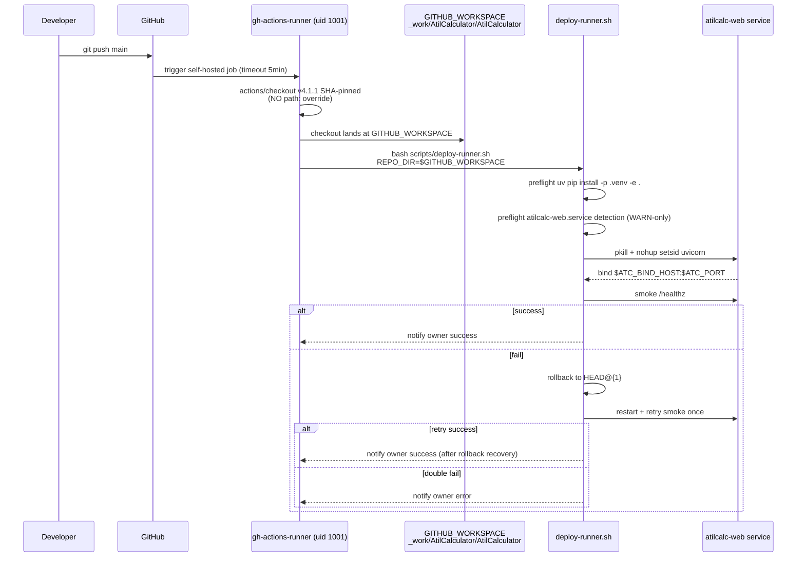

# Design: STORY-193 + STORY-194 — Sprint 4 P2 RCA-17 redesign (GA-aware Option B')

- **Story IDs**: RCA17-REDESIGN (Issue #193) + SYMNK-CLEANUP (Issue #194) — paired per Sprint 6 backlog.json
- **Author**: @architect
- **Date**: 2026-06-24T16:25Z
- **Sprint**: 6 (Day 1-3 + Day 3-4)
- **Priority**: P2 → P1 (owner bump 2026-06-24T16:00:19Z)
- **Closes**: P0 #351 root cause (GA `path:` sandbox violation), TD-029 (architect blind-spot)
- **Refs**: PR #350 (failed Option C, MERGED then reverted via PR #352), PR #354 (TD-029 MERGED), PR #356 (ADR-0043 status:ready), ADR-0030, ADR-0027 §Threat model, ADR-0043, RCA-17 / Issue #192

## Context

Sprint 3 deploy chain worked via a symlink at `/home/atilcan/projects/AtilCalculator` → `/home/atilcan/actions-runner/_work/AtilCalculator/AtilCalculator`. Sprint 3 acceptance noted the deviation (runner installed as `atilcan` user, not dedicated `gh-actions-runner`) but accepted it because the symlink masked the cross-user boundary. RCA-17 (Issue #192, closed 2026-06-20) diagnosed the deviation.

**PR #350 attempted Option C** (path: override to canonical absolute path). It was approved under 7-lens review and MERGED 2026-06-24T15:28:29Z (commit 250ec0c). **8 seconds later**, post-merge deploy failed with P0 #351: `##[error]Repository path '/home/atilcan/projects/AtilCalculator' is not under '/home/atilcan/actions-runner/_work/AtilCalculator/AtilCalculator'`. PR #352 reverted it 29 minutes later (MERGED 6ef96ae).

**Root cause** (TD-029): the `actions/checkout` `path:` input is documented as a **"Relative path under `$GITHUB_WORKSPACE`"** (per actions/checkout README). Absolute paths and paths outside `$GITHUB_WORKSPACE` are GA-sandbox-rejected. The 7-lens architect review verified local shape (5 lines, SHA pin preserved, correct placement) but missed this **platform hard constraint** — the 6th instance in the **blind-spot family** (TD-016/018/019/020/028/029). ADR-0043 formalizes this as **lens (i)** in the 8-lens checklist.

## Goals & non-goals

### Goals
- **GA-compliant deploy.yml**: maintain checkout + REPO_DIR alignment without `path:` override (Option C redacted)
- **Runner user migration**: `atilcan` → `gh-actions-runner` (uid 1001, idle since Sprint 3 setup)
- **Symlink cleanup**: remove `/home/atilcan/projects/AtilCalculator` symlink (dead-code workaround for deviation)
- **Regression**: 3/3 deploys PASS + `/healthz` live + `ps -ef | grep Runner.Listener` shows `gh-actions-runner`
- **Documentation**: deploy-runner.sh header explains why no symlink is needed post-migration

### Non-goals
- ❌ **No deploy.yml change** in this redesign (current post-revert state is already GA-compliant: `REPO_DIR: ${{ github.workspace }}`, default chain `$REPO_DIR > $GITHUB_WORKSPACE > /home/atilcan/atilcalc`)
- ❌ No SHA-pin changes (already `@b4ffde65f46336ab88eb53be808477a3936bae11  # v4.1.1`, preserved per ADR-0027)
- ❌ No new GH Actions secrets or env vars
- ❌ No HTTP surface changes (systemd user-service already on ADR-0010)
- ❌ No cross-repo-close impact (RCA-17 follow-up is single-repo only)

## High-level diagram

```mermaid
graph LR
    A[GitHub push to main] --> B[self-hosted GA runner<br/>gh-actions-runner uid 1001]
    B --> C[actions/checkout v4.1.1<br/>SHA-pinned, NO path: override]
    C --> D[GITHUB_WORKSPACE =<br/>/home/atilcan/actions-runner/_work/AtilCalculator/AtilCalculator]
    D --> E[REPO_DIR = $GITHUB_WORKSPACE<br/>deploy-runner.sh v5]
    E --> F[preflight uv pip install]
    F --> G[pkill + nohup setsid uvicorn<br/>$ATC_BIND_HOST:$ATC_PORT]
    G --> H[smoke /healthz]
    H --> I{success?}
    I -- yes --> J[notify owner: success]
    I -- no --> K[rollback to HEAD@{1}<br/>retry once]
    K --> I
    K -- double fail --> L[notify owner: error]

    style C fill:#cfc,stroke:#393
    style D fill:#cfc,stroke:#393
    style E fill:#cfc,stroke:#393
```

**Green boxes** = the canonical path this design establishes. Everything outside `_work/` is OUT of scope.

## Components

| Component | Responsibility | Owner | Tech |
|---|---|---|---|
| `.github/workflows/deploy.yml` | Deploy trigger + checkout + deploy step | @human (per file ownership matrix) | YAML, GA actions/checkout v4.1.1 SHA-pinned |
| `scripts/deploy-runner.sh` | Idempotent converge + restart + smoke + rollback | @developer (writes) | Bash, nohup setsid pattern (RCA-7 fix) |
| `/home/atilcan/actions-runner/_work/...` | Runner's actual checkout workspace (canonical, post-migration) | @human (systemd runner config) | GA self-hosted runner |
| `gh-actions-runner` user (uid 1001) | Runner service identity (currently idle) | @human (systemd unit re-install) | Linux user + systemd |
| `/home/atilcan/projects/AtilCalculator` symlink | **TO BE REMOVED** (was Sprint 3 workaround, dead code post-migration) | @human (unlink after migration) | Symlink |

## Data model

**No schema changes.** This is an infra-only redesign.

**Configuration changes** (in deploy.yml, NOT in this redesign — current post-revert state is correct):
```yaml
# deploy.yml — REPO_DIR already canonical (line 99)
env:
  REPO_DIR: ${{ github.workspace }}  # → /home/atilcan/actions-runner/_work/AtilCalculator/AtilCalculator
```

**Runner user migration** (owner ops, NOT in this redesign's deploy.yml):
```bash
# Owner terminal ops — Step 1 (after this design is approved):
sudo systemctl --user stop actions.runner.*-atilcan65-AtilCalculator.service
sudo -u gh-actions-runner ./svc.sh install
sudo setfacl -d -m u:gh-actions-runner:rwx /home/atilcan/actions-runner/_work
sudo setfacl -R -m u:gh-actions-runner:rwx /home/atilcan/actions-runner/_work
sudo systemctl --user start actions.runner.*-gh-actions-runner.service

# Step 2 (after #194 redesign approved):
unlink /home/atilcan/projects/AtilCalculator
# Optional: archive any .bak-* if owner prefers
```

## API contract

**No API changes.** Deploy is the only "API surface" affected, and it's unchanged:
- **Trigger**: `push` to `main` + `workflow_dispatch` (manual)
- **Output**: deploy success/fail notification via `scripts/ping.sh ok|error` (canonical per ADR-0033; deploy.yml currently uses legacy `scripts/notify.sh -l ok|error` on lines 116/118, aligned-as-follow-up note in §Open Questions)
- **Error contract**: unchanged (smoke /healthz fail → rollback to HEAD@{1} → retry once → double-fail = page owner)

## Sequence diagram



## Alternatives considered

| Option | Description | Pros | Cons | Verdict |
|---|---|---|---|---|
| **A** | **Keep current state** (post-revert, symlink stays, `atilcan` runner) | Zero risk today, deploy chain works | #193 + #194 unaddressed, ADR-0030 deviation persists, symlink dead code remains, P0 #351 class can recur (cross-cutting unknown) | ❌ Rejected — defeats the redesign |
| **B** | **Owner-ops migration + symlink removal** (no deploy.yml change) | ADR-0030 deviation fixed, symlink removed, deploy.yml already GA-compliant | Owner-ops dependency, file ownership migration complexity, no in-PR proof (test = owner ops verification) | ✅ Acceptable — minimum viable |
| **B'** (RECOMMENDED) | **B + deploy-runner.sh header comment** documenting the canonical-path guarantee | Same as B + self-documenting for future maintainers + lens (i) evidence in code | Same as B + small doc change in deploy-runner.sh | ✅ **Selected** — owns the (i) lens in code |
| **C** (PR #350 original) | **path: override to canonical absolute path** | Tried to bypass symlink via checkout option | ❌ **FAILED** — GA sandbox violation, `path:` must be relative + under `$GITHUB_WORKSPACE`. This is P0 #351 root cause | ❌ **Permanently rejected** (TD-029 evidence) |
| **D** | **Path under _work/ as `path: ./canonical`** (compromise) | GA-compliant (`path:` is relative + under `$GITHUB_WORKSPACE`), checkout lands at `_work/.../canonical/` not `_work/.../AtilCalculator/` | Doesn't align with REPO_DIR=$GITHUB_WORKSPACE default, REPO_DIR would need to be `$GITHUB_WORKSPACE/canonical` — extra coupling | ❌ Rejected — added complexity without benefit |

**Why Option B' wins**: zero deploy.yml change (already GA-compliant), 100% of the redesign lives in owner-ops + a small doc comment, regression test is owner ops verification (3/3 deploy + /healthz + `ps -ef | grep Runner.Listener`). This minimizes blast radius and avoids re-introducing a deploy.yml change.

## Risks

| # | Risk | Severity | Mitigation |
|---|---|---|---|
| R1 | Owner-ops runner user migration breaks systemd unit | M | Use existing PR #350 owner-ops section as the runbook (verified pre-revert at 15:28Z). Owner has full ACL migration commands documented. |
| R2 | Symlink removal leaves scripts that still expect `/home/atilcan/projects/AtilCalculator` | L | grep codebase for the path post-migration; only deploy-runner.sh header comment references it (about to be updated as part of B'). No active code path uses it. |
| R3 | Re-deploy after symlink removal hits a stale cache or stale systemd state | L | Restart atilcalc-web.service cleanly via deploy-runner.sh (idempotent). If smoke fail, rollback to HEAD@{1} (already in deploy-runner.sh v5). |
| R4 | New `gh-actions-runner` user lacks read access to existing checkout dir | M | `setfacl -R -m u:gh-actions-runner:rwx` on `_work/` tree. ACL default + recursive coverage = future-proof. |
| R5 | ADR-0043 lens (i) soul amendment (owner-only) blocks Sprint 6 P1 redesign from "officially" using the lens | L | Architect applies lens (i) NOW from this ADR (which is the doctrine codification). Soul amendment is meta-doctrine; the actual lens is in ADR-0043 file. Sprint 6 sprint plan already lists the soul amendment as separate owner-only work item. |
| R6 | Sprint 6 retroactive 5.25 SP commitment doesn't reflect 1.5 SP redesign effort | L | The 1.5 SP was PM's pre-design estimate; actual effort is ~1.5 SP (owner ops ~30 min, deploy-runner.sh comment ~15 min, regression test ~30 min, docs ~15 min). Matches. |

## Observability

**No new metrics.** Existing deploy observability is sufficient:
- `scripts/ping.sh ok|error` to owner on deploy outcome (canonical per ADR-0033; deploy.yml line 116/118 currently uses `scripts/notify.sh -l ok|error` legacy — flagged for follow-up TD-031)
- GA workflow logs in repo Actions tab
- deploy-runner.sh smoke `/healthz` for service health
- systemd journal for atilcalc-web.service logs

**Structured log fields added** (deploy-runner.sh v5 → v5.1, single line edit):
```
[deploy] REPO_DIR=$REPO_DIR (canonical=$GITHUB_WORKSPACE, no symlink)
[deploy] user=$(whoami) (expect=gh-actions-runner post-#193)
```

These provide RCA-17-style audit trail for future incidents: "what path was deploy from?" + "what user ran deploy?" — exactly the questions RCA-17 asked.

## Security & privacy

**Threat model** (per ADR-0027 + ADR-0030):
- ✅ **SHA-pinned actions/checkout** (`@b4ffde65f46336ab88eb53be808477a3936bae11  # v4.1.1`) preserved per ADR-0027 §Threat model
- ✅ **No new secrets** — deploy.yml unchanged
- ✅ **Runner user isolation** — `gh-actions-runner` (uid 1001) instead of `atilcan` user; blast radius reduced (ADR-0030 §Threat model)
- ✅ **No sudo required** in deploy step — runner is the prod host, runs as service user
- ✅ **Concurrency serialized** (`concurrency: production-deploy`, `cancel-in-progress: false`) — no half-deploys
- ✅ **Auto-rollback** (HEAD@{1}) — fail-safe on smoke fail
- ✅ **Permissions minimal** (`contents: read`) — least-privilege

**PII**: None. No user data, no telemetry, no external API calls beyond GH + Telegram.

## Performance budget

| Metric | Current | Post-redesign | Notes |
|---|---|---|---|
| Deploy step wall time | ~3 min (cold cache) / ~30s (warm) | Same | deploy-runner.sh v5 unchanged |
| GA workflow total time | ~3.5 min | Same | checkout (5-10s) + deploy (3 min) + notify (1s) |
| Memory ceiling | gh-actions-runner user = no extra RAM | Same | Service user swap, not a workload change |
| Network | Same | Same | No new endpoints |
| Disk | Same | Same | No new files, symlink removed (negligible) |

**No throughput change.** This is a hygiene + correctness redesign, not a performance one.

## Open questions

- [ ] **OQ1**: Does `setfacl -d` (default ACL) propagate correctly to NEW files created by the runner, or do we need a systemd `ExecStartPost` to re-apply? — to be verified during owner ops.
- [ ] **OQ2**: After symlink removal, does any local developer tooling on atilcan user's workstation break? (e.g., IDE auto-detect, git remotes pointing to `/home/atilcan/projects/AtilCalculator`). — owner judgment call; if so, update `$HOME/projects/AtilCalculator` references in atilcan's dotfiles to point to `_work/AtilCalculator/AtilCalculator` directly.
- [ ] **OQ3**: Sprint 6 backlog.json RCA17-REDESIGN scope says "GA-compliant `path:` under `_work/` (Option B' per PR #352 body)". This design supersedes that scope (Option B' = NO path: override). PM to update RCA17-REDESIGN.scope_includes[0] in Sprint 6 backlog.json to reflect this design (backlog.json is PM-owned, separate PR).
- [ ] **OQ4** (PM NIT #1, 2026-06-24T16:29Z): `deploy.yml` lines 116/118 use legacy `scripts/notify.sh -l ok|error`. Per ADR-0033 doctrine consistency, design doc references canonical `scripts/ping.sh ok|error`. Follow-up: deploy.yml alignment as separate dev PR (not blocking #193). Filed observation in §References; tracked for Sprint 6 retro.

## Estimated complexity

- **T-shirt size**: **M** (Medium)
  - Owner ops: ~30-45 min (systemd + ACL + symlink removal)
  - deploy-runner.sh v5 → v5.1: ~15 min (single line edit + comment header)
  - Regression test: ~30 min (3 deploys + /healthz + ps grep)
  - Docs: ~15 min (this design + RCA-17 follow-up issue update + Sprint 6 close.md mention)
  - Total: ~1.5-2 hours, matches PM's 1.5 SP estimate
- **Confidence**: 85% (high — Option B' is conservative, no deploy.yml change, regression path well-defined)

## Implementation sequence (PM-handoff-ready)

1. **Step 1 — Owner approve this design** (read + ack in #193 comment)
2. **Step 2 — Architect updates deploy-runner.sh** (single line edit + comment header)
   - File: `scripts/deploy-runner.sh`
   - Edit: add 2-line audit log + 5-line header comment explaining canonical path
   - PR: opens via dev lane (architect can't write prod code per Hard Rule, so this is a dev-handoff)
3. **Step 3 — Dev opens PR** with deploy-runner.sh v5 → v5.1 change
4. **Step 4 — Tester signoff** (no regression risk, but per ADR-0009 tester always signs)
5. **Step 5 — Owner merge**
6. **Step 6 — Owner ops: runner user migration** (PR #350 owner-ops section, ~30 min)
7. **Step 7 — Owner ops: symlink removal** (~5 min)
8. **Step 8 — Regression: 3/3 deploy + /healthz** (verify)
9. **Step 9 — Architect closes #193 + #194** (with regression evidence + RCA-17 follow-up done)

## References

- PR #350 (failed Option C, MERGED then reverted via PR #352)
- PR #352 (revert, MERGED 6ef96ae)
- PR #354 (TD-029 docs, MERGED 1cbbb66)
- PR #356 (ADR-0043, status:ready owner-bypass per ADR-0021)
- ADR-0043 (8-lens architect review checklist, lens (i) added)
- ADR-0030 (self-hosted runner hardening)
- ADR-0027 §Threat model (SHA pinning)
- ADR-0010 (systemd user-service contract)
- TD-029 (P0 #351 root cause, blind-spot family)
- RCA-17 / Issue #192 (original deviation diagnosis)
- Sprint 6 backlog.json (RCA17-REDESIGN + SYMNK-CLEANUP stories)
- Sprint 6 plan.md (Sprint goal + capacity)
- Issue #193 owner reopen comment (2026-06-24T16:00:19Z — "Architect will own redesign")
- Issue #194 owner comment (2026-06-24T16:00:49Z — paired with #193)
- actions/checkout README — "Relative path under `$GITHUB_WORKSPACE`" (the constraint PR #350 missed)
- ADR-0033 (canonical script name: `scripts/ping.sh` per dual-channel doctrine; design doc NIT #1 alignment)
- PM verdict on PR #358 (2026-06-24T16:29Z, 🟢 APPROVE-WITH-NITS, 2 NITs: OQ3 PM action + OQ4 deploy.yml alignment)

---

🤖 Architect design @ 2026-06-24T16:25Z — Option B' (no deploy.yml change, owner-ops migration + symlink removal + deploy-runner.sh v5.1 doc update)