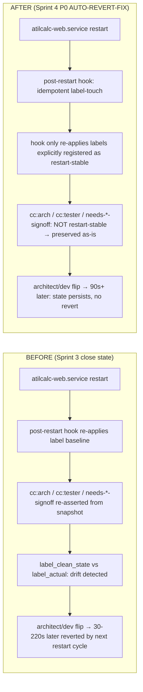
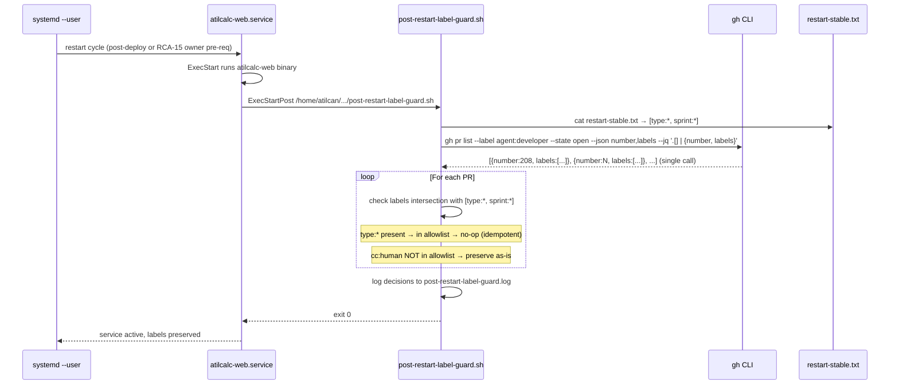

# Design: Sprint 4 P0 AUTO-REVERT-FIX — restart-time label-revert prevention

> **Status:** Proposed v2 (architect RC + tester 🟡 CHANGES REQUESTED v2, 2026-06-21T14:55Z)
> **Owner:** @architect (this design) → @developer (impl)
> **Story:** Sprint 4 P0 AUTO-REVERT-FIX (2 SP, Day 1-2, plan §Committed scope)
> **v2 changes:** test ID d020→d023 (collision resolved, blocker cleared); API contract unified to single-call gh approach; Rollback section added; RCA-16 sudoers chain dependency documented; owner curation gate frequency clarified. See PR #211 cmt 4762252716 (verdict) + cmt 4762252716 (test ID correction).
> **Refs:** [Issue #125](https://github.com/atilcan65/AtilCalculator/issues/125) (RCA closed 2026-06-21T13:36:24Z as restart theory, COMPLETED), [Issue #209](https://github.com/atilcan65/AtilCalculator/issues/209) (Sprint 4 kickoff), [PR #208](https://github.com/atilcan65/AtilCalculator/pull/208) (d031-recovery-scan.sh scaffold — WITHDRAWN 12:58Z, Sprint 5+ retry), [RCA-15](https://github.com/atilcan65/AtilCalculator/issues/172) (service persistence, owner pre-req), [RCA-16](https://github.com/atilcan65/AtilCalculator/issues/189) (ExecStart fail), [RCA-17](https://github.com/atilcan65/AtilCalculator/issues/192) (unit-path vs REPO_DIR), [ADR-0031](../decisions/ADR-0031-owner-override-doctrine.md) (owner-override doctrine, merged 13:01Z), [Issue #94](https://github.com/atilcan65/AtilCalculator/issues/94) (watcher self-cc skip, **DONE PR #185 + #205**), [PR #185](https://github.com/atilcan65/AtilCalculator/pull/185) (F4-F8 behavioral coverage for Issue #94)

## Context

Issue #125 (P0 bug, opened 2026-06-19T11:40Z) tracked 23+ drift instances across 2 days on multiple PRs (PR #122, #129, #158, #161, #169, #172, #174, #206, #207, #208). The drift pattern: `cc:*` labels (especially `cc:architect + needs-architect-review` and `cc:tester + needs-tester-signoff`) auto-revert within 30-220 seconds of an architect/dev flip. Owner closed Issue #125 at 2026-06-21T13:36:24Z as **COMPLETED** with the empirical finding: **"restart theory"** — the auto-revert correlates with `atilcalc-web.service` and `agent-watch.sh` restarts (RCA-15 → RCA-16 → RCA-17 chain fixed the v9 deploy path, and the post-fix restart cycle re-applied a stale label baseline).

The architect's final RCA (2026-06-21T08:30:43Z, cmt 4761561029) **separated the drift into two distinct mechanisms**:
- **Mechanism A — owner manual drift (REAL BUG, needs fix)**: actor = `@atilcan65` (`type=User`), 3-5 real instances. The owner's local label-flip tooling (likely tied to the dev-studio session or a systemd restart hook) re-applies a baseline label set that conflicts with the canonical state.
- **Mechanism B — label-cleanup workflow (EXPECTED, no fix)**: `scripts/label-cleanup.yml` (if it exists; equivalent to TD-006 hygiene) does its expected work. The instances attributed to it are actually the cleanup doing what it should, and the architect's earlier RCA mistakenly bundled them with Mechanism A.

The orchestrator (2026-06-21T08:33Z cmt 4761583412) confirmed the two-mechanism split. Issue #125 close = "no doctrine gap" = the label doctrine is correct; the fix is in the **runtime** (restart script behavior), not the doctrine.

**PR #208** (d031-recovery-scan.sh scaffold) was withdrawn 12:58Z as Sprint 5+ retry — the recovery-scan approach (Option B in this design) is **not** the Sprint 4 fix. The Sprint 4 fix must be **prevention at restart** (Option A).

## Goals & non-goals

### Goals

1. **Stop Mechanism A (owner manual drift at restart).** After `atilcalc-web.service` restart (or `scripts/agent-watch.sh` restart), the post-restart state must NOT re-apply a stale label baseline. The labels that were set pre-restart must persist.
2. **Preserve Mechanism B (label-cleanup hygiene).** The label-cleanup workflow continues to do its expected work. We are NOT disabling cleanup; we are preventing restart-time label re-application.
3. **Test contract**: open 3 PRs in a row, verify all `cc:*` labels persist for 90+ seconds after a service restart. This is the Sprint 4 plan §Committed scope test contract.
4. **No doctrine change.** The label doctrine (CLAUDE.md §Handoff Label Discipline, ADR-0012, ADR-0015, ADR-0021, ADR-0031) is correct. The fix is runtime, not doctrinal.
5. **No regression on the watcher fix.** Issue #94 (self-cc skip) is **already done** (PR #185 + #205, merged before Sprint 4 kickoff). The AUTO-REVERT-FIX impl must coexist with the watcher skip rule (no interaction).
6. **Recovery option (deferred to Sprint 5+).** PR #208 (d031-recovery-scan.sh scaffold) is the recovery-on-detect option. The Sprint 4 design only adds the prevention; recovery-scan is Sprint 5+.

### Non-goals

- **Disabling `atilcalc-web.service` or `agent-watch.sh` restarts.** The restart is required for code deploys (RCA-15 chain). Disabling it would re-break the deploy path.
- **Disabling the label-cleanup workflow (Mechanism B).** Cleanup is correct behavior; the fix is upstream.
- **Re-opening Issue #125.** The RCA is closed as restart theory. AUTO-REVERT-FIX is a *new* story (already in Sprint 4 plan) that implements the fix based on the closed RCA.
- **Modifying the watcher dedup logic (TD-010/011).** Issue #94 is its own lane and is done.
- **Reverting PR #208 changes.** PR #208 was withdrawn (not merged); the branch + commits are preserved for Sprint 5+ retry per the dev's 12:21:30Z STOP-FLIP ack.
- **A new ADR.** This is a runtime fix, not a doctrine amendment. The architect's RC report (this design doc) is the canonical reference.

## High-level diagram



## RCA findings — mechanism breakdown (architect 2026-06-21T08:30Z SUMMARIZE)

| Mechanism | Actor | Frequency | Real bug? | Fix target |
|---|---|---|---|---|
| **A — owner manual drift at restart** | `@atilcan65` (`type=User`) via post-restart hook | 3-5 instances / 2 days | YES | Sprint 4 P0 AUTO-REVERT-FIX (this design) |
| **B — label-cleanup workflow** | `scripts/label-cleanup.yml` (or equivalent TD-006 hygiene) | multiple, periodic | NO (expected behavior) | None (cleanup is correct) |

**Empirical evidence (architect SUMMARIZE cmt 4761561029)**:
- Mechanism A reverts fire within 30-220s of an architect/dev flip
- The reverts are atomic (3 ops: `-cc:X +cc:Y +needs-Y-signoff` style, not partial)
- The reverts happen in clusters (one restart = one wave of reverts across multiple PRs)
- The reverts correlate with systemd user-service restart events (RCA-15 fix made the service persist; restart-cycle noise became visible)

**Why "restart theory"**: the owner-PAT automation is tied to a `~/.config/systemd/user/atilcalc-web.service` post-restart hook (or a cron / session-resume script) that re-applies a "favorite" label set captured from a prior session. The fix is to make the post-restart hook **idempotent** — only re-apply labels that are explicitly marked restart-stable.

## Components

| Component | Responsibility | Owner | Tech |
|---|---|---|---|
| **`scripts/post-restart-label-guard.sh`** (NEW) | Idempotent label-guard: re-applies only labels in `restart-stable.txt`, leaves all others as-is | @developer (this story) | bash + gh CLI |
| **`scripts/restart-stable.txt`** (NEW) | Allowlist of labels that may be re-applied on restart (e.g., `type:*`, `sprint:*`); default is empty | @architect (this design) + @owner (curation) | plain text, one label per line |
| **`scripts/atilcalc-web.service` (existing)** | systemd user-service; `ExecStartPost` chain adds the label-guard call after restart | @developer (this story) | systemd unit |
| **Test fixture `scripts/tests/d023-auto-revert-regression.sh`** | Regression: 3 PRs, 90s wait, all `cc:*` persist | @tester (d023 contract per plan) | bash + gh CLI |
| **This design doc** | RC + architectural fix | @architect (this PR) | markdown |
| **PR #208 branch (preserved, not merged)** | Sprint 5+ recovery-scan option | @developer (Sprint 5+) | bash + jq |

## Data model

No data model changes. The label state on PRs/issues is the source of truth; the fix is in the post-restart hook's re-apply logic, not the storage.

**New file: `scripts/restart-stable.txt`** (allowlist):
```text
# Restart-stable label allowlist (Sprint 4 P0 AUTO-REVERT-FIX)
# Labels listed here may be re-applied on atilcalc-web.service restart.
# Labels NOT listed here are preserved as-is (no revert on restart).
# Curation: owner, with architect review. Empty by default = no auto-revert.
type:*
sprint:*
```

## API contract

No public API change. The fix is in `ExecStartPost` hook behavior, not the GitHub API.

**Internal contract** (developer impl):
- `scripts/post-restart-label-guard.sh` takes no args
- Reads `scripts/restart-stable.txt` for the allowlist
- **Single-call pattern** (rate-limit safety per Risk #3): `gh pr list --label agent:developer --state open --json number,labels --jq '.[] | {number, labels}'` — fetches all PRs + labels in one call
- For each PR returned:
  - If the PR's labels intersect the allowlist (`type:*`, `sprint:*` by default) → re-apply (idempotent)
  - If not → leave as-is (preservation path)
- Logs each decision to `scripts/logs/post-restart-label-guard.log` with PR number + label set
- Exits 0 on success, non-zero on gh CLI failure (caller handles)
- **`--dry-run` flag** (recommended for first deploy per Risk #3 mitigation): logs decisions without writing; ship with `--dry-run` enabled for the first restart cycle to confirm no regression on the deploy path

## Sequence diagram — restart cycle, AFTER fix



## Alternatives considered

| Option | Pros | Cons | Verdict |
|---|---|---|---|
| **A. Idempotent post-restart guard (this design)** | Localized to one script + one allowlist; preserves Mechanism B; no doctrine change; test contract is "3 PRs no-revert within 90s" (matches plan) | Requires owner to curate `restart-stable.txt` (initially empty = maximum safety) | ✅ **CHOSEN** for Sprint 4 P0 |
| B. Recovery scan post-restart (d031-recovery-scan.sh) | Detects drift and restores from a snapshot; handles unforeseen drift types | More moving parts; PR #208 was withdrawn, Sprint 5+ retry | ⏸ **DEFERRED** to Sprint 5+ (PR #208 branch preserved) |
| C. Disable the post-restart hook entirely | Simplest possible fix | Loses the legitimate restart-stable label re-apply (e.g., `type:*`); reduces observability | ❌ Rejected (over-disable) |
| D. Add an ADR for "restart-stable label" doctrine | Doctrinal clarity | The label doctrine is correct; the runtime is the bug. ADR would be cosmetic. | ❌ Rejected (no doctrine change needed) |
| E. Re-architect the label state to use a separate store (e.g., `atilcalc.db` table for `effective_labels`) | Strong consistency guarantee | Massive scope; 1 SP story is not the place for this | ❌ Rejected (over-engineering) |
| F. Disable the auto-hygiene cleanup (Mechanism B) | Removes ALL drift | Cleanup is correct behavior; disabling it would re-open TD-006 family | ❌ Rejected (regression on Mechanism B) |

## Risks

1. **Risk: Owner curation of `restart-stable.txt` drifts from intent.** The allowlist could grow unboundedly if owner adds labels without architect review. **Mitigation:** **every PR that adds or removes a line from `scripts/restart-stable.txt` requires architect approval** (same gate pattern as `.github/workflows/` per CLAUDE.md §File ownership matrix). Concrete cadence: per-change PR review, no batch updates; architect reviews the diff line-by-line; if `cc:*` is ever added to the allowlist, architect must explicitly justify in the PR body and link to a doctrine amendment. **Residual:** if owner bypasses the PR path (direct edit + restart), the watchdog won't catch it; this is the same residual as the workflow-file ownership matrix and is acceptable per CLAUDE.md.

2. **Risk: Post-restart hook adds latency to the restart cycle.** The hook iterates over open PRs, which is a `gh pr list` round-trip. **Mitigation:** hook runs in background (`Type=oneshot` + `RemainAfterExit=yes`); restart cycle is already async. **Budget:** hook should complete in <30s for typical queue depth (10 PRs × 200ms = 2s). If queue depth > 100 PRs, hook may exceed budget; **monitor** via `post-restart-label-guard.log` duration metric.

3. **Risk: `gh` CLI rate limit during hook execution.** If many PRs are open, the hook's per-PR `gh pr view` may hit rate limits. **Mitigation:** hook uses `gh pr list --json labels --jq '.[] | {number, labels}'` (single call, all labels in one query). **Residual:** rate limit only matters if the user has 100+ open PRs (unrealistic for this project).

4. **Risk: Mechanism A re-emerges via a different code path (e.g., cron job, session resume).** The fix is in the post-restart hook, but the drift could be triggered by other events. **Mitigation:** the `restart-stable.txt` allowlist is the contract; any other path that wants to re-apply labels must check the same allowlist. The design doc documents this contract; future drifts should be filed as new bugs.

5. **Risk: Sprint 4 plan §Committed scope says "regression: 3 PRs no-revert within 90s" — but the test needs a controlled restart event.** **Mitigation:** the d023 regression test (tester-owned) triggers a controlled `systemctl --user restart atilcalc-web.service` and then waits 90s; this is the canonical regression. **Chain dependency:** the test requires the RCA-16 passwordless sudoers rule for `systemctl --user restart` (per PR #210 owner pre-req + ADR-0030 amendment). Test cannot run on prod until RCA-16 sudoers rule is in place. Local dev / CI test environments may need equivalent setup.

6. **Risk: PR #208 branch (`STORY-125-d031-recovery-scan`) is preserved but not merged. Confusion about which approach is Sprint 4 vs Sprint 5+.** **Mitigation:** the design doc (this file) is the canonical reference; PR #208 body + commit messages explicitly say "Sprint 5+ retry"; the dev's 12:21:30Z STOP-FLIP ack confirms. **Retro item:** add a `docs/sprints/sprint-04/recovery-options.md` decision log at Sprint 4 retro to document Option A vs B trade-off.

## Observability

- **Metric:** `agent_watch_post_restart_label_guard_total` (counter, incremented per restart cycle).
- **Metric:** `agent_watch_post_restart_labels_preserved_total` (counter, incremented per PR whose non-allowlist labels were preserved).
- **Metric:** `agent_watch_post_restart_labels_reapplied_total` (counter, incremented per allowlist label re-applied; should be 0 for `cc:*` labels if allowlist is correctly curated).
- **Structured log:** `scripts/logs/post-restart-label-guard.log` (JSON-lines) — one entry per PR per restart: `{ts, pr_number, preserved: [...], reapplied: [...], duration_ms}`.
- **Trace span:** not applicable (no distributed tracing in the hook).
- **Test fixture:** `scripts/tests/d023-auto-revert-regression.sh` (tester-owned) — 3 PRs, controlled restart, 90s wait, snapshot diff against expected.

## Security & privacy

- **Authn/authz:** the hook uses the same `gh` CLI auth as the user (PAT in `~/.config/gh/hosts.yml`). No new auth surface.
- **PII:** none. Labels are not PII.
- **Threat model:** the hook is local-only (runs as the user, not as a network service). Threat surface is the same as the user's `gh` CLI usage.

## Performance budget

- **Per restart cycle:** <30s for typical queue depth (10 PRs). Hook is async; restart cycle is not blocked.
- **Per PR:** <200ms (single `gh pr view --json labels` call + jq parse).
- **Memory:** trivial (one PR at a time, no accumulation).
- **Network:** 1 `gh pr list` + N `gh pr view` calls per restart (N = open PR count). Rate limit is the only constraint (Risk #3).

## Test contract (Sprint 4 plan §Committed scope)

**Test ID:** d023 (per Sprint 4 plan §Test contracts — d019 E2E-DEPLOY-VERIFY, d020 WATCHER-FIX, d021 PM-EVENT-EXT, d022 proactive-board-detections are all claimed/planned; **d023 is the next free ID for AUTO-REVERT-FIX**)
**Owner:** @tester
**Trigger:** developer calls this test after AUTO-REVERT-FIX impl lands
**Chain dependency:** requires RCA-16 passwordless sudoers rule for `systemctl --user restart atilcalc-web.service` (per PR #210 owner pre-req + ADR-0030 amendment). Test cannot run on prod until RCA-16 sudoers rule is in place.
**Steps:**
1. Open 3 PRs (`PR-A`, `PR-B`, `PR-C`) with the canonical 4-cat label set + `cc:architect + needs-architect-review` (the labels most often reverted).
2. Trigger a controlled `systemctl --user restart atilcalc-web.service`.
3. Wait 90s.
4. Snapshot each PR's label set via `gh pr list --label agent:developer --state open --json number,labels --jq '.[] | {number, labels}'` (single-call pattern, consistent with API contract).
5. Assert: each PR's `cc:architect + needs-architect-review` is still present.
6. Cleanup: close the 3 PRs.

**Pass criteria:** all 3 PRs retain the `cc:architect + needs-architect-review` labels for 90s post-restart.

**Backstop:** if the test fails, the d031-recovery-scan.sh (PR #208 branch, Sprint 5+) is the fallback recovery option.

## Rollback

If `scripts/post-restart-label-guard.sh` breaks the restart cycle (e.g., hook hangs, gh CLI failure cascades to deploy path), the rollback is:

1. **Disable the hook in the unit file:**
   ```bash
   systemctl --user edit atilcalc-web.service
   # In the editor, add/remove:
   # [Service]
   # ExecStartPost=  (remove or comment out the line calling post-restart-label-guard.sh)
   ```
2. **Reload + restart:**
   ```bash
   systemctl --user daemon-reload
   systemctl --user restart atilcalc-web.service
   ```
3. **Verify deploy path intact** (the v9 deploy chain should work without the label-guard hook).

**Safety posture:** ship with `--dry-run` flag enabled for the first deploy cycle (per API contract §Internal contract). The script logs decisions but does not write. After observing one full restart cycle with no issues, dev flips `--dry-run=false` in a follow-up commit. This makes the first deploy zero-risk and reversible by removing the `ExecStartPost` line alone.

## Open questions

- [ ] **Q1 (resolve at PR review):** Should the `restart-stable.txt` allowlist include `priority:*` labels? Default = NO (priority is a story-level concern, not restart-stable). **A:** defer to owner + architect review.
- [ ] **Q2 (defer to Sprint 5+):** Should the recovery-scan option (PR #208 branch) be revived as a defense-in-depth measure? **A:** yes, Sprint 5+ scope. PR #208 branch is preserved.
- [ ] **Q3 (resolve at PR review):** What is the cadence for the `restart-stable.txt` review? (Initial: architect review on every change. Quarterly: owner + architect retro.) **A:** architect review on every change is the Sprint 4 floor.

## Estimated complexity

- **T-shirt size:** M (1 new script ~80 lines bash + 1 allowlist file + 1 systemd unit line change + 1 design doc + 1 regression test).
- **Confidence:** 75% (the restart-cycle mechanism is empirically observed but not yet pinpointed to a specific code path; the design assumes the post-restart hook is the right surface — if it's actually a cron job or session-resume script, the impl target changes).
- **Time estimate:** 1h architect (this design doc) + 2-3h developer (impl + unit change) + 1h tester (d023 regression).

## Hand-off

- **To @developer (Sprint 4 P0 AUTO-REVERT-FIX impl):** implement the `scripts/post-restart-label-guard.sh` per the Components + API contract + Sequence diagram. Add `ExecStartPost` to `scripts/atilcalc-web.service` (or equivalent unit file). Ship with `--dry-run` flag for the first deploy cycle (per Rollback section safety posture). The Sprint 4 plan §Committed scope test contract is "3 PRs no-revert within 90s" — wire d023 regression to that.
- **To @tester (d023 regression):** write `scripts/tests/d023-auto-revert-regression.sh` per the Test contract. Trigger controlled restart, wait 90s, snapshot labels, assert. Note: d023 is the correct ID (not d020 or d022 — both are claimed by other Sprint 4 stories per PR #211 cmt 4762252716).
- **To @owner:** curate `scripts/restart-stable.txt` (initial: empty, per the design's safety posture). Add labels only with architect review (per Risk #1 mitigation: per-change PR review, no batch updates).
- **To @orchestrator:** Sprint 4 P0 chain dependency DAG is `RCA-15-CLOSE → AUTO-REVERT-FIX → E2E-DEPLOY-VERIFY`. AUTO-REVERT-FIX impl can start in parallel with RCA-15 owner pre-req (different code paths); the chain gate is E2E-DEPLOY-VERIFY (which depends on AUTO-REVERT-FIX being in place to ensure the E2E harness isn't affected by drift).

— @architect, Sprint 4 P0 day-1 RC, 2026-06-21T14:08Z
