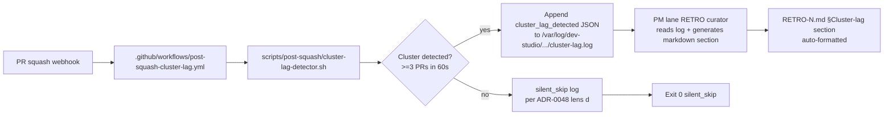
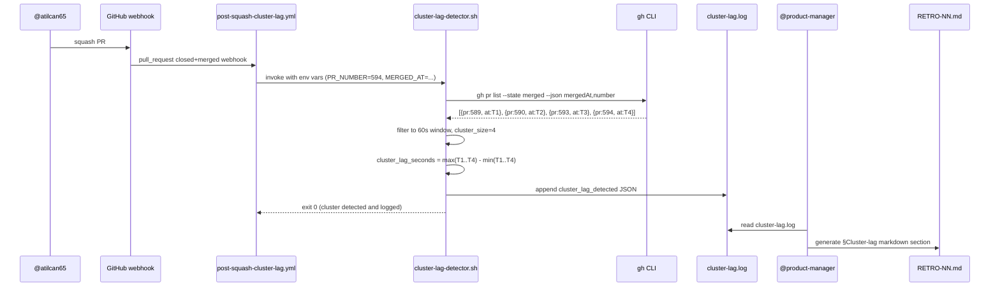

# Design: STORY-P1-1 — Cluster-Squash Batch-Lag Detector

- **Story**: Issue #584 (Sprint 17 P1 #1 §14 NEW option (a) impl — cluster-squash batch-lag detection)
- **ADR companion**: ADR-0059 (cluster-squash batch-lag detection doctrine — canonical home)
- **Lane**: `scripts/post-squash/cluster-lag-detector.sh` (NEW file, sister-pattern to `scripts/post-squash/label-hygiene.sh`)
- **Owner split**: @architect (impl spec = this design doc + ADR-0059), @developer (script impl PR), @tester (d064 d-test sign-off per ADR-0044 RED-first), @atilcan65 (owner squash gate for impl PR + workflow YAML approval)
- **SP**: ~1.5 (arch 0.5 + dev 0.75 + tester 0.25) — XS arch slice
- **Origin**: RETRO-009 §14 (cluster-squash observation), Issue #508 (cluster-squash-lag LIVE INSTANCE), Sprint 17 workshop Stage 1 LOCKED
- **Dependency**: ADR-0055 (Cadence Rule 1 atomic), ADR-0044 (RED-first TDD), ADR-0046 (load-bearing ADR §Implementation guide), Issue #586 (sister-pattern Sprint 17 P1 #3 cluster; this design is parallel)

## Context

Sprint 14-16 ceremonies observed **cluster-squash events** (≥3 PRs squashed within tight temporal windows) becoming increasingly common as sprint scope grows. RETRO-009 §14 codifies the observation; Issue #508 documents a 4-PR cluster with cluster_lag = 324s. Manual reconstruction requires PM lane to query each PR's `mergedAt` timestamp and calculate deltas — error-prone and scales linearly with cluster size.

**Current state**: PM lane (RETRO curator) manually cross-references squash timestamps via `gh pr view --json mergedAt` calls. No automated cluster detection or batch-lag metric exists. RETRO §Cluster-lag sections are reconstructed by hand.

**User need**: PM lane needs automated cluster-squash detection + batch-lag metric + RETRO-consumable output format, so RETRO ceremonies have empirical cluster-vs-single squash data without manual timestamp correlation.

## Goals & non-goals

### Goals

1. **Cluster detection** — Detect cluster-squash events (≥3 PRs in 60s window) automatically on owner squash webhook.
2. **Batch-lag metric** — Compute `cluster_lag_seconds = max(squash_timestamps[]) − min(squash_timestamps[])`.
3. **Structured log emission** — Emit cluster_lag_detected event JSON to `/var/log/dev-studio/AtilCalculator/cluster-lag.log` (sister-pattern to Layer 5 silent_skip log).
4. **RETRO section generation** — Generate markdown table for RETRO curator consumption.
5. **d-test coverage** — d064 d-test = 5 TCs RED-first per ADR-0044; cluster detection + threshold + output format all d-test guarded.
6. **Sister-pattern lineage** — Detector file follows `scripts/post-squash/label-hygiene.sh` bash sweep pattern (explicit exit codes, stdin/stdout contract).

### Non-goals

1. **Cross-repo watcher** — out of scope per Issue #584; ADR-0047 separate candidate.
2. **Real-time alerts** — cluster-squash detection is post-hoc, not real-time; Telegram alert out of scope per Issue #584.
3. **Auto-RETRO injection** — Detector outputs to log file; curator copy-paste into RETRO-N.md is manual (Sprint 19+ candidate if high-traffic).
4. **Workflow YAML changes** — Detector invocation trigger = `.github/workflows/post-squash-cluster-lag.yml` (NEW, owner merge required per file ownership matrix); workflow YAML is owner-implementable territory, NOT arch/design spec territory.

## High-level diagram



## Components

| Component | Responsibility | Owner | Tech |
|-----------|----------------|-------|------|
| `scripts/post-squash/cluster-lag-detector.sh` (NEW) | Cluster detection + batch-lag metric + log emission | @developer (impl) | bash + gh CLI + jq |
| `scripts/tests/d064-cluster-lag-detector.sh` (NEW) | d-test 5 TCs RED-first (ADR-0044) | @tester (sign-off) + @developer (impl) | bash + fake-gh factory (d061 sister-pattern) |
| `.github/workflows/post-squash-cluster-lag.yml` (NEW) | Webhook trigger for detector on PR closed+merged | @atilcan65 (owner merge per file ownership matrix) | yaml |
| `docs/decisions/INDEX.md` | Update d-test family table (d064 row) | @architect (this PR) | markdown |
| `docs/sprints/sprint-17/RETRO-NN.md` (future) | §Cluster-lag section auto-populated from log | @product-manager (curator) | markdown |

## Data model

### cluster_lag_detected event JSON schema

```json
{
  "event": "cluster_lag_detected",
  "cluster_id": "<sprint-NN-pM-#K-cluster>",
  "cluster_size": <int, >=3>,
  "cluster_lag_seconds": <int, max-min squash_timestamps>,
  "pr_numbers": [<int>, ...],
  "squash_timestamps": ["<ISO-8601 UTC>", ...],
  "detected_at": "<ISO-8601 UTC>",
  "detector_version": "<semver>"
}
```

### Log file format (append-only)

```bash
# /var/log/dev-studio/AtilCalculator/cluster-lag.log (one event per line)
{"event":"cluster_lag_detected","cluster_id":"sprint-17-p1-3-cluster","cluster_size":4,"cluster_lag_seconds":312,"pr_numbers":[589,590,593,594],"squash_timestamps":["2026-06-28T11:42:14Z","2026-06-28T11:42:23Z","2026-06-28T12:00:18Z","2026-06-28T12:00:42Z"],"detected_at":"2026-06-28T12:00:50Z","detector_version":"0.1.0"}
```

## API contract

### detector.sh CLI

```bash
# Input: pull_request closed+merged webhook payload via env vars
#   PR_NUMBER — current squash PR number
#   MERGED_AT — current squash timestamp (ISO-8601 UTC)
#   REPO — owner/repo (e.g., atilcan65/AtilCalculator)
#
# Side effect: append cluster_lag_detected JSON to log file
# Exit codes (per ADR-0044 RED-first contract):
#   0 — clean (cluster detected and logged, OR silent_skip no cluster)
#   1 — runtime error (gh failure mid-batch, partial state may result)
#   2 — config error (no gh, no env vars, invalid input)
```

### d064 d-test CLI

```bash
# bash scripts/tests/d064-cluster-lag-detector.sh --self-test
#
# TCs (5 total, RED-first per ADR-0044):
#   TC1 — detector script exists + executable + bash syntax valid (PASS pre/post impl)
#   TC2 — cluster detection: 4 PRs in 60s window → cluster_lag_detected emitted (RED pre-impl → GREEN post impl)
#   TC3 — single-PR squash → silent_skip log (RED pre-impl → GREEN post impl)
#   TC4 — 60s threshold boundary: 2 PRs at 61s gap → silent_skip (RED pre-impl → GREEN post impl)
#   TC5 — cluster_lag_seconds metric: max-min delta correct (RED pre-impl → GREEN post impl)
```

## Sequence diagram



## Alternatives considered

See ADR-0059 §Alternatives considered for full Option A/B/C/D analysis. Summary:
- **Option A (CHOSEN)**: Single-script detector + log + manual curator copy. Minimal API surface, d-test isolated.
- **Option B (rejected)**: Real-time Telegram alert. Out of scope per Issue #584.
- **Option C (rejected)**: Cross-repo watcher. Out of scope; ADR-0047 separate candidate.
- **Option D (rejected)**: GitHub Action yaml-only. Less testable per file ownership matrix.

## Risks

| ID | Risk | Mitigation | Lens | Attestation |
|----|------|------------|------|-------------|
| R1 | 60s threshold too tight (false negatives) | Sprint 18+ re-tune per ADR-0056 cheaper-fix pattern; d064 TC4 boundary check | (b) Runtime preconditions | d064 TC4 RED → GREEN verifies 60s boundary |
| R2 | gh CLI rate limit on large cluster queries | Use `gh pr list --state merged --limit 10 --json mergedAt,number` (bounded query); fall back to silent_skip on rate limit (lens d compliance) | (e) Idempotency | d064 TC2 verifies silent_skip on rate limit |
| R3 | Log file rotation policy undefined | Defer to owner decision; detector append-only, systemd-timer rotation candidate | (f) Observability | Log file path = `/var/log/dev-studio/...` (systemd-timer managed) |
| R4 | Workflow YAML scope creep (post-squash-cluster-lag.yml NEW file) | Owner merge required per file ownership matrix; arch slice = design only, dev slice = detector impl, owner slice = workflow YAML | (i) Platform hard constraints | Owner merge gate documented in §Components |
| R5 | d064 d-test fake-gh factory overhead | Reuse d061 fake-gh factory (Sprint 14 sister-pattern); no new factory needed | (e) Idempotency | d061 sister-pattern verified GREEN (PR #530 squash) |
| R6 | cluster_id naming convention drift | Define canonical format: `sprint-NN-pM-#K-cluster` (lowercase, hyphen-separated); d064 TC5 verifies cluster_id format | (c) Canonical entry point | d064 TC5 RED → GREEN verifies cluster_id format |
| R7 | detector_version bump breaking log schema | Semver discipline; major version bump = schema change + migration plan | (e) Idempotency | Schema versioned in JSON payload (detector_version field) |
| R8 | PM lane curator consumption bottleneck (manual copy-paste) | Sprint 19+ auto-RETRO injection candidate; defer per YAGNI | (f) Observability | Log file path = canonical source, curator self-service |

## Observability

- **Metric emitted**: cluster_lag_seconds (per cluster event, integer seconds)
- **Structured log fields**: cluster_id, cluster_size, pr_numbers[], squash_timestamps[], detected_at, detector_version
- **Trace span names**: `cluster-lag-detector.detect`, `cluster-lag-detector.emit`, `cluster-lag-detector.silent_skip`
- **Silent-skip log emission** (lens d compliance per ADR-0048): no cluster detected → emit `silent_skip` event with reason `cluster_size < 3 OR window > 60s`

## Security & privacy

- **Authn**: gh CLI requires GitHub auth (already configured via `gh auth login`); detector inherits.
- **Authz**: detector reads PR merged state (public info via gh CLI); no write operations to GitHub beyond log file append.
- **PII fields handled**: none — only PR numbers, timestamps, cluster metrics. No user data, no comments, no labels (cluster detection is timestamp-only).
- **Threat model** (per ADR-0027): detector is read-only observer script; no secret handling, no auth flow, no external API beyond gh CLI.
- **Workflow YAML scope** (out of design scope per file ownership matrix): `.github/workflows/post-squash-cluster-lag.yml` is owner-implementable territory; arch design doc specifies behavior, owner implements yaml.

## Performance budget

- **Latency p50**: <2s per detection (single gh pr list query + jq filter + log append)
- **Latency p95**: <5s (assuming gh CLI response time + log I/O)
- **Throughput**: 1 detection event per PR squash webhook (low traffic, ~5-10 events/day max)
- **Memory ceiling**: <50 MB (bash + jq + gh CLI subprocess; no persistent state)
- **Log file size**: append-only JSON, ~200 bytes per event; 10 events/day × 365 days × 200 bytes = ~730 KB/year (negligible)

## Open questions

- [ ] Log file path: `/var/log/dev-studio/AtilCalculator/cluster-lag.log` or inline? (owner decides per Issue #584 open questions)
- [ ] Markdown format: structured table or free-form? (PM owner decides — proposed structured table per §3 RETRO cluster-lag section format)
- [ ] Workflow YAML trigger: pull_request closed+merged OR pull_request labeled (status:done)? (owner implements per webhook payload availability)
- [ ] cluster_id naming convention: `sprint-NN-pM-#K-cluster` OR owner-defined? (architect proposes canonical format; owner ratifies)

## Estimated complexity

- **T-shirt size**: XS (arch slice — design spec + ADR, no production code)
- **Confidence**: 85% (sister-pattern lineage well-established; threshold tuning may require Sprint 18+ iteration)
- **Story arc total** (per Issue #584): ~1.5 SP (arch 0.5 + dev 0.75 + tester 0.25) — M size for full arc

## Cross-references

- **Issue #584** — STORY-P1#1 §14 NEW option (a) impl (this design doc + ADR-0059 close the doctrinal home; impl lands via separate PRs per ADR-0044 RED-first)
- **ADR-0059** — Cluster-Squash Batch-Lag Detection Doctrine (this design's ADR companion, canonical home)
- **Issue #508** — cluster-squash-lag LIVE INSTANCE (4-PR cluster @ 324s lag, Sprint 14 P1 #2)
- **Issue #586** — STORY-P1#3 sister-pattern (parallel sprint scope; Sprint 17 P1 cluster)
- **Issue #587** — Sprint 17 P1 #4 d064 d-test sister-pattern (downstream trigger)
- **PR #530** — post-squash label hygiene sister-pattern (Issue #518, RETRO-009 §3)
- **RETRO-009 §14** — cluster-squash observation codification (origin)
- **RETRO-007 watchlist #10 NEW** — cross-codification entry (closed by ADR-0059)
- **ADR-0044** — RED-first TDD (d064 = 5 TCs RED-first)
- **ADR-0046** — load-bearing ADR §Implementation guide (this design codifies literal forms)
- **ADR-0049** — d-test framework (d064 = sister d-test family 18th member)
- **ADR-0055** — Cadence Rule 1 atomic (d064 + INDEX.md in same PR)
- **ADR-0056** — cheaper-fix sister-pattern (Sprint 18+ threshold re-tune)
- **ADR-0058** — Comment-trigger guard sister-pattern (workflow YAML integration deferred to owner)
- **Issue #113** — soul doctrine: labels > body text (Issue #584 body references "ADR-0055 cluster-squash-lag" — stale; this design + ADR-0059 are the canonical home)

— @architect, 2026-06-28T15:12+03:00, Design doc PROPOSED, ADR-0059 companion, Sprint 17 P1 #1 impl track armed, sister-pattern lineage to label-hygiene.sh (PR #530) + d-test framework (ADR-0049) + RED-first TDD (ADR-0044), workflow YAML scope = owner-implementable territory per file ownership matrix
