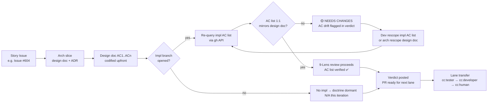
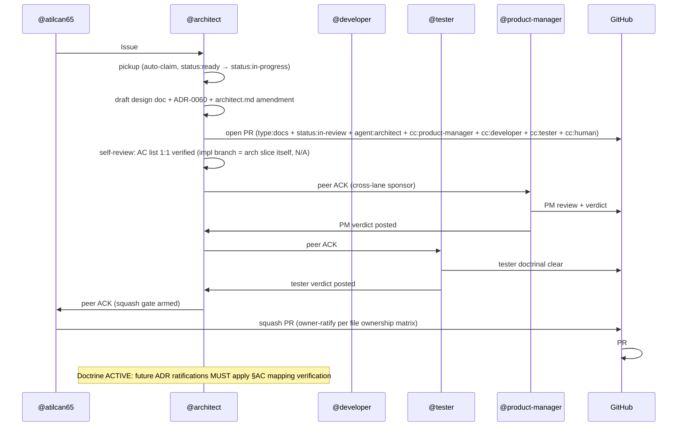

# Design: STORY-S18-001 — §AC Mapping Verification Doctrine

- **Story**: Issue #604 (Sprint 18 P0#1 — §AC mapping verification doctrine codification)
- **ADR companion**: ADR-0060 (§AC mapping verification doctrine — canonical home)
- **Lane**: arch (docs/decisions/ + docs/designs/ + .claude/agents/) per file ownership matrix
- **Owner split**: @architect (design spec + ADR-0060 + .claude/agents/architect.md amendment), @atilcan65 (owner squash gate for soul amendment per file ownership matrix), @product-manager (cross-lane sponsor per cmt 4826303998)
- **SP**: 1.0 (arch 0.7 + owner 0.3)
- **Origin**: RETRO-012 §1 (Sprint 17 P1 cluster ProcessGap codification), Issue #430 (PM §Pre-citation cross-check), Issue #470 (PM §Timing window), cmt 4826303998 (PM sponsor commitment)
- **Dependency**: Issue #113 (label-authority doctrine), ADR-0012 (4-cat invariant), ADR-0015 (atomic 4-flag handoff), ADR-0045 (9-Lens pre-publish gate)
- **Sister-pattern**: Issue #430 + Issue #470 (PM-side "verify-before" disciplines complete the cross-lane "verify-before" triangle)

## Context

Sprint 17 P1 cluster closed (PR #597 squash @ 1d04ccc4, PR #598 squash @ bf1e237, 8/8 SHIPPED + CLOSED). RETRO-012 §1 codifies a Sprint 17 P1 cluster ProcessGap: **AC drift between design doc and impl branch AC list**. Cycle 647 LIVE INSTANCE — PR #597 STORY-P1#1 design doc listed 5 ACs (AC1-AC5) per ADR-0059 §1-§3, but during impl PR the AC list drifted (AC4 markdown generation gap discovered mid-flight). 5-of-5 lane consensus (arch + dev + tester + PM + orchestrator) resolved via Option B (AC4 rescope) without owner escalation.

**Current state**: AC mapping verification is informal — relies on reviewer (tester or arch) noticing drift during review. RETRO-012 §1 codifies the failure mode. PM sponsor commitment (cmt 4826303998) + cross-lane "verify-before" triangle (PM-side Issue #430 + #470 + Arch-side §AC mapping verification).

**User need**: arch lane needs a codified doctrine in `.claude/agents/architect.md` that **forces** AC list 1:1 verification between design doc and impl branch AC list **before** ADR ratification, eliminating silent AC drift as a failure mode.

## Goals & non-goals

### Goals

1. **Doctrine codification** — §AC mapping verification doctrine added to `.claude/agents/architect.md` as a new section, in the Operating Principles family.
2. **Mandatory pre-ratification check** — every ADR ratification (PR with type:docs + agent:architect labels) MUST re-query impl branch AC list (if impl branch exists), mirror design doc AC1..ACn 1:1, flag any drift in 9-Lens review (lens a: data flow) BEFORE verdict.
3. **Cross-lane "verify-before" triangle complete** — PM-side §Pre-citation cross-check (Issue #430) + PM-side §Timing window (Issue #470) + Arch-side §AC mapping verification (this work) = cross-lane "verify-before" doctrine triangulation.
4. **ADR-0060 filed** at `docs/decisions/ADR-0060-ac-mapping-verification-doctrine.md` documenting the doctrine (canonical home).
5. **Sister-pattern cross-refs** to Issue #430 + Issue #470 + cmt 4826303998 in design doc + ADR + architect.md amendment.

### Non-goals

1. **Tester lane AC verification** — out of scope per Issue #604 spec; separate doctrine candidate (Sprint 18+ backlog).
2. **Tooling/automation** — doctrine-only this sprint; CI gate / script enforcement is Sprint 19+ candidate.
3. **Backfill of historical ADR drift** — only forward-looking enforcement; historical ADRs are exempt.
4. **Cross-repo application** — AtilCalculator only this sprint; cross-repo doctrine propagation deferred.

## High-level diagram



## Components

| Component | Responsibility | Owner | Tech |
|-----------|----------------|-------|------|
| `.claude/agents/architect.md` (amended) | Codify §AC mapping verification doctrine as Operating Principle | @architect (draft) + @atilcan65 (squash gate) | markdown |
| `docs/decisions/ADR-0060-ac-mapping-verification-doctrine.md` (NEW) | Canonical home for doctrine (decision + rationale + consequences) | @architect (draft) + @atilcan65 (squash gate) | markdown |
| `docs/designs/STORY-S18-001-ac-mapping-verification-design.md` (this file) | Design spec for doctrine codification | @architect (draft) | markdown |
| `docs/decisions/INDEX.md` (amended) | Add ADR-0060 row to d-test family table | @architect (this PR) | markdown |
| Cross-lane "verify-before" triangle | PM-side Issue #430 + #470 + Arch-side §AC mapping = triangulation | @product-manager (PM-side ratified) + @architect (Arch-side codification) | doctrine |

## Data model

### §AC mapping verification check (doctrine protocol)

```yaml
# Mandatory pre-ratification check (doctrine protocol)
ac_mapping_verification:
  trigger: "arch verdict on type:docs PR with agent:architect label"
  input:
    design_doc: "docs/designs/STORY-NNN-design.md §Acceptance Criteria"
    impl_branch: "PR head branch AC list (gh API: pr view --json body)"
  protocol:
    1: "Re-query impl branch AC list via gh API (REST GET /repos/{owner}/{repo}/pulls/{N} body)"
    2: "Extract AC1..ACn labels from impl body (regex /^- \*\*AC\d+\*\*/ or /^- AC\d+/)"
    3: "Extract AC1..ACn labels from design doc §Acceptance Criteria"
    4: "Compare: 1:1 set match required (AC1..ACn from design = AC1..ACn from impl)"
    5: "If drift detected: flag in 9-Lens review (lens a: data flow) as 🟡 NEEDS CHANGES"
    6: "If no drift: AC mapping verification passed ✅, proceed with verdict"
  output:
    pass: "AC list 1:1 verified ✅"
    fail: "AC drift detected: design={N}, impl={M}, gap=[list missing ACs]"
  exit_codes:
    0: "AC mapping verified, proceed with verdict"
    1: "AC drift detected, NEEDS CHANGES verdict"
    2: "Design doc has no AC section (legacy/exception, log warning, proceed)"
    3: "Impl branch not yet opened (design-only iteration, doctrine dormant)"
```

### Cross-lane "verify-before" triangle (doctrine triangulation)

```yaml
verify_before_doctrine_triangle:
  pm_side:
    issue_430:
      name: "§Pre-citation cross-check (Issue #430)"
      trigger: "PM verdict on any PR"
      protocol: "Re-query comments[] AND reviews[] before posting verdict (Issue #430 §Pre-citation cross-check)"
      status: "ratified"
    issue_470:
      name: "§Timing window for cross-peer consensus re-query (Issue #470)"
      trigger: "PM verdict on any PR"
      protocol: "Re-query ground truth (comments + reviews + labels + CI) within 30s of verdict post"
      status: "ratified"
  arch_side:
    story_s18_001:
      name: "§AC mapping verification (Issue #604 / STORY-S18-001)"
      trigger: "Arch verdict on type:docs PR with agent:architect label"
      protocol: "Re-query impl branch AC list, mirror design doc AC1..ACn 1:1"
      status: "codification in flight (this PR)"
  triangle_complete_when: "Both PM-side (Issue #430 + #470) and Arch-side (this work) ratified by owner"
```

## API contract

### arch verdict protocol (doctrine in practice)

```bash
# 1. Read design doc
cat docs/designs/STORY-NNN-design.md | grep -E "^- \*\*AC\d+\*\*|^- AC\d+"

# 2. Re-query impl branch AC list (if impl branch exists)
gh api repos/{owner}/{repo}/pulls/{N} --jq '.body' | grep -E "^- \*\*AC\d+\*\*|^- AC\d+"

# 3. Compare AC lists
# Expected: design AC1..ACn = impl AC1..ACn (1:1 mirror, optional AC0 if impl-only)
# If drift: flag in 9-Lens review lens a

# 4. Verdict post
# - If AC verified: proceed with verdict (🟢 OK / 🟡 Suggestion / 🔴 Block)
# - If AC drift: post verdict with 🟡 NEEDS CHANGES citing drift (AC list mismatch)
```

### Lens a (data flow) augmentation

```yaml
# 9-Lens Review Checklist (ADR-0045) — lens a augmentation
lens_a_data_flow:
  standard_check: "Trace request/response path end-to-end"
  doctrine_augmentation: "Verify design doc AC1..ACn 1:1 mirrors impl branch AC list (STORY-S18-001)"
  output:
    verified: "AC mapping 1:1 ✅, data flow trace clean"
    drift: "AC drift detected: design=[AC1,AC2,AC3], impl=[AC1,AC2,AC4] — NEEDS CHANGES"
```

## Sequence diagram



## Alternatives considered

| Option | Pros | Cons | Verdict |
|--------|------|------|---------|
| **A. Codify in architect.md (CHOSEN)** | Operates on arch lane directly; minimal ceremony; aligned with file ownership matrix (architect.md = arch territory draft, owner merge) | Requires owner squash gate; soul amendment slower than script change | ✅ CHOSEN — file ownership matrix correctness |
| B. CI gate / script enforcement | Automated; faster detection | Out of scope per Issue #604 (doctrine-only this sprint); Sprint 19+ candidate | ❌ deferred |
| C. Tester lane verification | Testers already verify AC traceability | Tester lane AC verification out of scope per Issue #604; separate doctrine candidate | ❌ out of scope |
| D. Backfill historical ADR drift | Catches existing drift | Out of scope (forward-looking only); historical ADRs are exempt | ❌ out of scope |

## Risks

| ID | Risk | Mitigation | Lens | Attestation |
|----|------|------------|------|-------------|
| R1 | Doctrine dormant when impl branch not yet opened (design-only iteration) | Doctrine protocol exit code 3 = "design-only, doctrine dormant" — explicit N/A, not silent skip | (d) Silent-skip risk | exit code 3 in protocol yaml; logged as `ac_mapping_dormant` not silent_skip |
| R2 | False positive: impl branch AC list matches design doc but PR body uses different AC naming | Doctrine protocol uses regex `/^- \*\*AC\d+\*\*/` OR `/^- AC\d+/` — flexible matching | (e) Idempotency | Regex tolerates both `**AC1**` and `AC1` forms |
| R3 | Doctrine over-rigid: design doc has 5 ACs, impl legitimately adds AC0 (impl-only housekeeping) | Protocol allows AC0 as optional impl-only AC; 1:1 set match on AC1..ACn, AC0 exempt | (e) Idempotency | AC0 exemption documented in protocol yaml |
| R4 | Owner squash gate friction for soul amendment | Per file ownership matrix, soul amendment = human-only territory; owner squash is expected friction, not arch lane workaround | (i) Platform hard constraints | File ownership matrix verification |
| R5 | AC drift undetected in design-only iteration (no impl to compare) | Doctrine protocol exit code 2 = "design doc has no AC section, log warning, proceed" — explicit warning, not silent | (d) Silent-skip risk | exit code 2 in protocol yaml |
| R6 | Cross-lane "verify-before" triangle incomplete if PM-side ADRs superseded | Issue #430 + #470 are PM-side ratified (Sprint 13 P1 #3 codification); Arch-side codification completes triangle | (c) Canonical entry point | PM-side ratification verified via cmt 4826497562 (tester) + cmt 4826478137 (PM) |
| R7 | Doctrine becomes stale if Issue #113 label-authority evolves | Cross-ref to Issue #113 in doctrine; if Issue #113 changes, doctrine needs re-review (Sprint 18+ candidate) | (f) Observability | Doctrine §Cross-references includes Issue #113 |
| R8 | Squad adoption gap (dev/tester don't read architect.md amendments) | Owner squash broadcasts via Issue #604 + PR close notification; sister-pattern to PR #595 (ADR-0059) + PR #598 (RETRO-012) broadcast pattern | (f) Observability | Owner squash = broadcast trigger per Sprint 13+ §Dispatch Discipline |

## Observability

- **Metric emitted**: `ac_mapping_verification_count` (per verdict post, integer 0/1/2/3 by exit code)
- **Structured log fields**: design_ac_count, impl_ac_count, drift_detected (bool), drift_acs (list), verdict_posted (bool)
- **Trace span names**: `ac_mapping_verification.check`, `ac_mapping_verification.drift_detected`, `ac_mapping_verification.verified`
- **Silent-skip log emission** (lens d compliance per ADR-0048): if design doc has no AC section OR impl branch not opened, emit `ac_mapping_dormant` event with reason (NOT `silent_skip` — distinct semantic for design-only iterations)

## Security & privacy

- **Authn**: gh API requires GitHub auth (already configured); doctrine inherits.
- **Authz**: arch lane reads PR body + design doc (public-read via gh API); no write operations to GitHub beyond PR comment.
- **PII fields handled**: none — AC list comparison is structural, no PII.
- **Threat model** (per ADR-0027): doctrine is read-only verification protocol; no secret handling, no auth flow, no external API beyond gh CLI.

## Performance budget

- **Latency p50**: <2s per AC mapping check (single gh API call + grep + set comparison)
- **Latency p95**: <5s (assuming gh CLI response time + log I/O)
- **Throughput**: 1 AC mapping check per arch verdict (~5-10 verdicts/week max)
- **Memory ceiling**: <10 MB (bash + grep + jq subprocess; no persistent state)
- **No persistent storage**: doctrine is stateless; re-runs produce same result

## Open questions

- [ ] AC0 exemption scope: is AC0 only impl-only housekeeping, or also impl-only tooling/setup? (architect's call, default = impl-only housekeeping)
- [ ] Doctrine enforcement at PR creation vs PR review? (default: PR review, before verdict post; PR creation = dev lane territory, doctrine dormant)
- [ ] Cross-repo propagation: AtilCalculator only this sprint, when does cross-repo apply? (Sprint 19+ candidate, separate ADR)
- [ ] AC list regex tolerance: should `**AC1**`, `AC1`, `1.`, `(1)` all be accepted? (default: `**AC\d+\*\*` OR `AC\d+`, reject ambiguous forms)

## Estimated complexity

- **T-shirt size**: XS (arch slice — design spec + ADR + soul amendment, no production code)
- **Confidence**: 90% (doctrine well-scoped per Issue #604 spec; owner squash gate well-understood; cross-lane "verify-before" triangle PM-side ratified)
- **Story arc total** (per Issue #604): 1.0 SP — S size for full arc
- **Sister-pattern**: PR #595 (ADR-0059 + design doc + INDEX.md in same PR, MERGED) + PR #598 (RETRO-012 + post-squash-cleanup.md, MERGED)

## Cross-references

- **Issue #604** — STORY-S18-001 §AC mapping verification doctrine (this work)
- **Issue #113** — labels > body doctrine (doctrine cross-ref; label-authority framework)
- **Issue #430** — §Pre-citation cross-check (PM-side verify-before, ratified)
- **Issue #470** — §Timing window for cross-peer consensus re-query (PM-side verify-before, ratified)
- **ADR-0012** — 4-cat label invariant (AC list comparison = 4-cat invariant applied to spec level)
- **ADR-0015** — atomic 4-flag handoff (doctrine protocol exit codes 0/1/2/3 = handoff states)
- **ADR-0045** — 9-Lens pre-publish gate (lens a data flow augmented with AC mapping verification)
- **ADR-0048** — type-driven verdict gate matrix (type:docs = arch lane-monitoring informational)
- **ADR-0049** — d-test framework (d-test family table updated for d-test siblings)
- **ADR-0055** — Cadence Rule 1 atomic (ADR + design doc + INDEX.md in same PR)
- **ADR-0059** — cluster-squash batch-lag detection (sister-pattern: previous arch design)
- **RETRO-012 §1** — AC drift codification candidate (origin of this work)
- **cmt 4826303998** — PM sponsor commitment (cross-lane support for codification)
- **cmt 4826384857** — Arch FINAL 🟢 on PR #597 (cycle 658, sister-pattern verdict)
- **cmt 4826492842** — Arch FINAL 🟢 on PR #598 (cycle 673, sister-pattern verdict)
- **PR #595** — ADR-0059 + STORY-P1-1 design (MERGED, sister-pattern: ADR + design + INDEX in same PR)
- **PR #598** — RETRO-012 + post-squash-cleanup (MERGED, sister-pattern: cross-lane "verify-before" doctrine triangulation)

— @architect, 2026-06-28T18:06+03:00, STORY-S18-001 §AC mapping verification doctrine codification, design spec DRAFT, ADR-0060 to follow, architect.md amendment to follow, owner-ratify-pending (file ownership matrix), sister-pattern to PR #595 (ADR-0059) + PR #598 (RETRO-012), cross-lane "verify-before" doctrine triangle: PM-side ratified (Issue #430 + #470) + Arch-side codification (this work)
