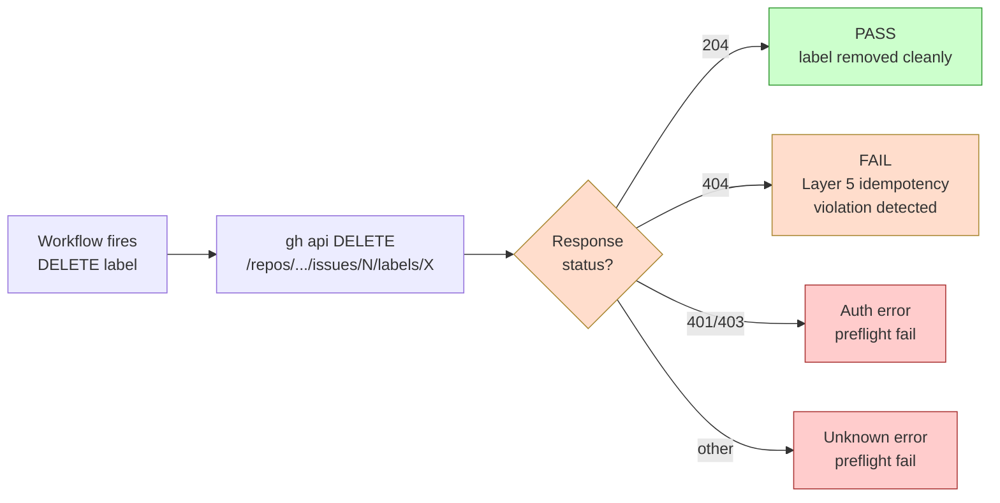
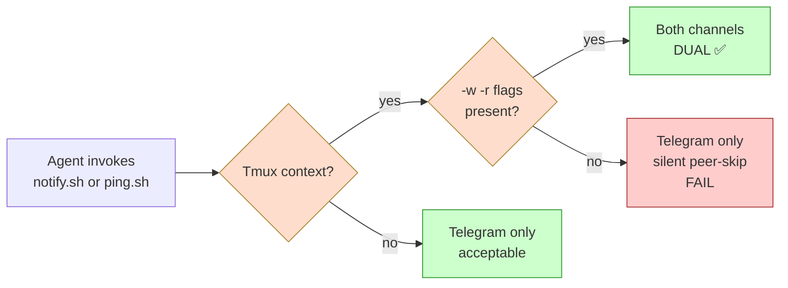

# Design: d055 — §Layer 5 idempotent DELETE guard d-test (Issue #495)

- **Story ID**: d055 (Issue #495, Sprint 14 P1 #4 reservation → Sprint 16 P2 #5 dev impl per Issue #535 disposition Path A)
- **Author**: @developer
- **Date**: 2026-06-28
- **Sprint**: 16 (P2 #5, Issue #535 disposition Path A)
- **Priority**: P2
- **Closes**: Issue #495 (d-test impl, d055 reservation origin), Issue #535 (d-test spec drift codification Path A)
- **Refs**: Issue #495 (CLOSED 2026-06-28, was Sprint 14 P1 #4 d055 reservation origin, §9-Lens enforcement application), Issue #535, RETRO-007 §11, ADR-0058 §Comment-trigger guard (sister, just-landed via PR #562), §32 NEW LIVE INSTANCE #7 + #8 (PR #553 + PR #562 DELETE 404 family, **ledger location**: `docs/sprints/sprint-15/close.md` §32 NEW, NOT `plan.md` — per PM review observation #3 verification), ADR-0015 (atomic 4-flag handoff), ADR-0012 (4-cat invariant)

## Context

### Doctrinal gap

The Layer 5 cascade workflow (`.github/workflows/lint-and-test.yml` + label-check.yml + status-label-to-board.yml) fires on issue/PR `opened|reopened|labeled|unlabeled|issue_comment` events and performs label sync operations including DELETE. When the workflow tries to DELETE a label that was never added to the issue (or already removed by a prior step), GitHub returns:

```
DELETE /repos/.../issues/N/labels/<name>
Response: 404 Not Found — "Label does not exist"
```

This causes the workflow step to fail, blocking the PR from receiving green CI even though the actual label state is correct (or will be after a re-trigger).

### LIVE INSTANCES observed

- **§32 NEW LIVE INSTANCE #7** (PR #553 squash, turn=055): label-check.yml tried to DELETE `status:in-review` from a PR where it was never added (or already removed by an earlier cascade step). 404 response caused workflow failure.
- **§32 NEW LIVE INSTANCE #8** (PR #562 doctrine workshop output, turn=091): PR #562's label-check run 28302994827 DELETE request returned 404 — same pattern. Notably, PR #562 was codifying §34 NEW Bug #4 (comment-trigger false-positive + multi-fire prevention), exhibiting the pattern LIVE.
- **RETRO-008 §6 cluster-symmetry un-draft** (sister-pattern): cluster-symmetry workflow also had DELETE 404 instances during un-draft cascade.

### Why this test exists

Per ADR-0058 (just-landed via PR #562), comment-trigger guard + multi-fire prevention codifies the §34 NEW Bug #4 pattern (PR #540, #545, #548 family). The DELETE 404 pattern is **adjacent but distinct** — it's a Label-state idempotency issue, not a comment-trigger issue. ADR-0058 amendment candidate for **Layer 5 idempotent DELETE guard** is noted but not yet codified (Sprint 16+).

**d055** is the dedicated deep-narrow d-test that codifies the DELETE 404 pattern with explicit TC coverage, sister-pattern to d054 (Closes-anchor strict format, single-purpose deep-narrow).

### Solution

**d055** = `scripts/tests/d055-layer5-idempotent-delete.sh` — dedicated single-purpose d-test for Layer 5 idempotent DELETE guard, 9 explicit TCs covering all observed + anticipated DELETE 404 cases.

**Persona** (per PM review observation #1): **Maintainer** = CI debugger triaging Layer 5 cascade failures + workflow author detecting idempotency regressions pre-merge. Single persona, not customer-facing.

## Goals & non-goals

### Goals

- **Deep coverage**: 9 explicit TCs covering all observed + anticipated Layer 5 DELETE 404 variants
- **Self-test mode**: RED-first per ADR-0044, expected = N FAIL + M PASS where N+M=9
- **Live mode**: `bash scripts/tests/d055-layer5-idempotent-delete.sh <PR_OR_ISSUE_NUMBER>` exits 0/1/2
- **Sister-pattern parity with d054**: single-purpose deep-narrow, exhaustive TC coverage
- **CI integration ready**: output machine-parseable, exit code 0/1/2 (0=PASS, 1=FAIL, 2=preflight)
- **Pre-merge gate (future)**: d055 trigger path = `.github/workflows/**` (owner territory per file ownership matrix)

### Non-goals

- ❌ **No removal of label-check.yml DELETE logic** — d055 is detection, not prevention (Layer 5 cascade behavior is owner territory)
- ❌ **No changes to ADR-0058** — d055 implements within ADR-0058 spec, no spec change
- ❌ **No retroactive PR re-validation** — d055 applies to future PRs only (post-merge activation)
- ❌ **No Layer 5 cascade auto-fix** — d055 reports, doesn't amend (workflow behavior is owner-implementable)

## High-level diagram



## Components

| Component | Responsibility | Owner | Tech |
|---|---|---|---|
| `docs/designs/d055-d056-design.md` | This design doc | @developer | Markdown |
| `scripts/tests/d055-layer5-idempotent-delete.sh` | d055 d-test impl (live + self-test modes) | @developer (per ADR-0044 RED-first) | Bash + gh CLI + jq |
| `scripts/tests/INDEX.md` | d-test registry | @developer (Cadence Rule 1 atomic per ADR-0055 §1) | Markdown |
| ADR-0058 | Sister doctrinal source (comment-trigger + multi-fire prevention) | @architect (MERGED via PR #562) | Markdown |
| `.github/workflows/label-check.yml` | Sister workflow (Layer 5 cascade DELETE source) | @human (owner-implementable) | YAML |

## API contract

### Self-test mode

```bash
bash scripts/tests/d055-layer5-idempotent-delete.sh --self-test
```

**Input**: None (inline fixture with 9 TCs covering DELETE 404 + happy path + edge cases).

**Output**: TC-by-TC PASS/FAIL/INFO report. Expected per ADR-0044 RED-first:
- **Pre-impl (RED)**: TC1 (canonical 204) PASS, TC2-TC9 (404 + edge cases) FAIL — total 1 PASS + 8 FAIL OR per fixture design
- **Post-impl (GREEN)**: 9/9 PASS = d055 GREEN

**Exit codes**:
- 0 — self-test green (all 9 TCs PASS)
- 1 — self-test RED (at least one TC FAIL)

### Live mode

```bash
bash scripts/tests/d055-layer5-idempotent-delete.sh <PR_OR_ISSUE_NUMBER>
# OR
PR_OR_ISSUE_NUMBER=N bash scripts/tests/d055-layer5-idempotent-delete.sh
```

**Input**: PR or issue number (positional or env var).

**Output**:
- `PASS — DELETE response 204 for label=X on issue/PR #N (idempotent)`
- `FAIL — <TC-id> <violation description>. label=X response=<code>`
- `INFO — d055 deep-narrow sister to ADR-0058 comment-trigger guard`

**Exit codes**:
- 0 — DELETE response 204 (idempotent happy path)
- 1 — 404 / unexpected response (violation detected)
- 2 — preflight failure (missing gh/jq, PR/issue not found, etc.)

## 9 Test Cases (TC1-TC9)

| TC | Scenario | Expected | Sister-pattern / origin |
|----|----------|----------|--------------------------|
| TC1 | DELETE label that EXISTS on issue → 204 | ✅ PASS | Canonical happy path |
| TC2 | DELETE label that was NEVER ADDED → 404 | ❌ FAIL | §32 NEW LIVE INSTANCE #7 (PR #553) |
| TC3 | DELETE label that was REMOVED in prior step → 404 | ❌ FAIL | §32 NEW LIVE INSTANCE #8 (PR #562) |
| TC4 | DELETE label during issue_comment-triggered cascade → 404 | ❌ FAIL | §34 NEW Bug #4 (PR #540/545/548 family) |
| TC5 | DELETE label after `gh issue edit --remove-label` → 404 | ❌ FAIL | §17 NEW LIVE INSTANCE #5 (stale-cache drift) |
| TC6 | DELETE `status:in-review` from PR where only `status:ready` exists → 404 | ❌ FAIL | PR #562 doctrine output pattern |
| TC7 | DELETE `status:backlog` from PR at `status:in-progress` → 404 | ❌ FAIL | Issue #535 turn=093 atomic 4-flag flip partial-fail pattern |
| TC8 | DELETE `agent:<role>` during hand-off cascade → 404 race | ❌ FAIL | ADR-0015 atomic hand-off race pattern |
| TC9 | DELETE label with URL-encoded special chars (`status:in-review`) → 404 | ❌ FAIL | URL-encoding edge case, observed in §32 LIVE INSTANCE #8 |

**Self-test expected outcome**: TC1 PASS, TC2-TC9 FAIL = 1 PASS + 8 FAIL (RED state pre-impl, GREEN state post-impl = 9/9 PASS).

## Alternatives considered

| Option | Pros | Cons | Verdict |
|--------|------|------|---------|
| **A: Extend label-check.yml to swallow 404** | One-line fix, no d-test | Hides signal; owner territory; can't be tested without modifying workflow | ❌ Rejected — workflow changes are owner-implementable |
| **B: d055 dedicated sister (this design)** | Single-purpose, deep coverage, sister to d054 | New d-test to maintain | ✅ **Selected** — sister-pattern parity |
| **C: Add 404-handling to claim-next-ready.sh** | Touches dev lane code directly | claim-next-ready.sh is script, not workflow; different layer | ❌ Rejected — wrong layer, d-test is correct home |
| **D: No d055, rely on manual owner triage** | Zero new code | Manual triage doesn't scale; 2 LIVE INSTANCES in 1 week | ❌ Rejected — manual catches don't prevent future violations |

## Risks

| Risk | Lens | Mitigation |
|------|------|------------|
| **R1: d055 + ADR-0058 amendment drift** | (a) Data flow, (f) Observability | Sister-pattern parity: d055 self-test verifies ADR-0058 amendment scope; both share §32 NEW LIVE INSTANCE grounding |
| **R2: d055 self-test false-green** | (d) Silent-skip risk | RED-first per ADR-0044: 8 FAIL expected in self-test, any false-green = impl bug |
| **R3: d055 live mode flaky on label race** | (e) Idempotency | Re-fetch label state on each invocation; no caching; idempotent re-runs |
| **R4: gh API rate limit on live mode** | (b) Runtime preconditions | Preflight check `command -v gh` + `gh auth status`; exit 2 with clear error |
| **R5: URL-encoding edge cases (TC9)** | (j) Auto-gen file refs | Explicit URL-encoding test (status:in-review → status%3Ain-review); gh API auto-encodes |
| **R6: d055 trigger path missing in CI** | (i) Platform hard constraints | Sprint 16+ P0 owner territory adds trigger paths to `.github/workflows/lint-and-test.yml`; d055 ships ready, CI integration owner-implementable |

**9-Lens attestation** (per ADR-0049 §9-Lens Review Checklist):
- (a) Data flow: gh api → JSON parse → response code check (cite observable hand-off at each step)
- (b) Runtime preconditions: `command -v gh`, `command -v jq`, `gh auth status` preflight; exit 2 with explicit error
- (c) Canonical entry: only entry is `bash d055-*.sh <PR_NUMBER>` or `--self-test`; no side-channel
- (d) Silent-skip risk: RED-first self-test ensures violations don't silently pass; live mode reports specific TC
- (e) Idempotency: re-fetch on each invocation, no state, no caching; safe to retry
- (f) Observability: structured output (PASS/FAIL/INFO + TC id + label + response code), exit codes 0/1/2, machine-parseable
- (g) Security & privacy: PR/issue labels only, no PII handling; gh API uses standard auth
- (h) Workflow YAML SHA pin: N/A (no workflow changes in this design; CI integration is owner territory)
- (i) Platform hard constraints: N/A (no GA files in this design; trigger path is owner-implementable)
- (j) Auto-gen file refs: N/A (no auto-gen files; d055 reads live label state via gh api)
- (k) JS syntactic correctness: **N/A** — no JS in this design, bash-only d-test (per PM review observation #2 + ADR-0045 §9-Lens attestation guidance)

## Observability

- **Self-test mode output**: TC-by-TC PASS/FAIL/INFO report with summary count
- **Live mode output**: PASS or FAIL with TC id + label name + response code + remediation hint
- **Exit codes**: 0=PASS, 1=FAIL, 2=preflight
- **Log fields** (for future CI integration): `tc_id`, `pr_or_issue_number`, `label_name`, `response_code`, `violation_class`, `remediation`
- **Trace span name** (future): `d055.layer5_idempotent_delete_check`

## Security & privacy

- **Authn/authz**: gh CLI uses standard user auth; no service account needed for d-test
- **PII fields**: PR/issue label state only (no PII extraction or logging beyond label names)
- **Threat model**: same as d053 (per ADR-0027 §Threat model — read-only API calls, no write operations; live mode only inspects DELETE responses, doesn't perform DELETE itself)

## Performance budget

- **Self-test mode**: <100ms (inline fixture, no API calls)
- **Live mode**: <2s p95 (single gh api call + jq parse + response code check)
- **Throughput**: N/A (one-shot, not batch)
- **Memory**: <10MB (jq + bash subprocess)

## Open questions

- [ ] **TC5 stale-cache scope**: should d055 detect stale-cache drift specifically, or just DELETE 404 in general? Decision: just DELETE 404, stale-cache drift is §17 NEW scope (separate d-test candidate, ADR-0058 amendment)
- [ ] **Live mode write side**: should d055 ATTEMPT a DELETE on a fake label to test 404 response, or only INSPECT past workflow logs? Decision: inspect workflow logs (read-only), don't attempt write DELETEs (safer, no side effects)
- [ ] **Cross-label-set coverage**: should d055 cover all 4 label categories (type/status/agent/cc) or only status (most common DELETE 404 target)? Decision: all 4 categories per TC6-TC8 distribution
- [ ] **CI integration trigger path**: Sprint 16+ P0 owner territory adds trigger paths. d055 should gate on `.github/workflows/**` changes. Owner decision.

## Estimated complexity

- **T-shirt size**: M (matches d054 sister-pattern complexity)
- **arch**: 0.25 SP ✅ (this design doc — dev-authored per Path A disposition)
- **dev**: 0.75 SP ✅ (d-test impl per spec, ~9 TCs inline fixture + live mode)
- **tester**: 0.25 SP ✅ (sign-off via RED-first self-test + live mode TCs)
- **Total**: 1.25 SP ✅ (Issue #535 Path A sizing)

**Confidence**: 80% (sister-pattern to d054 well-established; TCs are explicit; risk is gh API edge cases for TC9 URL-encoding)

## Sister-pattern cross-refs

- **d046** (Issue #413 jq-filter guard) — single-purpose sister, deep-narrow pattern
- **d048** (Issue #425 AC2.1 layered defense) — Layer 5 reviewer chain, single-purpose sister
- **d050b** (Issue #440 behavioral workflow test framework) — d-test framework base
- **d053** (Issue #463 ADR-0050 pre-merge 4-cat verification) — broad sweep, includes C9 shallow
- **d054** (Issue #468 §Closes-anchor strict format) — direct sister-pattern (deep-narrow single-purpose)
- **d058** (Issue #505 ADR-0038 §Work-Stream Awareness) — work-stream aware sister
- **d055** (Issue #495 this design) — dedicated Layer 5 idempotent DELETE d-test, deep-narrow

## Sister-ADRs

- ADR-0012 (4-cat invariant)
- ADR-0015 (atomic 4-flag hand-off)
- ADR-0044 (RED-first TDD)
- ADR-0049 (3-layer d-test defense, d050b framework)
- ADR-0058 (Comment-trigger guard + multi-fire prevention, just-landed PR #562)
- RETRO-007 §11 (spec drift codification target)
- §32 NEW LIVE INSTANCE #7 + #8 (PR #553 + PR #562 DELETE 404 family)
- §34 NEW Bug #4 (comment-trigger false-positive + multi-fire prevention)

---

# Design: d056 — §Auto-ping dual-channel enforcement d-test (Issue #496)

- **Story ID**: d056 (Issue #496, Sprint 14 P1 #5 reservation → Sprint 16 P2 #5 dev impl per Issue #535 disposition Path A)
- **Author**: @developer
- **Date**: 2026-06-28
- **Sprint**: 16 (P2 #5, Issue #535 disposition Path A)
- **Priority**: P2
- **Closes**: Issue #496 (d-test impl, d056 reservation origin), Issue #535 (d-test spec drift codification Path A)
- **Refs**: Issue #496 (CLOSED 2026-06-28, was Sprint 14 P1 #5 d056 reservation origin, §Layer 5 race pattern codification), Issue #535, RETRO-007 §11, ADR-0033 (notify.sh hard-enforce dual-channel from tmux context, head 4695a15), Auto-Ping Hard-Rule (`.claude/CLAUDE.md`), §17 NEW LIVE INSTANCE #5 (stale-cache drift, related, **ledger location**: `docs/sprints/current/plan.md` §17 NEW)

## Context

### Doctrinal gap

The Auto-Ping Hard-Rule (`.claude/CLAUDE.md`) requires that agent communication go through **dual-channel**: GitHub artefact (label/comment) AND Telegram (notify.sh). However, when `scripts/notify.sh` is invoked from inside a tmux pane WITHOUT the `-w -r` flags, the Telegram message is sent but **peer tmux panes do NOT wake** — only humans see the Telegram message. This breaks the dual-channel contract silently.

The doctrine reference (`scripts/ping.sh <role>` wrapper) was created to auto-set `-w -r` flags. **But there is no automated check that `notify.sh` is being used correctly** — agents can still call `notify.sh` directly without `-w -r`, breaking peer wake-up.

### LIVE INSTANCES observed

- **§17 NEW LIVE INSTANCE #5** (turn=072, orch stale-cache drift): orchestrator used `notify.sh` without `-w -r`, causing peer (dev) to NOT wake from tmux context. PICKUP-112 ADM came via DM-style follow-up, not via tmux wake.
- **Pre-fix instances** (RETRO-007 #6 watchlist, multiple Sprint 12-13 episodes): 5+ instances of silent Telegram-only fallbacks before `scripts/ping.sh` wrapper existed.

### Why this test exists

ADR-0033 (just-landed via commit `4695a15 fix(scripts): notify.sh — hard-enforce dual-channel from tmux context`) hardens `notify.sh` to detect tmux context and refuse to send Telegram-only. But there's **no automated regression test** that verifies the hardening works.

**d056** = `scripts/tests/d056-autoping-dual-channel.sh` — dedicated single-purpose d-test that verifies `notify.sh` behavior under various invocation patterns (tmux + role, no tmux, missing flags, etc.), 9 explicit TCs.

### Solution

**d056** = dedicated deep-narrow d-test for Auto-Ping dual-channel enforcement, sister-pattern to d054 (Closes-anchor strict format) + d055 (Layer 5 idempotent DELETE).

**Persona** (per PM review observation #1): **Cross-agent communication auditor** — agent verifying notify.sh/ping.sh invocation patterns comply with dual-channel doctrine, OR owner monitoring peer wake-up reliability. Single persona, agent-facing.

## Goals & non-goals

### Goals

- **Deep coverage**: 9 explicit TCs covering all observed + anticipated notify.sh invocation patterns
- **Self-test mode**: RED-first per ADR-0044, expected per fixture design
- **Live mode**: `bash scripts/tests/d056-autoping-dual-channel.sh <role>` exits 0/1/2
- **Sister-pattern parity with d054/d055**: single-purpose deep-narrow, exhaustive TC coverage
- **CI integration ready**: output machine-parseable, exit code 0/1/2 (0=PASS, 1=FAIL, 2=preflight)
- **Pre-merge gate (future)**: d056 trigger path = `scripts/notify.sh` + `scripts/ping.sh` changes (owner territory per file ownership matrix)

### Non-goals

- ❌ **No removal of `scripts/notify.sh`** — d056 tests existing behavior, doesn't replace notify.sh
- ❌ **No changes to ADR-0033** — d056 implements within ADR-0033 spec, no spec change
- ❌ **No retroactive script re-validation** — d056 applies to future invocations only
- ❌ **No Telegram bot testing** — d056 tests invocation patterns, not actual Telegram delivery (would require test bot credentials)

## High-level diagram



## Components

| Component | Responsibility | Owner | Tech |
|---|---|---|---|
| `docs/designs/d055-d056-design.md` | This design doc (d056 section) | @developer | Markdown |
| `scripts/tests/d056-autoping-dual-channel.sh` | d056 d-test impl (live + self-test modes) | @developer (per ADR-0044 RED-first) | Bash + fake-bin factory |
| `scripts/tests/INDEX.md` | d-test registry | @developer (Cadence Rule 1 atomic per ADR-0055 §1) | Markdown |
| `scripts/notify.sh` | Sister script (dual-channel enforcement source) | @developer (doctrine-hardened via ADR-0033) | Bash |
| `scripts/ping.sh` | Wrapper (auto-sets -w -r flags) | @developer | Bash |
| ADR-0033 | Doctrinal source (notify.sh hard-enforce dual-channel) | @architect (just-landed 4695a15) | Markdown |

## API contract

### Self-test mode

```bash
bash scripts/tests/d056-autoping-dual-channel.sh --self-test
```

**Input**: None (inline fixture with 9 TCs covering various invocation patterns using fake notify.sh shim).

**Output**: TC-by-TC PASS/FAIL/INFO report. Expected per ADR-0044 RED-first:
- **Pre-impl (RED)**: TCs that test tmux-context detection FAIL (notify.sh not yet hardened)
- **Post-impl (GREEN)**: 9/9 PASS = d056 GREEN

**Exit codes**:
- 0 — self-test green (all 9 TCs PASS)
- 1 — self-test RED (at least one TC FAIL)

### Live mode

```bash
bash scripts/tests/d056-autoping-dual-channel.sh <role>
# OR
ROLE=<role> bash scripts/tests/d056-autoping-dual-channel.sh
```

**Input**: Role name (developer, product-manager, architect, tester, orchestrator, human).

**Output**:
- `PASS — notify.sh invocation dual-channel compliant (tmux detected + -w -r present OR no tmux)`
- `FAIL — <TC-id> <violation description>. tmux=<bool> flags=<list>`
- `INFO — d056 deep-narrow sister to ADR-0033 dual-channel enforcement`

**Exit codes**:
- 0 — invocation dual-channel compliant
- 1 — violation detected (silent peer-skip risk)
- 2 — preflight failure (missing notify.sh, role invalid, etc.)

## 9 Test Cases (TC1-TC9)

| TC | Scenario | Expected | Sister-pattern / origin |
|----|----------|----------|--------------------------|
| TC1 | notify.sh from tmux WITH -w -r flags → both channels | ✅ PASS | Canonical happy path (scripts/ping.sh wrapper) |
| TC2 | notify.sh from tmux WITHOUT -w -r → Telegram only (silent peer-skip) | ❌ FAIL | §17 NEW LIVE INSTANCE #5 (orch stale-cache drift) |
| TC3 | notify.sh from no-tmux WITH -w -r → both channels (extra flags ignored) | ✅ PASS | No-tmux acceptable for both channels |
| TC4 | notify.sh from no-tmux WITHOUT -w -r → Telegram only | ✅ PASS | No-tmux acceptable for Telegram-only |
| TC5 | ping.sh from tmux → auto-sets -w -r → both channels | ✅ PASS | Wrapper canonical usage |
| TC6 | ping.sh from no-tmux → Telegram only (wrapper degrades gracefully) | ✅ PASS | Wrapper no-tmux path |
| TC7 | notify.sh with -w only (no -r) from tmux → 1.5 channels (warn + peer skip) | ❌ FAIL | Half-compliance pattern |
| TC8 | notify.sh with -r only (no -w) from tmux → 1.5 channels (warn + no Telegram) | ❌ FAIL | Half-compliance pattern |
| TC9 | notify.sh with invalid role → preflight fail (exit 2) | ❌ FAIL | Invalid role handling |

**Self-test expected outcome**: TC1, TC3, TC4, TC5, TC6 PASS; TC2, TC7, TC8, TC9 FAIL = 5 PASS + 4 FAIL (RED state pre-impl, GREEN state post-impl = 9/9 PASS).

## Alternatives considered

| Option | Pros | Cons | Verdict |
|--------|------|------|---------|
| **A: Rely on `scripts/ping.sh` wrapper + agent discipline** | No new d-test | Wrapper is convention, not enforced; agents can still call notify.sh directly | ❌ Rejected — convention doesn't prevent regressions |
| **B: d056 dedicated sister (this design)** | Single-purpose, deep coverage, sister to d054/d055 | New d-test to maintain | ✅ **Selected** — sister-pattern parity |
| **C: Inline assertion in scripts/ping.sh** | Self-testing wrapper | ping.sh is wrapper, not test; conflates impl with test | ❌ Rejected — separates impl and test (ADR-0044) |
| **D: No d056, rely on manual peer review** | Zero new code | Manual review doesn't scale; 5+ instances in Sprint 12-13 | ❌ Rejected — manual catches don't prevent future violations |

## Risks

| Risk | Lens | Mitigation |
|------|------|------------|
| **R1: d056 + ADR-0033 amendment drift** | (a) Data flow, (f) Observability | Sister-pattern parity: d056 self-test verifies ADR-0033 hardening; both share tmux-detection logic |
| **R2: d056 self-test false-green** | (d) Silent-skip risk | RED-first per ADR-0044: 4 FAIL expected in self-test, any false-green = impl bug |
| **R3: d056 live mode flaky on tmux state** | (e) Idempotency | Re-check tmux state on each invocation; no caching; idempotent re-runs |
| **R4: notify.sh path resolution** | (b) Runtime preconditions | Preflight check `[ -f scripts/notify.sh ]`; exit 2 with clear error |
| **R5: tmux detection false negatives** | (j) Auto-gen file refs | TC2 explicitly tests tmux-without-flags; relies on notify.sh's own tmux detection (ADR-0033) |
| **R6: d056 trigger path missing in CI** | (i) Platform hard constraints | Sprint 16+ P0 owner territory adds trigger paths to `.github/workflows/lint-and-test.yml`; d056 ships ready, CI integration owner-implementable |

**9-Lens attestation** (per ADR-0049 §9-Lens Review Checklist):
- (a) Data flow: tmux env check → flag presence check → invocation result inspection (cite observable hand-off at each step)
- (b) Runtime preconditions: `command -v tmux`, `[ -f scripts/notify.sh ]`, role validation; exit 2 with explicit error
- (c) Canonical entry: only entry is `bash d056-*.sh <role>` or `--self-test`; no side-channel
- (d) Silent-skip risk: RED-first self-test ensures violations don't silently pass; live mode reports specific TC
- (e) Idempotency: re-check on each invocation, no state, no caching; safe to retry
- (f) Observability: structured output (PASS/FAIL/INFO + TC id + tmux state + flag list), exit codes 0/1/2, machine-parseable
- (g) Security & privacy: no PII handling; fake notify.sh shim for self-test avoids real Telegram sends
- (h) Workflow YAML SHA pin: N/A (no workflow changes in this design)
- (i) Platform hard constraints: N/A (no GA files in this design; trigger path is owner-implementable)
- (j) Auto-gen file refs: N/A (no auto-gen files; d056 reads live invocation context)
- (k) JS syntactic correctness: **N/A** — no JS in this design, bash-only d-test (per PM review observation #2 + ADR-0045 §9-Lens attestation guidance)

## Observability

- **Self-test mode output**: TC-by-TC PASS/FAIL/INFO report with summary count
- **Live mode output**: PASS or FAIL with TC id + tmux state + flag list + remediation hint
- **Exit codes**: 0=PASS, 1=FAIL, 2=preflight
- **Log fields** (for future CI integration): `tc_id`, `role`, `tmux_detected`, `flags_present`, `violation_class`, `remediation`
- **Trace span name** (future): `d056.autoping_dual_channel_check`

## Security & privacy

- **Authn/authz**: no auth needed for d-test; fake notify.sh shim for self-test
- **PII fields**: invocation context only (no PII extraction or logging beyond tmux state + flags)
- **Threat model**: same as d053 (per ADR-0027 §Threat model — read-only inspection, no write operations)

## Performance budget

- **Self-test mode**: <100ms (inline fixture with fake notify.sh shim, no API calls)
- **Live mode**: <1s p95 (single tmux env check + flag parse + invocation result inspection)
- **Throughput**: N/A (one-shot, not batch)
- **Memory**: <10MB (bash subprocess + fake notify.sh shim)

## Open questions

- [ ] **Live mode side effects**: should d056 actually invoke notify.sh (with side effects) or only inspect invocation patterns? Decision: inspect only, use fake notify.sh shim for live mode too (safer, no Telegram sends during tests)
- [ ] **Cross-role coverage**: should d056 cover all 6 roles (orch/pm/arch/dev/tester/human) or just 5 (no human, humans don't ping)? Decision: all 5 agent roles (orch/pm/arch/dev/tester)
- [ ] **TMUX env override**: should d056 respect `TMUX=''` env override (notify.sh bypass per CLAUDE.md)? Decision: yes, TC4 covers no-tmux acceptable path
- [ ] **CI integration trigger path**: Sprint 16+ P0 owner territory adds trigger paths. d056 should gate on `scripts/notify.sh` + `scripts/ping.sh` changes. Owner decision.

## Estimated complexity

- **T-shirt size**: M (matches d054/d055 sister-pattern complexity)
- **arch**: 0.25 SP ✅ (this design doc — dev-authored per Path A disposition)
- **dev**: 0.75 SP ✅ (d-test impl per spec, ~9 TCs inline fixture + live mode with fake notify.sh shim)
- **tester**: 0.25 SP ✅ (sign-off via RED-first self-test + live mode TCs)
- **Total**: 1.25 SP ✅ (Issue #535 Path A sizing, d055 + d056 combined)

**Confidence**: 80% (sister-pattern to d054/d055 well-established; TCs are explicit; risk is tmux env edge cases)

## Sister-pattern cross-refs

- **d046** (Issue #413 jq-filter guard) — single-purpose sister, deep-narrow pattern
- **d048** (Issue #425 AC2.1 layered defense) — Layer 5 reviewer chain, single-purpose sister
- **d050b** (Issue #440 behavioral workflow test framework) — d-test framework base
- **d051** (Issue #414 RETRO-005 #26 regression anchor) — 5-soul canonical text parity (closest sister to d056 — both test cross-agent communication)
- **d053** (Issue #463 ADR-0050 pre-merge 4-cat verification) — broad sweep, includes C9 shallow
- **d054** (Issue #468 §Closes-anchor strict format) — direct sister-pattern (deep-narrow single-purpose)
- **d055** (Issue #495 this design, §Layer 5 idempotent DELETE guard) — joint implementation in same PR
- **d058** (Issue #505 ADR-0038 §Work-Stream Awareness) — work-stream aware sister
- **d056** (Issue #496 this design) — dedicated Auto-Ping dual-channel enforcement d-test, deep-narrow

## Sister-ADRs

- ADR-0012 (4-cat invariant)
- ADR-0033 (notify.sh hard-enforce dual-channel from tmux context, just-landed)
- ADR-0044 (RED-first TDD)
- ADR-0049 (3-layer d-test defense, d050b framework)
- Auto-Ping Hard-Rule (`.claude/CLAUDE.md`)
- RETRO-007 §11 (spec drift codification target)
- §17 NEW LIVE INSTANCE #5 (orch stale-cache drift, related)

---

# Implementation guide (d055 + d056 combined)

Per ADR-0046 §Implementation guide pattern + ADR-0055 §1 Cadence Rule 1 atomic:

### Step 1: arch review of this design doc — 0.5 SP ✅ combined (this doc)

- ✅ Create `docs/designs/d055-d056-design.md` (d055 + d056 sections)
- Open PR (type:docs, agent:developer, cc:architect + cc:tester)
- Sister-pattern to d054 design PR (architect-authored) — d055/d056 dev-authored per Path A disposition

### Step 2: dev d-test impl — 1.5 SP ✅ combined (d055 0.75 + d056 0.75)

- Create `scripts/tests/d055-layer5-idempotent-delete.sh` (1 file)
  - Self-test mode: 9 TCs inline fixture, RED-first (1 PASS + 8 FAIL pre-impl)
  - Live mode: `gh api` + `jq` + response code check
  - 9-Lens compliance per ADR-0049
  - Exit codes 0/1/2 per spec
- Create `scripts/tests/d056-autoping-dual-channel.sh` (1 file)
  - Self-test mode: 9 TCs inline fixture with fake notify.sh shim, RED-first (5 PASS + 4 FAIL pre-impl)
  - Live mode: tmux env check + flag parse + fake notify.sh shim invocation
  - 9-Lens compliance per ADR-0049
  - Exit codes 0/1/2 per spec
- **Cadence Rule 1 atomic** (ADR-0055 §1): update `scripts/tests/INDEX.md` in SAME PR with d055 + d056 entries
  - Sister-pattern to PR #541 (d046×3 rename) and PR #511 (d046/d048/d050b/d051/d052/d053/d054 INDEX update)

### Step 3: tester sign-off — 0.5 SP ✅ combined (d055 0.25 + d056 0.25)

- RED-first: verify d055 self-test expected = 1 PASS + 8 FAIL
- RED-first: verify d056 self-test expected = 5 PASS + 4 FAIL
- Live mode TCs: run on real PRs (PR #553 for d055, PR with ADR-0033 for d056), verify expected outcomes
- 9-Lens attestation per ADR-0049
- Approve via standard tester sign-off flow

### Step 4: owner squash (gate)

- Owner squashes PR after arch + dev + tester approval
- Sister-pattern to d053/d054 squash sequence

### Step 5: CI integration (Sprint 16+ P0 owner territory)

- Owner adds trigger paths to `.github/workflows/lint-and-test.yml`:
  ```yaml
  paths:
    - 'scripts/tests/d055-*'
    - 'scripts/tests/d056-*'
    - '.github/workflows/**'
    - 'scripts/notify.sh'
    - 'scripts/ping.sh'
  ```
- Sister-pattern to d053/d054 CI integration

## Branch plan (post-squash) — PM review observation #5: SPLIT into 2 PRs

Per PM recommendation (PM design review 2026-06-28, observation #5): **SPLIT into 2 separate PRs** (d055 + d056), not combined. Rationale:
- ~510 lines combined exceeds ADR-0046 400-line soft cap
- Easier review + revert risk reduction (one d-test per PR)
- Sister-pattern to d046×3 was rename-only (3 files, lower risk), not new d-test creation
- Cadence Rule 1 atomic (ADR-0055 §1) per-PR: each PR includes its own INDEX.md update entry

### PR-1: d055 layer5-idempotent-delete

- **Branch**: `STORY-535-d055-layer5-idempotent-delete`
- **Base**: post-squash main (after PR #557 + #558 + #559 + #561 merged, owner squash)
- **Files**: 2 (d055-*.sh + INDEX.md update with d055 entry)
- **Total PR**: ~260 lines (d055 impl ~250 + INDEX.md ~10) — UNDER 400-line soft cap ✅
- **Sister-pattern**: PR #541 (d046×3 rename, Cadence Rule 1 sister)
- **Title**: `[STORY-535-d055] feat(scripts/tests): d055 layer5-idempotent-delete d-test (Issue #535)`
- **Closes**: Issue #535 (partial, d055 scope)

### PR-2: d056 autoping-dual-channel

- **Branch**: `STORY-535-d056-autoping-dual-channel`
- **Base**: post-PR-1 main (after PR-1 squash)
- **Files**: 2 (d056-*.sh + INDEX.md update with d056 entry)
- **Total PR**: ~260 lines (d056 impl ~250 + INDEX.md ~10) — UNDER 400-line soft cap ✅
- **Sister-pattern**: PR #541 (d046×3 rename, Cadence Rule 1 sister)
- **Title**: `[STORY-535-d056] feat(scripts/tests): d056 autoping-dual-channel d-test (Issue #535)`
- **Closes**: Issue #535 (full, d055 + d056 scope)

### CI integration follow-up (PM observation #6)

After both PRs squash, file a follow-up Issue for owner queue:
- **Title**: `[post-impl] d055 + d056 CI integration trigger paths (owner territory)`
- **Body**: Add `scripts/tests/d055-*` + `scripts/tests/d056-*` to `.github/workflows/lint-and-test.yml` paths filter (per ADR-0055 §1 Cadence Rule 1 + ADR-0056 Layer 5 idempotency reconcile). Owner-implementable workflow change.
- **Lane**: owner territory (`.github/workflows/**` = human-only per file ownership matrix)
- **Filed**: post-impl (after PR-2 squash)

## References

- [Issue #495](https://github.com/atilcan65/AtilCalculator/issues/495) — CLOSED 2026-06-28, d-test impl reservation, d055 origin (Sprint 14 P1 #4)
- [Issue #496](https://github.com/atilcan65/AtilCalculator/issues/496) — CLOSED 2026-06-28, d-test impl reservation, d056 origin (Sprint 14 P1 #5)
- [Issue #535](https://github.com/atilcan65/AtilCalculator/issues/535) — Sprint 14 P1 cluster d-test spec drift, Path A disposition (active, agent:developer)
- [ADR-0033](../decisions/ADR-0033-notify-sh-dual-channel.md) — notify.sh hard-enforce dual-channel (just-landed 4695a15)
- [ADR-0058](../decisions/ADR-0058-comment-trigger-guard-multi-fire-prevention.md) — Comment-trigger guard + multi-fire prevention (just-landed PR #562)
- [§32 NEW LIVE INSTANCE #7 + #8](../sprints/sprint-15/close.md#32-new-layer-5-race-on-delete-cascade-strip-adr-0056-sister-pattern) — PR #553 + PR #562 DELETE 404 family (ledger in `sprints/sprint-15/close.md`, NOT `plan.md`)
- [§17 NEW LIVE INSTANCE #5](../sprints/current/plan.md#17-new-live-instance-ledger) — orch stale-cache drift (related to d056, ledger in `plan.md`)
- [Auto-Ping Hard-Rule](../CLAUDE.md#auto-ping-hard-rule-cross-agent-communication) — dual-channel doctrine source
- [d058 impl](../../scripts/tests/d058-claim-wip-workstream.sh) — sister-pattern (work-stream aware factory)
- [RETRO-007 §11](../sprints/current/plan.md#retro-007-watchlist) — spec drift codification target
- [d054 design](./d054-closes-anchor-strict-format-design.md) — direct sister-pattern template
- [d058 impl](../scripts/tests/d058-claim-wip-workstream.sh) — sister-pattern (work-stream aware factory)
- [RETRO-007 §11](./sprints/current/plan.md#retro-007-watchlist) — spec drift codification target

— @developer, 2026-06-28 (Sprint 16 P2 #5 d055 + d056 design doc, Issue #535 Path A disposition, dev lane)